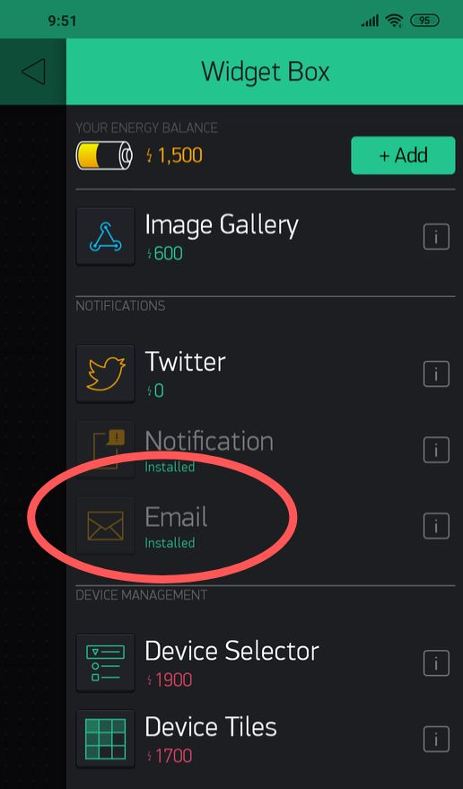
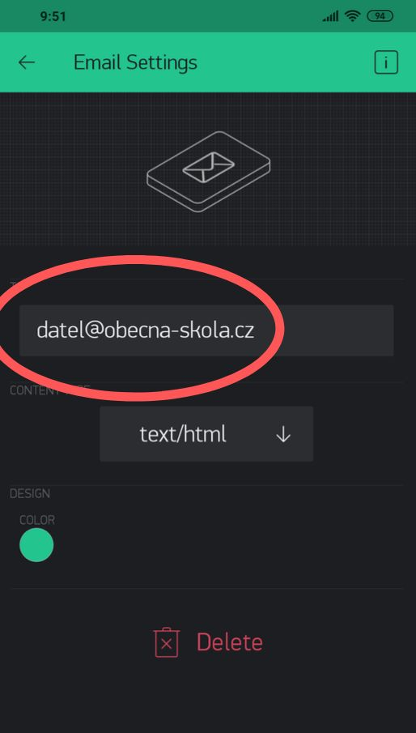
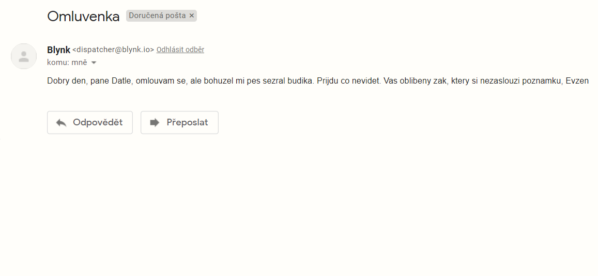

import Image from '@theme/IdealImage';

## Úvod

Ani mobilní telefon není neomylný! Občas tě může zklamat a nevzbudit. Pokud se ti to stane, nezoufej. Stiskni 👇 chytré tlačítko a omluv se učiteli dřív, než to oznámí rodičům.

V tomto projektu se naučíš, **jak odeslat e-mail pomocí chytrého tlačítka**. 📩

K tomu budeš potřebovat pouze základní [**Sadu Start**](https://www.hardwario.store/cz/p/start-set) od HARDWARIO.


## Zrealizuj to v Node-RED

1. Sestav Sadu Start a spáruj ji. Pokud to děláš poprvé, připravili jsme pro tebe jednoduchý návod. Pro Core Module budeš potřebovat firmware pro rádiové tlačítko. Pokud nevíš, jak firmware nahrát nebo co to vlastně je, zjistíš to [zde](https://docs.hardwario.com/tower/desktop-programming/firmware-flashing/).
2. V Playgroundu klikni na záložku **Functions**, kde se nachází programovací prostředí [Node-RED](https://docs.hardwario.com/tower/platform-integrations/blynk-app/#node-red-setup). 🤖
3. Z panelu vlevo přetáhni na plochu Node-RED **MQTT** uzel ze sekce Input.

<div class="container">
  <div class="row">
    <Image img={require('./img/apology-to-teachers/apology-to-teachers-1.webp')}/>
  </div>
</div>

4. V uzlu nastav funkci tlačítka. Dvojklikem otevři jeho nastavení a **zkopíruj následující řádek do pole Topic**:

```
node/push-button:0/push-button/-/event-count
```

Potvrď kliknutím na tlačítko **Done**.

## Nastav obsah omluvy.

1. Obsah omluvy určíš také v Node-RED. Umísti vedle MQTT node také **Change node** z kategorie **Functions**. Tento node určuje, jaký e-mail se odešle.

<div class="container">
  <div class="row">
    <Image img={require('./img/apology-to-teachers/apology-to-teachers-2.webp')}/>
  </div>
</div>

2. Dvojklikem otevři node a nastav dvě pravidla v poli **Rules** (viz screenshot níže).

První pravidlo bude **msg.payload**: tím nastavíš obsah zprávy. Měj na paměti, že node nerozumí českým háčkům a čárkám – a nezapomeň se podepsat. Zpráva může vypadat třeba takto:

_Dear Mr. Woodpecker, I'm sorry, but unfortunately my dog ate my alarm clock. I'll come a.s.a.p. Evzen (your favorite pupil, who does not deserve to have a note sent home to his parents)._

Druhé pravidlo přidáš kliknutím na tlačítko **+ add** níže a vyplníš do něj **msg.topic**. To bude předmět e-mailu – například Apology nebo Being late

<div class="container">
  <div class="row">
    <Image img={require('./img/apology-to-teachers/apology-to-teachers-3.webp')}/>
  </div>
</div>

Potvrď kliknutím na tlačítko **Done**. 👏

## Spusť aplikaci na svém mobilním telefonu.

1. **Pokračuj na svém mobilu**. E-mail se odešle učiteli pouhým stiskem tlačítka přes aplikaci **Blynk**. 📱 Pokud ještě Blynk neznáš z jiných projektů, [podívej se, jak začít](https://docs.hardwario.com/tower/platform-integrations/blynk-app/).

2. Vyber z nabídky možnost **E-mail**. ✉️ Tlačítko bude umístěno na pracovní ploše projektu.




3. Kliknutím na tlačítko přejdeš do nastavení. Zde zadej e-mailovou adresu svého učitele, na kterou bude omluva odeslána.




Až budeš hotový, vrať se na plochu pomocí šipky vlevo nahoře a aktivuj Blynk stisknutím tlačítka Play vpravo nahoře.

## Nastav odesílání e-mailů

1. Nyní se vrať do Playgroundu. Za svůj flow přidej **E-mail node** ze sekce Blynk ws. 📮

<div class="container">
  <div class="row">
    <Image img={require('./img/apology-to-teachers/apology-to-teachers-4.webp')}/>
  </div>
</div>

2. Dvojklikem otevři node a do řádku **E-mail** zadej e-mailovou adresu učitele.
   
<div class="container">
  <div class="row">
    <Image img={require('./img/apology-to-teachers/apology-to-teachers-5.webp')}/>
  </div>
</div>

3. Poté klikni na **ikonu tužky** vedle řádku **Connection** a nastav další údaje. Do pole **Auth Token** zkopíruj kód, který ti poslal Blynk na e-mail.
**Do pole URL** zkopíruj adresu z dolní části okna (viz screenshot) a v poli **Name** zadej název funkce, například *Apology*.

<div class="container">
  <div class="row">
    <Image img={require('./img/apology-to-teachers/apology-to-teachers-6.webp')}/>
  </div>
</div>

4. Propoj jednotlivé uzly, stiskni tlačítko **Deploy** a klidně se uvolni – e-mail, který ti zachrání kůži, když se zpozdíš, je připraven! 🙏
 
<div class="container">
  <div class="row">
    <Image img={require('./img/apology-to-teachers/apology-to-teachers-7.webp')}/>
  </div>
</div>

## Připravit, pozor… teď!

1. Chceš si to vyzkoušet? **Změň e-mailovou adresu na svou vlastní pro testování**.
2. Znovu potvrď tlačítkem **Deploy**, potom už jen stiskni tlačítko a… voilà, **někdo ti píše**! 💌


