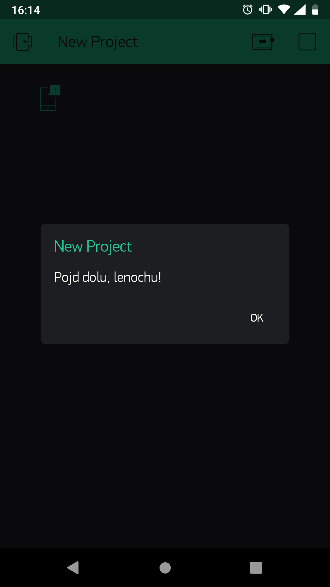
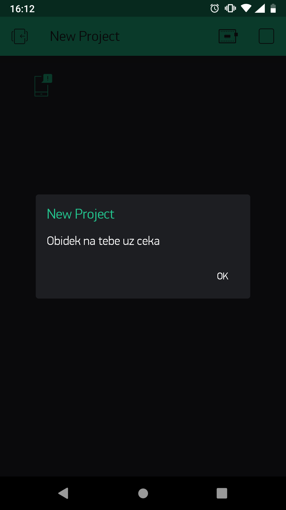

import Image from '@theme/IdealImage';

## Úvod

Máš už hotovou základní verzi tlačítka, kterým tě máma zavolá k večeři? Tak to gratulki. 👍 S tímhle vylepšením projekt posuneš dál – zpráva se změní podle denní doby, a ještě na ni můžeš zareagovat.

V tomhle projektu se naučíš **nastavit jinou zprávu na jiný čas**, odeslat speciální notifikaci **dlouhým podržením tlačítka** a naprogramovat možnost jednoduché **reakce**. 👌

Základní verzi tohohle projektu najdeš tady: [Vyrob si IoT tlačítko, se kterým tě máma zavolá k večeři](/cs/projects/button-for-parents/).

Budeš potřebovat **krabičku s tlačítkem** a **USB dongle**. Proto si vystačíš se základní HARDWARIO sadou, tedy [**Start setem**](https://www.hardwario.store/p/start-set/).


## Připrav si Node-RED

1. Start set sestav a spáruj. Na Core Module potřebuješ zase ten starý známý firmware **bcf-radio-push-button**.

<div class="container"> <div class="row"> <Image img={require('./img/button-for-parents-upgrade/button-for-parents-upgrade-1.webp')}/> </div> </div>

## Nastav si notifikaci

1. Nastav si flow pro notifikaci podobně jako u [základní verze tohohle projektu](/cs/projects/button-for-parents/).

Na plochu polož **MQTT node** ze sekce Input, který má v Topicu počítání kliknutí. Vedle něj hoď **notifikaci na mobil** propojenou s Blynkem.

❗ **Change nod zatím vynechej**, hned se dozvíš proč.

Zatím to vypadá takto:

<div class="container"> <div class="row"> <Image img={require('./img/button-for-parents-upgrade/button-for-parents-upgrade-2.webp')}/> </div> </div>

2. Mezi oba nody tentokrát vlož jiný node, do kterého zkopíruješ javascript. Najdeš ho jako **node Function** pod stejnojmennou sekcí.

<div class="container"> <div class="row"> <Image img={require('./img/button-for-parents-upgrade/button-for-parents-upgrade-3.webp')}/> </div> </div>

3. Do tohohle nodu vložíš **kód, se kterým ovládneš čas**. ⏳ Nastavíš si, od kolika do kolika hodin ti má chodit zpráva o snídani 🍳, obědu 🍗 a večeři 🍕. Chytrý javascript, co?

Následující kód zkopíruj do řádku **Function** v nastavení nodu. Když se na kód podíváš, uvidíš, že některé části jsou barevně zvýrazněné. V nich nastavíš **dobu jídla** a **svoji vlastní zprávu**. Barevné části kódu si libovolně přizpůsob, jenom mysli na to, že čárky a háčky nebudou fungovat.

```
var date = new Date();
var hour = date.getHours();

if(hour >= 8 && hour < 11)
{
 msg.payload = "Pojd na snidani, ospalce";
 return msg;
}
else if(hour >= 11 && hour < 17)
{
 msg.payload = "Obidek na tebe uz ceka";
 return msg;
}
else if(hour >= 17 && hour < 21)
{
 msg.payload = "Podava se vrchol dne, vecere";
 return msg;
}
```

<div class="container"> <div class="row"> <Image img={require('./img/button-for-parents-upgrade/button-for-parents-upgrade-4.webp')}/> </div> </div>

4. Ve stejném okně ještě tenhle node pojmenuj, a to v řádku **Name**. Třeba jako _Nastavení času a zprávy_.

<div class="container"> <div class="row"> <Image img={require('./img/button-for-parents-upgrade/button-for-parents-upgrade-5.webp')}/> </div> </div>

Potvrď tlačítkem **Done**.

## Nastav dlouhé stisknutí tlačítka

1. A jedeme dál. Teď si nastav, co tlačítko provede, když ho rodiče **dlouho podrží**. To se totiž taky dá ovládnout. 👌

Na plochu polož **další MQTT** node ze sekce Input.

2. Nastav do něj ale jiný **Topic**, díky kterému tlačítko zareaguje právě na dlouhé stisknutí.

```
node/push-button:0/push-button/-/hold-count
```

<div class="container"> <div class="row"> <Image img={require('./img/button-for-parents-upgrade/button-for-parents-upgrade-6.webp')}/> </div> </div>

3. Za něj hoď **Change node**, který jsi používal už u basic verze. V něm nastav svoji vlastní zprávu, která se pošle, když rodiče tlačítko dlouho podrží. Dá se to využít třeba na zavolání k čemukoliv jinému než k jídlu 🙂 Takže třeba: _Pojd dolu, lenochu!_

<div class="container"> <div class="row"> <Image img={require('./img/button-for-parents-upgrade/button-for-parents-upgrade-7.webp')}/> </div> </div>

4. Za tenhle node hoď ještě jeden, kterým zprávu odklikneš. Navíc ti vyskočí nejenom v mobilu, ale i na počítači.

Je to **node Notification** pod sekcí Dashboard.

<div class="container"> <div class="row"> <Image img={require('./img/button-for-parents-upgrade/button-for-parents-upgrade-8.webp')}/> </div> </div>

5. Uvnitř vyber na řádku **Layout** OK / Cancel Dialog a potvrď tlačítkem **Done**.

<div class="container"> <div class="row"> <Image img={require('./img/button-for-parents-upgrade/button-for-parents-upgrade-9.webp')}/> </div> </div>

6. Všechno propoj podle obrázku a zmáčkni **Deploy**.

<div class="container"> <div class="row"> <Image img={require('./img/button-for-parents-upgrade/button-for-parents-upgrade-10.webp')}/> </div> </div>

## Akce!

1. Stejně jako předtím, vylepšenou krabičku **dej do správy mamce a taťkovi**.
2. Nauč je, že **krátkým stisknutím** tě zavolají k jídlu…



3. A pokud tě chtějí zavolat kvůli čemukoli jinému, musí tlačítko **zmáčknout déle**. 👇



Aspoň tě nezklame, když na talíř nedostaneš jídlo, ale rodinnou diskuzi. No fuj, jiné menu, prosím!
