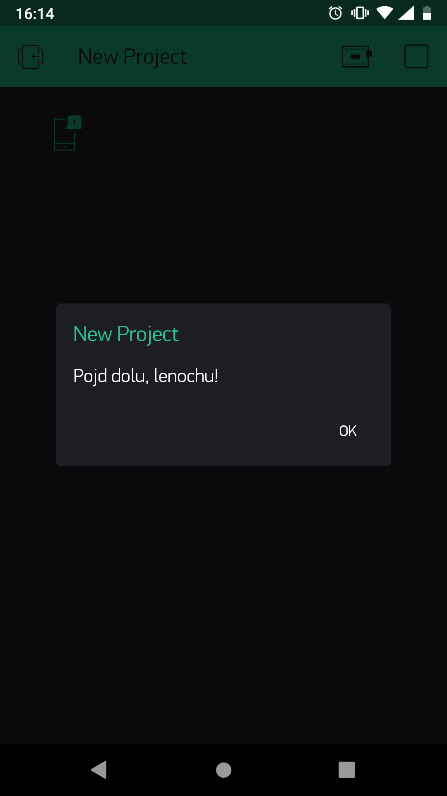

import Image from '@theme/IdealImage';

## Úvod

Máte už hotovou základní verzi tlačítka, kterým vás máma zavolá k večeři? Gratulujeme. 👍 S tímto vylepšením posunete projekt dál: zpráva se bude měnit podle denní doby a navíc na ni můžete odpovědět.

V tomto projektu se naučíte **nastavit různé zprávy pro různou denní dobu**, odeslat speciální notifikaci **dlouhým podržením tlačítka** a naprogramovat jednoduchou **odpověď**. 👌

Základní verzi projektu najdete tady: [Vyrobte si IoT tlačítko, kterým vás máma zavolá k večeři](/cs/projects/button-for-parents/).

Budete potřebovat **krabičku s tlačítkem** a **USB dongle**. Vystačíte si tedy se základní [**Sadou Start**](https://www.hardwario.store/cz/p/start-set) od HARDWARIO.


## Připravte si Node-RED

1. Sadu Start sestavte a spárujte. Do modulu Core Module budete potřebovat opět starý známý firmware **twr-radio-push-button**.

<div class="container"> <div class="row"> <Image img={require('./img/button-for-parents-upgrade/button-for-parents-upgrade-1.webp')} alt="Záložka Devices v Playgroundu se spárovaným zařízením pod aliasem push-button:0"/> </div> </div>

## Nastavte si notifikaci

1. Flow pro notifikaci nastavte podobně jako u [základní verze projektu](/cs/projects/button-for-parents/).

Na plochu umístěte uzel **mqtt in** ze sekce **network**, který má v poli Topic počítání stisknutí. Vedle něj umístěte **uzel write** ze sekce **Blynk IoT** a nastavte ho stejně jako v základní verzi: stejné připojení (Url, Auth Token, Template ID) i stejný virtuální pin. Notifikaci do mobilu pak pošle automatizace, kterou už v Blynku máte.

❗ **Uzel Change zatím vynechte**, hned se dozvíte proč.

Zatím to vypadá takto:

<div class="container"> <div class="row"> <Image img={require('./img/button-for-parents-upgrade/button-for-parents-upgrade-2.webp')} alt="Uzel MQTT event-count a uzel notify pro Blynk umístěné na ploše, zatím nepropojené"/> </div> </div>

2. Mezi oba uzly tentokrát vložte jiný uzel, do kterého zkopírujete JavaScript. Najdete ho jako uzel **function** ve stejnojmenné sekci.

<div class="container"> <div class="row"> <Image img={require('./img/button-for-parents-upgrade/button-for-parents-upgrade-3.webp')} alt="Uzel Function zvýrazněný v paletě a umístěný mezi uzly MQTT a notify"/> </div> </div>

3. Do tohoto uzlu vložíte **kód, kterým ovládnete čas**. ⏳ Nastavíte v něm, od kolika do kolika hodin vám má chodit zpráva o snídani 🍳, obědě 🍗 a večeři 🍕. Chytrý JavaScript, že?

Následující kód zkopírujte v nastavení uzlu na záložku **On Message**. Když se na kód podíváte, uvidíte, že některé části jsou barevně zvýrazněné. V nich nastavíte **čas jídla** a **vlastní zprávu**. Barevné části kódu si upravte podle sebe, jen pamatujte, že háčky a čárky fungovat nebudou.

```
var date = new Date();
var hour = date.getHours();

if(hour >= 8 && hour < 11)
{
 msg.payload = "Pojd na snidani, ospalce";
 return msg;
}
else if(hour >= 11 && hour < 17)
{
 msg.payload = "Obidek na tebe uz ceka";
 return msg;
}
else if(hour >= 17 && hour < 21)
{
 msg.payload = "Podava se vrchol dne, vecere";
 return msg;
}
```

<div class="container"> <div class="row"> <Image img={require('./img/button-for-parents-upgrade/button-for-parents-upgrade-4.webp')} alt="Dialog Edit function node s JavaScriptem hlídajícím čas jídel na záložce On Message"/> </div> </div>

4. Ve stejném okně uzel ještě pojmenujte v řádku **Name**, třeba _Nastavení času a zprávy_.

<div class="container"> <div class="row"> <Image img={require('./img/button-for-parents-upgrade/button-for-parents-upgrade-5.webp')} alt="Dialog Edit function node s pojmenováním uzlu ve zvýrazněném poli Name"/> </div> </div>

Potvrďte tlačítkem **Done**.

## Nastavte dlouhé stisknutí tlačítka

1. A jedeme dál. Teď nastavte, co tlačítko udělá, když ho rodiče **dlouho podrží**. I to se dá ovládat. 👌

Na plochu umístěte **další uzel mqtt in** ze sekce **network**.

2. Nastavte v něm ale jiný **Topic**, díky kterému tlačítko zareaguje právě na dlouhé stisknutí.

```
node/push-button:0/push-button/-/hold-count
```

<div class="container"> <div class="row"> <Image img={require('./img/button-for-parents-upgrade/button-for-parents-upgrade-6.webp')} alt="Dialog Edit mqtt in node se zvýrazněným polem Topic s tématem hold-count tlačítka"/> </div> </div>

3. Za něj umístěte uzel **change**, který už znáte ze základní verze. Nastavte v něm vlastní zprávu, která se odešle, když rodiče tlačítko dlouho podrží. Hodí se k zavolání kvůli čemukoli jinému než jídlu 🙂, třeba: _Pojd dolu, lenochu!_

<div class="container"> <div class="row"> <Image img={require('./img/button-for-parents-upgrade/button-for-parents-upgrade-7.webp')} alt="Dialog Edit change node nastavující msg.payload na zprávu Pojd dolu, lenochu!"/> </div> </div>

4. Za tento uzel přidejte ještě jeden, ve kterém zprávu odkliknete. Zpráva vám navíc vyskočí nejen v mobilu, ale i na počítači.

Je to uzel **notification** v sekci **dashboard**.

<div class="container"> <div class="row"> <Image img={require('./img/button-for-parents-upgrade/button-for-parents-upgrade-8.webp')} alt="Uzel notification pojmenovaný show notification umístěný za uzlem set msg.payload ve flow držení tlačítka"/> </div> </div>

5. V uzlu vyberte v řádku **Layout** možnost OK / Cancel Dialog a potvrďte tlačítkem **Done**.

<div class="container"> <div class="row"> <Image img={require('./img/button-for-parents-upgrade/button-for-parents-upgrade-9.webp')} alt="Dialog Edit notification node s Layout nastaveným na OK / Cancel Dialog"/> </div> </div>

6. Všechno propojte podle obrázku: oba flow vedou do uzlu write a do uzlu notification. Pak stiskněte **Deploy**.

<div class="container"> <div class="row"> <Image img={require('./img/button-for-parents-upgrade/button-for-parents-upgrade-10.webp')} alt="Oba flow tlačítka propojené s uzly notify a show dialog, se zvýrazněným tlačítkem Deploy"/> </div> </div>

## Akce!

1. Stejně jako minule svěřte vylepšenou krabičku **mámě a tátovi**.
2. Vysvětlete jim, že **krátkým stisknutím** vás zavolají k jídlu…



3. …a pokud vás chtějí zavolat kvůli čemukoli jinému, musí tlačítko **podržet déle**. 👇


Aspoň vás nezklame, když místo jídla dostanete na talíř rodinnou poradu. Fuj, jiné menu, prosím!
