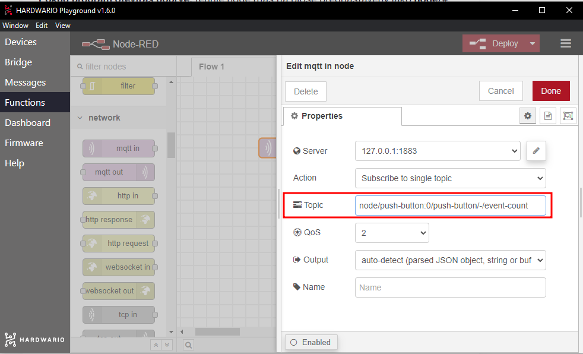
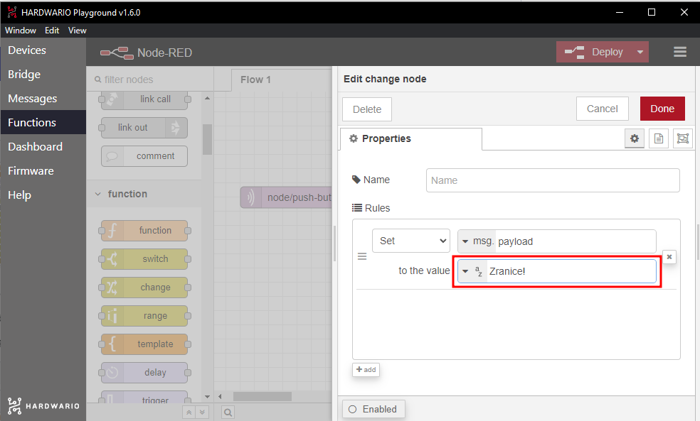
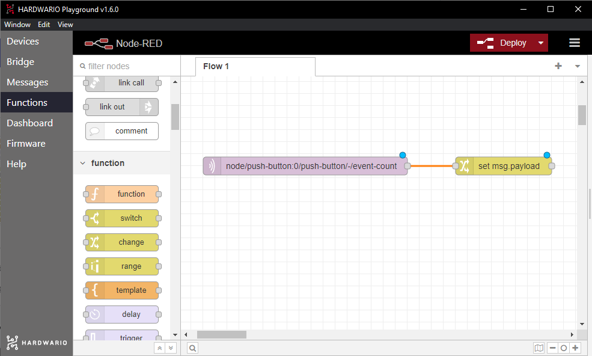
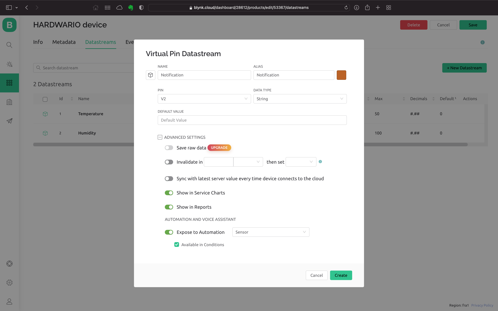
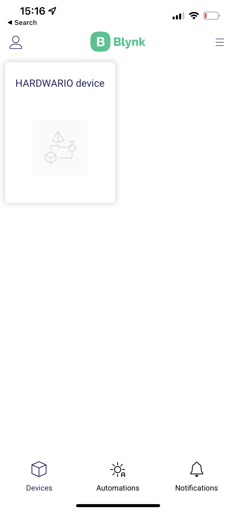
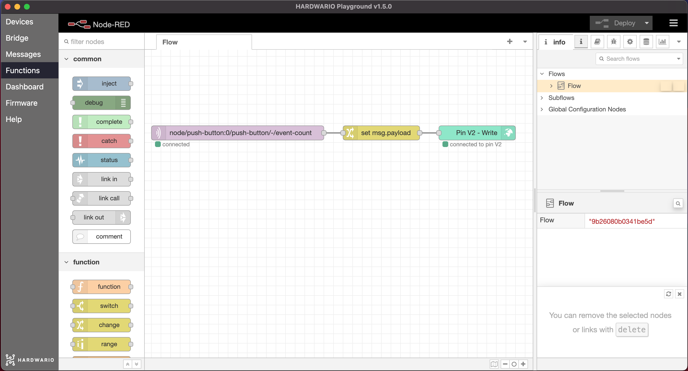
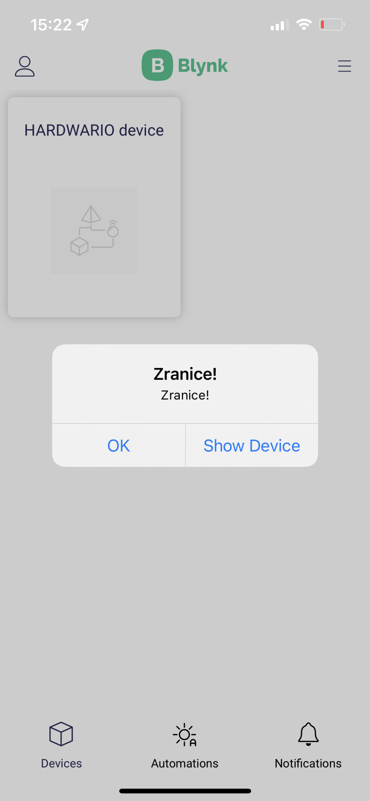

## Úvod

Znáte to: zrovna hrajete hry nebo posloucháte hudbu naplno, a když vás máma volá k večeři, vůbec o tom nevíte. Sestavte proto rodičům chytré tlačítko, kterým vás upozorní přes mobil a nebudou muset křičet přes celý dům.

V tomto projektu se naučíte, **jak tlačítkem poslat zprávu do mobilu** odkudkoli v domě. 👌

Budete potřebovat krabičku s **tlačítkem** a **USB dongle**. Vystačíte si tedy se základní [**Sadou Start**](https://www.hardwario.store/cz/p/start-set) od HARDWARIO.


## Rozjeďte to v Node-RED

1. Sadu Start sestavte a spárujte. Do modulu Core Module potřebujete firmware **twr-radio-push-button**.
2. V Playgroundu klikněte na **záložku Functions**. Tady krabičku nastavíte tak, aby dělala, co chcete.
3. Jdeme programovat. 🤞 Na plochu Node-RED umístěte světle fialovou bublinu, tedy uzel. Najdete ho vlevo jako **mqtt in** v sekci **network**.


**Pokud program otevíráte poprvé:** tento uzel už máte na ploše předem nastavený jako **node/#**. Druhou, tmavě zelenou bublinu můžete smazat.

4. V uzlu nastavíte klíčovou funkci, tedy stisk tlačítka. Dvakrát na uzel klikněte a **do pole Topic zkopírujte tento řádek**:

```
node/push-button:0/push-button/-/event-count
```



Potvrďte tlačítkem **Done**.

**Tip:** Vidíte v Playgroundu záložku **Messages**? Zobrazují se v ní všechny akce, řádek po řádku. Stiskněte tlačítko na krabičce a… tadá, objevil se stejný řádek:
```
node/push-button:0/push-button/-/event-count
```
Co to znamená? Příště můžete řádky do pole Topic kopírovat přímo ze záložky Messages.

## Napište vlastní zprávu

1. Zprávu nastavíte také tady v Node-RED. Kamkoli vedle světle fialového vstupu MQTT umístěte **žlutý uzel change ze sekce function**.


2. Uzel change určuje, co se při stisku stane, třeba že se odešle zpráva. Popusťte uzdu fantazii a napište si vlastní (jen pozor, Blynk nezobrazuje háčky a čárky). Malá inspirace:
	- Vecere!
	- Cas krmeni
	- Bez si doplnit skutecnou manu
	- Lektvar zdravi je uvareny

Stačí na uzel dvakrát kliknout a v poli **Rules** (pravidla) napsat zprávu do druhého řádku.



Potvrďte tlačítkem **Done**.

3. Na okraji každého uzlu uvidíte malou šedou kuličku. Když na ni kliknete, podržíte tlačítko myši a táhnete do strany, vytáhnete z uzlu provázek. Tak se uzly propojují.
Vyzkoušejte to. **Oba uzly propojte** tažením myši od jedné bubliny ke druhé. Hračka. 🙆



## Připravte si aplikaci Blynk IoT

Krabička s tlačítkem se s chytrým telefonem propojí přes aplikaci **Blynk IoT**. Node-RED pošle text zprávy do Blynku a automatizace v Blynku z každé nové zprávy udělá push notifikaci.

1. Pokud ještě nemáte účet v aplikaci [Blynk IoT](https://blynk.io), založte si ho. Na tento projekt stačí bezplatný tarif: v době psaní návodu zahrnuje push notifikace v aplikaci a až pět automatizací.

2. Dalším krokem je vytvoření šablony zařízení (template). Jak na to, ukazuje [rychlý návod Blynku](https://docs.blynk.io/en/getting-started/template-quick-setup). Pokud máte šablonu z předchozích projektů, klidně ji použijte.

3. Teď nastavte nový datastream. V detailu šablony otevřete záložku **Datastreams**, klikněte na **New Datastream** a vyberte **Virtual Pin**. Otevře se nastavení datastreamu:


4. Pojmenujte nový datastream (třeba `Zprava`) a vyberte jeden z volných pinů, třeba V2. V notifikaci na mobilu chceme zobrazit vaši vlastní zprávu, proto **jako datový typ (Data Type) zvolte String** (textový řetězec).

5. V nastavení datastreamu ještě povolte, aby ho automatizace mohly použít jako podmínku: v části **Automations** zapněte **Use as Condition**. Datastream vytvoříte kliknutím na **Create**.




6. Vpravo nahoře uložte šablonu tlačítkem **Save**.

## Založte zařízení

Pokud ho ještě nemáte, založte si z vytvořené šablony zařízení: v sekci **Devices** přidejte nové zařízení, vyberte svou šablonu a zařízení pojmenujte. Na jeho záložce **Device Info** najdete **Auth Token**, který budete potřebovat v Node-RED.

## Vytvořte automatizaci

1. Přepněte se do sekce **Automations** a založte novou automatizaci.


2. Jako podmínku vyberte **Device State**. Automatizace se pak vyhodnotí pokaždé, když Node-RED pošle do Blynku novou zprávu.


3. Nastavení automatizace je jednoduché: v části **When** určíte, kdy se má automatizace spustit, a v části **Do this**, co se pak má stát.

4. Nejdřív nastavte část **When**. Vyberte své zařízení a **vytvořený datastream**. Objeví se třetí rozbalovací seznam, ten nechte nastavený na **Is Any**. Automatizace tak zareaguje na každou zprávu, i když bude stejná jako minulá.

5. V části **Do this** přidejte akci, která pošle notifikaci do mobilní aplikace (**Send In-App Notifications**), a jako příjemce zadejte sebe. Do textu notifikace vložte zástupný symbol **Trigger value** (`{TRIGGER_VALUE}`). Blynk za něj dosadí text vaší zprávy.

6. Nakonec nezapomeňte automatizaci **pojmenovat**. **Limit period** určuje, za jak dlouho se automatizace smí spustit znovu. Zvolte co nejkratší dobu, jinak by druhá zpráva odeslaná krátce po první nedorazila.


7. Automatizaci uložte kliknutím na **Save**.

## Nastavte si aplikaci v mobilu

😎 Stáhněte si do mobilu **aplikaci Blynk IoT** z [App Store](https://apps.apple.com/us/app/blynk-iot/id1559317868) nebo [Google Play](https://play.google.com/store/apps/details?id=cloud.blynk). Přihlaste se do ní stejným účtem a povolte jí oznámení, aby se zpráva mohla zobrazit.




## Propojte mobil s krabičkou

1. Vraťte se k počítači. Na plochu Node-RED přidejte za oba uzly **zelený uzel write**. Najdete ho vlevo v sekci **Blynk IoT** (sekce **Blynk ws** patří ke starému Blynku, který už nefunguje).
2. Uzel otevřete dvojklikem. Vedle pole **Connection** uvidíte **malou tužku**. Klikněte na ni a otevře se nové okno.
3. Do pole **Url** vložte ``blynk.cloud``.
4. Do polí **Auth Token** a **Template ID** zkopírujte hodnoty z webové aplikace Blynk na počítači: Auth Token najdete na záložce **Device Info** zařízení, Template ID v detailu šablony.


5. Nastavení potvrďte tlačítkem **Add**.


6. Do pole **Virtual Pin** zadejte číslo pinu vytvořeného datastreamu (pro V2 je to 2) a vše uložte tlačítkem **Done**.

7. **Uzel write propojte s uzlem, ve kterém jste nastavili zprávu.** Teď jste zařízení naprogramovali tak, aby se stisk tlačítka na krabičce ➡️ proměnil ve zprávu, ➡️ která doputuje až do vašeho mobilu. 👾



❗ Celý flow spusťte červeným tlačítkem **Deploy** vpravo nahoře. 🚨

## Akce!

1. Stiskněte tlačítko a… kouzlo! 🎇 **Zpráva se vám objeví v mobilu!** 🙌
2. Dejte tlačítko mámě nebo tátovi. Koukají, co? Rodinný klid před večeří je zachráněn. 🤓



