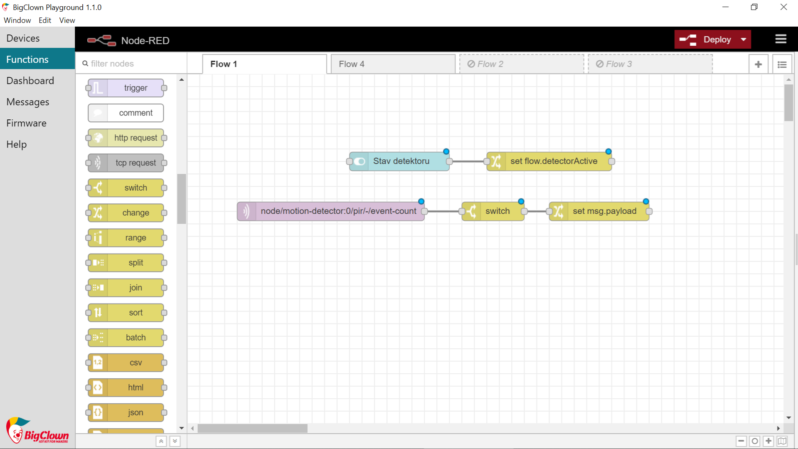

import Image from '@theme/IdealImage';

## Úvod

Ježíšek je ultratajná osoba, ale s IoT ho můžeš načapat přímo při rozdávání dárků. 🎄 Pomůže ti k tomu PIR Module: detektor pohybu

S tímhle projektem se naučíš **detekovat pohyb ve vzdáleném pokoji**. Díky tomu si můžeš ověřit, jestli po českých domácnostech chodí Santa, Ježíšek, Děda Mráz nebo někdo úplně jiný. 😲

Pokud máš Starter Set, budeš k němu potřebovat ještě [PIR Module](https://www.hardwario.store/p/pir-module/). **Kompletní výbavu** najdeš v sadě [Motion Set](https://www.hardwario.store/p/motion-set).


## Připrav si krabičku

1. Sestav svůj Set. Na Core Module potřebuješ firmware **bcf-radio-motion-detector**. <div class="container"> <div class="row"> <Image img={require('./img/christmas-detector/christmas-detector-1.webp')}/> </div> </div>

2. Při správně nainstalovaném firmware uvidíš v Playgroundu na záložce Devices Alias jako **motion-detector**.
<div class="container"> <div class="row"> <Image img={require('./img/christmas-detector/christmas-detector-2.webp')}/> </div> </div>

## Nastav si Node-RED

1. Programování odstartuj v Node-RED. Nejdřív v Playgroundu klikni na záložku **Functions**.
2. Na volnou plochu si přetáhni světle fialový node (bublinu) s názvem **MQTT**. Najdeš ho v sekci Input.

<div class="container"> <div class="row"> <Image img={require('./img/christmas-detector/christmas-detector-3.webp')}/> </div> </div>

3. Node rozklikni dvojklikem. V řádku **Topic** určíš klíčovou hodnotu. Teď to bude počítadlo pohybů, které jsou zaznamenány:


```
node/motion-detector:0/pir/-/event-count
```

<div class="container"> <div class="row"> <Image img={require('./img/christmas-detector/christmas-detector-4.webp')}/> </div> </div>

Potvrď pomocí tlačítka **Done**.

4. Za tenhle node postav node **Switch** ze sekce Function. Díky němu zařízení pozná, že je detektor zapnutý a může hlásit veškerý pohyb.
5. Uvnitř nodu vyplň řádek **Property** jako _flow_. _detectorActive_ a podmínku uvnitř pole uprav na _is true_ (mrkej na obrázek).
**Náš tip**: Přečti si o téhle funkci víc.
<div class="container"> <div class="row"> <Image img={require('./img/christmas-detector/christmas-detector-5.webp')}/> </div> </div>

Potvrď tlačítkem **Done**.

6. Teď přijde **node Change** ze stejné sekce Function.
<div class="container"> <div class="row"> <Image img={require('./img/christmas-detector/christmas-detector-6.webp')}/> </div> </div>

7. V něm nastavíš zprávu, která se ti ukáže, jakmile dorazí ten vousáč s dárkama (případně miminko). 🎅 👼 Takže třeba: _Jezisek je v obyvaku_.
**Náš tip**: Pokud si chceš nastavit i upozornění do mobilu, nepoužívej čárky ani háčky, Blynk to nemá rád.
<div class="container"> <div class="row"> <Image img={require('./img/christmas-detector/christmas-detector-7.webp')}/> </div> </div>

Potvrď tlačítkem **Done**.

8. Nad tímhle flow načni další, díky kterému budeš moct detektor zapínat a vypínat. Bude se skládat ze dvou nodů. První je **node Switch** ze sekce Dashboard.
<div class="container"> <div class="row"> <Image img={require('./img/christmas-detector/christmas-detector-8.webp')}/> </div> </div>

9. Uvnitř tohohle nodu uprav **Label** na _Stav detektoru_. Takhle bude označený tvůj projekt v Dashboardu.
<div class="container"> <div class="row"> <Image img={require('./img/christmas-detector/christmas-detector-9.webp')}/> </div> </div>

Potvrď tlačítkem **Done**.

10. Za něj postav **node Change** ze sekce Dashboard. Jojo, ten, co už máš o kousek níž. 👍
<div class="container"> <div class="row"> <Image img={require('./img/christmas-detector/christmas-detector-10.webp')}/> </div> </div>

11. Uvnitř nastav v poli **Rules** funkci, se kterou zařízení pozná, jestli je tlačítko vypnuté, nebo zapnuté: _flow_. _detectorActive_ (viz obrázek). Pozor na překlepy!
<div class="container"> <div class="row"> <Image img={require('./img/christmas-detector/christmas-detector-11.webp')}/> </div> </div>

Potvrď tlačítkem **Done**.

12. Teď všechny nody **pospojuj podle obrázku**, ale ještě nemačkej tlačítko Deploy. Chybí nám poslední node, který přidáme za chviličku. S ním nastavíš upozornění do mobilu. 🤳



## Připrav Blynk IoT pro upozornění

Detekce dorazí na tvůj smartphone přes appku **Blynk IoT**, kam zachycený pohyb přiletí jako push notifikace. A to je fakt super. 😎

1. Pokud ještě žádný nemáš, založ si účet v [Blynk IoT](https://docs.hardwario.com/tower/platform-integrations/blynk-app/). V [tomhle návodu](https://docs.hardwario.com/tower/platform-integrations/blynk-app/) najdeš, jak si nastavit účet, šablonu zařízení (device template) a zařízení (device) — budeš potřebovat všechny tři. Můžeš taky využít šablonu z některého předchozího projektu.

2. V Blynk IoT se push notifikace nepřidává na obrazovku telefonu jako widget — posílá se jako **Event** definovaný na tvé šabloně. V detailu šablony otevři záložku **Events** a přidej nový event (třeba ho pojmenuj `motion` a dej mu zprávu, kterou chceš dostávat, například _Jezisek je v obyvaku_). Pak pro tenhle event zapni **Notifications**, aby ti ho Blynk doručil na telefon. [Návod](https://docs.hardwario.com/tower/platform-integrations/blynk-app/) tě nastavením šablony provede.

3. Stáhni si do telefonu appku **Blynk IoT** z [App Store](https://apps.apple.com/us/app/blynk-iot/id1559317868) nebo [Google Play](https://play.google.com/store/apps/details?id=cloud.blynk) a přihlas se stejným účtem. Ujisti se, že má appka povolená upozornění, aby se zpráva mohla zobrazit. 📱

## Propoj mobil s krabičkou

1. Vrať se k počítači. Na plochu Node-RED postav poslední node celého projektu — node ze sekce **Blynk IoT**, který umí spustit tvůj event (node **log event**). Patří hned za flow se switchem (mrkni na obrázek). 👀 <div class="container"> <div class="row"> <Image img={require('./img/christmas-detector/christmas-detector-13.webp')}/> </div> </div>

2. Rozklikni node dvojklikem. Vpravo uvidíš **malou tužtičku**. Klikni na ni a otevře se nové okno. Do pole **Url** zadej `blynk.cloud` a do polí **Auth Token** a **Template ID** zkopíruj hodnoty z detailu zařízení ve webové appce Blynk na počítači. Potvrď tlačítkem **Add**.

3. Nastav node tak, aby spouštěl **Event**, který jsi vytvořil (kód eventu, např. `motion`). Právě tohle promění zachycený pohyb v push notifikaci. Potvrď tlačítkem **Done**.

4. Nakonec tenhle zelený node **propoj** s předchozím flow, aby detektor ➡️ spustil Blynk IoT event ➡️ který dorazí na tvůj mobil. Pak zmáčkni červené tlačítko **Deploy**. 🚨

## A... akce!

1. Je čas špehovat toho dárečkového krále. V záložce **Dashboard** v Playgroundu **zapni svůj detektor**. 🕵️
<div class="container"> <div class="row"> <Image img={require('./img/christmas-detector/christmas-detector-17.webp')}/> </div> </div>

2. PIR Module vycítí i sebemenší pohyb a zpráva o cizí přítomnosti ti přijde do mobilu raz dva. **Ježíšek nemá šanci**! Honem se běž podívat a načapej ho

1. Poznámka na okraj: Ježíška si po načapání **udobři**, aby ti doma vůbec nějaké dárky nechal. 😜
