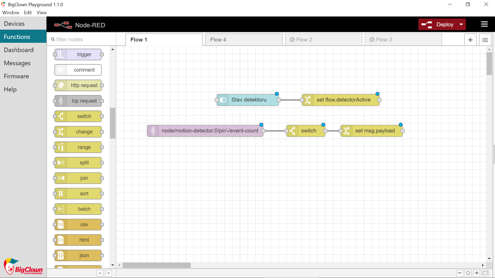

import Image from '@theme/IdealImage';

## Úvod

Ježíšek je nesmírně tajemná bytost, ale s IoT ho můžete načapat přímo při nadílce. 🎄 Pomůže vám s tím detektor pohybu PIR Module.

V tomto projektu se naučíte **zaznamenat pohyb ve vzdálené místnosti**. Díky tomu si můžete ověřit, jestli k vám domů chodí Santa, Ježíšek, Děda Mráz, nebo někdo úplně jiný. 😲

Pokud máte Sadu Start, budete k ní potřebovat ještě [PIR Module](https://www.hardwario.store/cz/p/pir-module). **Kompletní výbavu** najdete v [Sadě Motion](https://www.hardwario.store/cz/p/motion-set).


## Připravte si krabičku

1. Sestavte sadu. Do modulu Core Module potřebujete firmware **twr-radio-motion-detector**. <div class="container"> <div class="row"> <Image img={require('./img/christmas-detector/christmas-detector-1.webp')} alt="Záložka Firmware v Playgroundu s vybraným firmwarem twr-radio-motion-detector k nahrání"/> </div> </div>

2. Pokud se firmware nahrál správně, uvidíte v Playgroundu na záložce Devices alias **motion-detector**.
<div class="container"> <div class="row"> <Image img={require('./img/christmas-detector/christmas-detector-2.webp')} alt="Záložka Devices v Playgroundu se spárovaným zařízením pod aliasem motion-detector:0"/> </div> </div>

## Nastavte si Node-RED

1. Programovat začnete v Node-RED. Nejdřív v Playgroundu klikněte na záložku **Functions**.
2. Na prázdnou plochu přetáhněte světle fialový uzel (bublinu) s názvem **mqtt in**. Najdete ho v sekci **network**.

<div class="container"> <div class="row"> <Image img={require('./img/christmas-detector/christmas-detector-3.webp')} alt="Uzel mqtt in zvýrazněný v paletě a uzel mqtt umístěný na ploše"/> </div> </div>

3. Uzel otevřete dvojklikem. Do řádku **Topic** zadejte klíčovou hodnotu. Uzel teď bude počítat zaznamenané pohyby:


```
node/motion-detector:0/pir/-/event-count
```

<div class="container"> <div class="row"> <Image img={require('./img/christmas-detector/christmas-detector-4.webp')} alt="Uzel MQTT na ploše s tématem event-count PIR čidla motion-detectoru"/> </div> </div>

Potvrďte tlačítkem **Done**.

4. Za tento uzel umístěte uzel **switch** ze sekce **function**. Díky němu zařízení pozná, že je detektor zapnutý a může hlásit každý pohyb.
5. V uzlu vyplňte řádek **Property** jako _flow_. _detectorActive_ a podmínku v poli upravte na _is true_ (viz obrázek).
**Náš tip**: Víc o uzlu switch se dočtete v [dokumentaci Node-RED](https://nodered.org/docs/user-guide/nodes#switch).
<div class="container"> <div class="row"> <Image img={require('./img/christmas-detector/christmas-detector-5.webp')} alt="Dialog Edit switch node kontrolující vlastnost flow.detectorActive s podmínkou is true"/> </div> </div>

Potvrďte tlačítkem **Done**.

6. Za uzel switch umístěte uzel **change** ze stejné sekce **function**.
<div class="container"> <div class="row"> <Image img={require('./img/christmas-detector/christmas-detector-6.webp')} alt="Uzel Change zvýrazněný v paletě, uzel set msg.payload je umístěný za uzlem switch"/> </div> </div>

7. V něm nastavíte zprávu, která vyskočí, jakmile dorazí vousáč s dárky (nebo Ježíšek). 🎅 👼 Třeba: _Jezisek je v obyvaku_.
**Náš tip**: Pokud chcete nastavit i upozornění do mobilu, nepoužívejte háčky ani čárky, protože Blynk diakritiku nezobrazuje.
<div class="container"> <div class="row"> <Image img={require('./img/christmas-detector/christmas-detector-7.webp')} alt="Dialog Edit change node s pravidlem nastavujícím flow.detectorActive na msg.payload"/> </div> </div>

Potvrďte tlačítkem **Done**.

8. Nad tento flow přidejte další, kterým budete detektor zapínat a vypínat. Bude se skládat ze dvou uzlů. První je uzel **switch** ze sekce **dashboard**.
<div class="container"> <div class="row"> <Image img={require('./img/christmas-detector/christmas-detector-8.webp')} alt="Uzel switch z palety dashboard zvýrazněný a umístěný nad flow detektoru"/> </div> </div>

9. V tomto uzlu změňte **Label** na _Stav detektoru_. Tak bude váš projekt označený na Dashboardu.
<div class="container"> <div class="row"> <Image img={require('./img/christmas-detector/christmas-detector-9.webp')} alt="Dialog Edit switch node s Label Stav detektoru a hodnotami true a false"/> </div> </div>

Potvrďte tlačítkem **Done**.

10. Za něj umístěte uzel **change** ze sekce **function**. Ano, stejný, jaký už máte o kousek níž. 👍
<div class="container"> <div class="row"> <Image img={require('./img/christmas-detector/christmas-detector-10.webp')} alt="Uzel Change zvýrazněný v paletě, uzel set msg.payload je umístěný za přepínačem Stav detektoru"/> </div> </div>

11. V poli **Rules** nastavte funkci, podle které zařízení pozná, jestli je přepínač zapnutý, nebo vypnutý: _flow_. _detectorActive_ (viz obrázek). Pozor na překlepy!
<div class="container"> <div class="row"> <Image img={require('./img/christmas-detector/christmas-detector-11.webp')} alt="Dialog Edit change node pro flow přepínače se zvýrazněným pravidlem Set flow.detectorActive na msg.payload"/> </div> </div>

Potvrďte tlačítkem **Done**.

12. Teď všechny uzly **propojte podle obrázku**, ale tlačítko Deploy ještě nestiskněte. Chybí poslední uzel, který přidáme za chvilku. S ním nastavíte upozornění do mobilu. 🤳



## Připravte Blynk IoT na upozornění

Zachycený pohyb vám dorazí do chytrého telefonu jako push notifikace z aplikace **Blynk IoT**. Šikovné, že? 😎 Node-RED pošle text zprávy do Blynku a automatizace v Blynku z každé nové zprávy udělá notifikaci.

1. Pokud ještě nemáte účet v [Blynk IoT](https://blynk.io), založte si ho. Na tento projekt stačí bezplatný tarif: v době psaní návodu zahrnuje push notifikace v aplikaci a až pět automatizací.

2. Vytvořte šablonu zařízení (template). Jak na to, ukazuje [rychlý návod Blynku](https://docs.blynk.io/en/getting-started/template-quick-setup). Můžete také použít šablonu z některého předchozího projektu.

3. V šabloně otevřete záložku **Datastreams**, klikněte na **New Datastream** a vyberte **Virtual Pin**. Datastream pojmenujte (třeba `Zprava`), vyberte volný pin (třeba V2) a jako datový typ (**Data Type**) zvolte **String**, protože notifikace ponese váš vlastní text.

4. V nastavení datastreamu povolte, aby ho automatizace mohly použít jako spouštěč: v části **Automations** zapněte **Use as Condition**. Datastream vytvořte a šablonu uložte.

5. Ze šablony založte zařízení: v sekci **Devices** přidejte nové zařízení, vyberte svou šablonu a zařízení pojmenujte. Na jeho záložce **Device Info** najdete **Auth Token**, který budete potřebovat v Node-RED.

## Vytvořte automatizaci

1. V Blynku otevřete **Automations** a založte novou automatizaci. Jako podmínku (**When**) zvolte **Device State**, pak své zařízení, svůj datastream a **Is Any**. Automatizace tak zareaguje na každou zprávu, i když bude stejná jako minulá.

2. V části **Do this** přidejte akci, která pošle notifikaci do mobilní aplikace (**Send In-App Notifications**), a jako příjemce zvolte sebe. Do textu notifikace vložte zástupný symbol **Trigger value** (`{TRIGGER_VALUE}`). Blynk za něj dosadí text, který mu pošle Node-RED.

3. Automatizaci pojmenujte. **Limit period** určuje, za jak dlouho se automatizace smí spustit znovu: zvolte co nejkratší dobu, jinak vám o dalším pohybu krátce po prvním nepřijde zpráva. Automatizaci uložte.

4. Stáhněte si do telefonu aplikaci **Blynk IoT** z [App Store](https://apps.apple.com/us/app/blynk-iot/id1559317868) nebo [Google Play](https://play.google.com/store/apps/details?id=cloud.blynk) a přihlaste se stejným účtem. Zkontrolujte, že má aplikace povolená upozornění, aby se zpráva mohla zobrazit. 📱

## Propojte mobil s krabičkou

1. Vraťte se k počítači. Na plochu Node-RED umístěte poslední uzel celého projektu: uzel **write** ze sekce **Blynk IoT** (ne ze sekce **Blynk ws**, ta patří ke starému Blynku, který už nefunguje). Patří hned za flow s přepínačem (viz obrázek). 👀 <div class="container"> <div class="row"> <Image img={require('./img/christmas-detector/christmas-detector-13.webp')} alt="Uzel notify pro Blynk zvýrazněný na ploše, umístěný na konec flow detektoru"/> </div> </div>

2. Uzel otevřete dvojklikem. Vedle pole **Connection** uvidíte **malou tužku**. Klikněte na ni a otevře se nové okno. Do pole **Url** zadejte `blynk.cloud` a do polí **Auth Token** a **Template ID** zkopírujte hodnoty z webové aplikace Blynk na počítači: Auth Token najdete na záložce **Device Info** zařízení, Template ID v detailu šablony. Potvrďte tlačítkem **Add**.

3. Do pole **Virtual Pin** zadejte číslo pinu svého datastreamu (pro V2 je to 2). Právě tím se zachycený pohyb promění v push notifikaci: uzel zapíše zprávu do datastreamu a automatizace ji pošle dál. Potvrďte tlačítkem **Done**.

4. Nakonec tento zelený uzel **propojte** s předchozím flow, aby zpráva z detektoru ➡️ odešla do Blynk IoT ➡️ a dorazila do vašeho mobilu. Pak stiskněte červené tlačítko **Deploy**. 🚨

## A… akce!

1. Je nejvyšší čas vyzvědět, kdo nosí dárky. Na záložce **Dashboard** v Playgroundu **zapněte detektor**. 🕵️
<div class="container"> <div class="row"> <Image img={require('./img/christmas-detector/christmas-detector-17.webp')} alt="Hotový flow s přepínačem Stav detektoru a řetězcem události PIR končícím uzlem notify"/> </div> </div>

2. PIR Module zachytí i sebemenší pohyb a zprávu, že se něco děje, vám raz dva pošle do mobilu. **Ježíšek nemá šanci**! Rychle se běžte podívat a načapejte ho!

1. Poznámka na okraj: Po načapání si Ježíška **udobřete**, ať vám doma vůbec nějaké dárky nechá. 😜
