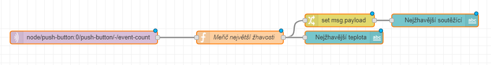
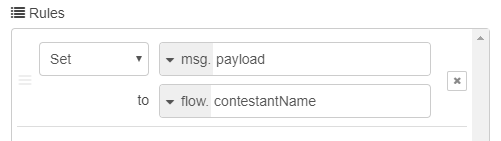
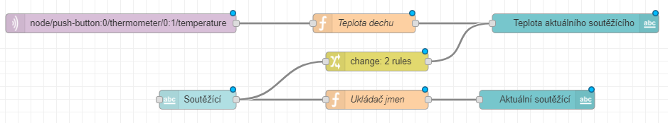
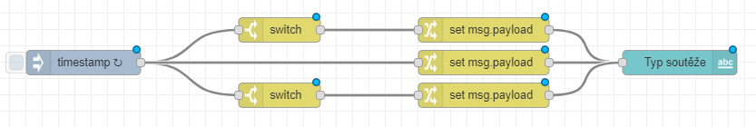
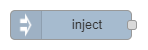
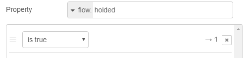
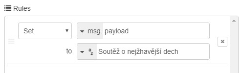
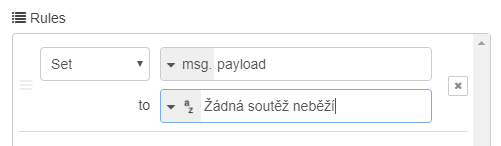
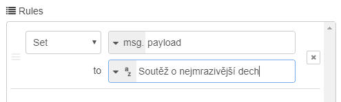
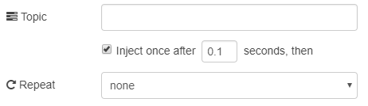

import Image from '@theme/IdealImage';

## Úvod

Troufáte si? Postavte jeden projekt se dvěma oblíbenými soutěžemi a přepínejte mezi nimi, jak se vám zachce! O zábavu na párty máte postaráno. 🕺

V tomto projektu se naučíte **uložit nejvyšší naměřenou hodnotu, nastavit v jednom projektu několik typů soutěže a přepínat mezi nimi**.

Základní verzi projektu najdete tady: [IoT párty hra: máte v sobě dračí oheň, nebo mrazivý dech?](/cs/projects/dragons-fire/)

I tentokrát vám stačí základní sada HARDWARIO [**Start Set**](https://www.hardwario.store/cz/p/start-set/).


## Připravte si Node-RED

1. Start Set sestavte a spárujte. Do modulu Core Module budete potřebovat opět starý známý firmware **bcf-radio-push-button**.

<div class="container">
  <div class="row">
    <Image img={require('./img/push-the-button/push-the-button-playground-devices-connected.webp')} alt="Záložka Devices v Playgroundu se spárovaným Core Module pod aliasem push-button:0"/>
  </div>
</div>

## Změřte nejžhavější dech

Sestavte tento flow, se kterým odhalíte **nejžhavějšího draka** z vaší party. 🐉 Nejvyšší teplota se začne měřit po **krátkém stisknutí tlačítka**.



**Potřebujete poradit, jak na to?**

- Uzel **MQTT** ze sekce Input má v poli Topic krátké stisknutí tlačítka:

```
node/push-button:0/push-button/-/event-count
```

- Kód JavaScriptu v uzlu **Function** vypadá takto:

```
var hottestTemp = flow.get("hottestTemp");
var pressed = flow.get("pressed") || false;

flow.set("holded", false);flow.set("pressed", !pressed);

if(!flow.get("pressed"))
{
 if(flow.get("contestantTemp") > hottestTemp)
 {
 flow.set("hottestTemp", flow.get("contestantTemp"));
 msg.payload = flow.get("hottestTemp");
 return msg;
 }
}
```

- Spodní uzel **Text** zaznamenává nejvyšší teplotu. Nezapomeňte do řádku Value format vyplnit hodnotu `{{msg.payload}}°C`.

- Uzel **Change** vypisuje účastníka s nejžhavějším dechem. Nastavte v něm flow. contestantName



- Flow uzavírá obyčejný uzel **Text**.

## Změřte nejmrazivější dech

Pod předchozí flow umístěte další. Změříte s ním, kdo z vás dýchá tak studeně, že by mohl **konkurovat Nočnímu králi**. ❄ Nejnižší teplota se začne měřit až po **dlouhém stisknutí tlačítka**.

**Náš tip**: Podobný flow nemusíte stavět od nuly: uzly jednoduše zkopírujte a upravte. Stačí **Ctrl+C a Ctrl+V**, a to i pro několik uzlů naráz. Sláva! 🙌


**Potřebujete poradit, jak na to?**

- Pole Topic v uzlu **MQTT** tentokrát odpovídá dlouhému stisknutí tlačítka:

```
node/push-button:0/push-button/-/hold-count
```

- Kód v uzlu **Function** vypadá tentokrát takto:

```
var coldestTemp = flow.get("coldestTemp");
var holded = flow.get("holded") || false;

flow.set("pressed", false);

flow.set("holded", !holded);

if(!flow.get("holded"))
{
if(flow.get("contestantTemp") < coldestTemp)
 {
  flow.set("coldestTemp", flow.get("contestantTemp"));

  msg.payload = flow.get("coldestTemp");
  return msg;
 }
}
```

- **Oba uzly Text jsou stejné jako v předchozím flow**, jen v nich nejžhavější změňte na nejchladnější.

- **Uzel Change je stejný jako v předchozím flow.**

❗ **Náš tip**: Něco nefunguje, jak má? Přidejte na plochu uzel Debug, který vám pomůže vychytat případné brouky. 🐞

## Nastavte průběžné měření

Vytvořte nový flow a umístěte ho pod oba předchozí. Tento flow změří každý pokus a tabulka si navíc zapamatuje jména účastníků.



**Potřebujete poradit, jak na to?**

- Pole Topic v uzlu **MQTT** obsahuje měření teploty:

```
node/push-button:0/thermometer/0:1/temperature
```

- Kód v uzlu **Function** vypadá takto:

```
var temp = msg.payload;

if(flow.get("pressed"))
{
 if(flow.get("contestantTemp") < temp)
 {
  flow.set("contestantTemp", temp);
  return msg;
  }
}
else if(flow.get("holded"))
{
  if(flow.get("contestantTemp") > temp)
  {
   flow.set("contestantTemp", temp);
   return msg;
 }
}
```

- Tmavě modrý uzel **Text** ukazuje ve stupních Celsia teplotu, kterou krabička naměří aktuálnímu soutěžícímu: `{{msg.payload}}°C`

- Uzel **Text input** (ten světle modrý) má v řádku Delay nulu, takže jméno soutěžícího musíte v tabulce potvrdit klávesou Enter.

- Uzel **Change** má dvě pravidla. První nechává hodnotu prázdnou, dokud nepřijde první teplota. Druhé nastaví průměrnou teplotu na 30 °C, takže teplejší výsledky budou nad 30 °C a chladnější pod touto hodnotou.


- Uzel **Function** s kódem pro ukládání jmen vypadá jednoduše takto:

```
flow.set("contestantName", msg.payload);
return msg;
```

- Poslední uzel **Text** je obyčejný textový uzel, který oznamuje aktuálního soutěžícího. Voilà!

## Nastavte typ soutěže

Hračka? Tak přidejte ještě jeden **timestamp flow**, kterým budete měnit typ hry! Krátké stisknutí tlačítka změří nejžhavější dech, dlouhé podržení nejmrazivější. Skvělé! 👍



### Potřebujete poradit, jak na to?

- První uzel se jmenuje **Inject** a najdete ho v sekci Input. Každou sekundu kontroluje, která soutěž právě běží: podle dlouhého nebo krátkého stisknutí tlačítka pozná, jestli se soutěží o nejchladnější, nebo nejžhavější dech, a tuto soutěž pak vypíše.



Nastavte v něm opakování každou sekundu.


- **Horní uzel Switch** reaguje na krátké stisknutí tlačítka a obsahuje _is true_.


- **Dolní uzel Switch** reaguje na podržení tlačítka a také obsahuje _is true_.



- Všechny tři uzly Change obsahují zprávu. Horní oznamuje **soutěž o nejžhavější dech**:



Prostřední hlásí, že **zrovna neběží žádná soutěž**:



Spodní oznamuje **soutěž o nejmrazivější dech**:



- Závěrečný uzel **Text** oznamuje typ soutěže.

## Nastavte výchozí hodnoty

Držte si klobouky, jedeme do finále. Poslední flow nastaví **výchozí hodnoty**: 30 °C jako optimální teplotu, velmi nízkou výchozí hodnotu nejvyšší teploty a velmi vysokou výchozí hodnotu nejnižší teploty. S těmito hodnotami se pak porovnávají skutečně naměřené teploty.


### Potřebujete poradit, jak na to?

- Uzel **Inject** má zaškrtnuté políčko, díky kterému se výchozí hodnoty nastaví chvilku po stisknutí tlačítka Deploy.



-  Uzel **Function** obsahuje JavaScript, který výchozí hodnoty nastavuje.

```
flow.set("contestantTemp", 30);
flow.set("hottestTemp", 0);
flow.set("coldestTemp", 100);
return msg;
```

## Podívejte se na tu nádheru

Takhle krásně teď vypadá vaše plocha. Vychutnejte si ten pohled jako první setkání s mořem… 🌊 Ještě chvilku… a ještě chvilku… A pak už jen stiskněte starého dobrého kamaráda **Deploy** vpravo nahoře.


## Jdeme soutěžit!

1. Jak jste si asi všimli, krabička rozlišuje dva typy stisknutí: krátké stisknutí spustí **soutěž o nejžhavější dech**, dlouhé podržení tlačítka **soutěž o nejmrazivější dech**.


### Jak soutěžit?

- Otevřete v Playgroundu záložku **Dashboard**.
- Nejdřív napište jméno soutěžícího
- a potvrďte ho klávesou **Enter**.
- Potom **krátkým nebo dlouhým stisknutím tlačítka** zvolte typ soutěže. 👇
- Až soutěžící předvede, co umí, **stejně dlouhým stisknutím tlačítka** soutěž ukončete a výsledek uložte.
- U dalších soutěžících postupujte stejně, jeden po druhém.


2. I na této úrovni obtížnosti platí, že **jakákoli pomoc je povolená**. Vyzkoušejte, co vám nejvíc rozpálí dech a co ho naopak zmrazí. Držíme palce, draci! 💪
