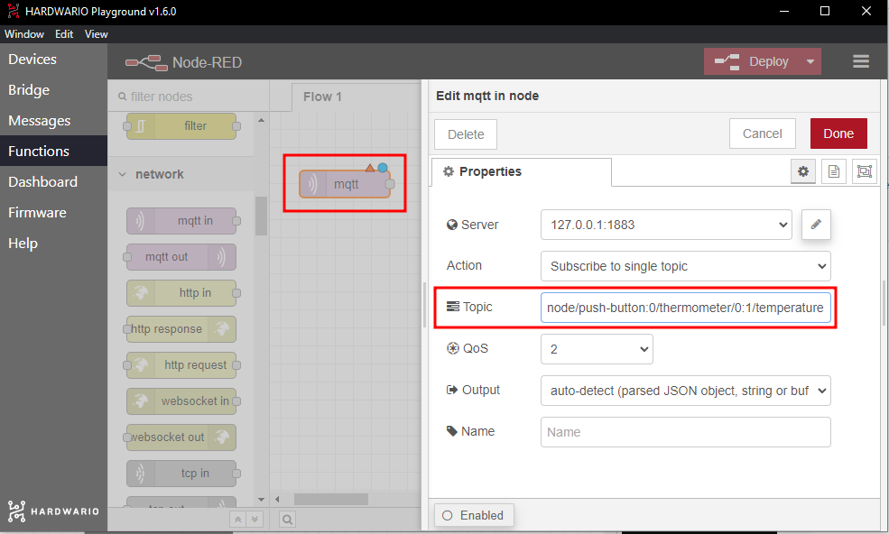

## Úvod

Užijte si s kamarády zábavu s IoT. Kdo z vás bude mít nejžhavější, nebo nejchladnější dech? Čím si k vítězství pomůžete, je na vás. Povoleno je všechno. 😱

V tomto projektu se naučíte **měřit teplotu pomocí IoT**. Stačí vám základní [**Sada Start**](https://www.hardwario.store/cz/p/start-set) od HARDWARIO.


## Připravte si krabičku

1. Sadu Start sestavte a spárujte. Do modulu Core Module potřebujete firmware **twr-radio-push-button**.

2. Otevřete v Playgroundu záložku **Messages**. Uvidíte v ní změny teploty. Krabička teplotu posílá sama, a to pravidelně každých 15 minut a navíc hned, jakmile se změní aspoň o 0,2 °C. Právě toho využijeme.


## Nastavte si Node-RED

1. Záložka Messages vám možná stačit nebude. ✌️ Postavte si z bublin v Node-RED vlastní barevný ukazatel teploty. Nejdřív v Playgroundu klikněte na záložku **Functions**.

2. Na prázdnou plochu umístěte světle fialový uzel (bublinu) s názvem **mqtt in**. Najdete ho v sekci **network**.

3. Uzel otevřete dvojklikem. V řádku **Topic** určíte, co má barevný ukazatel zobrazovat, tentokrát teplotu. Do řádku proto zkopírujte zprávu s teplotou ze záložky Messages (bez čísla), nebo klidně použijte tuto:
```
node/push-button:0/thermometer/0:1/temperature
```



Potvrďte tlačítkem **Done**.

4. Vedle uzlu umístěte druhý, tentokrát modrý uzel s názvem **gauge**. Najdete ho v sekci **dashboard**. Tento uzel určuje, jak se naměřená teplota zobrazí na obrazovce: jako ukazatel. Oba uzly propojte.


5. Na uzel Gauge dvakrát klikněte. V řádku **Type** nastavíte, jak se bude graf zobrazovat (nejlepší bude Gauge). V řádku **Range** upravíte minimální a maximální hodnotu ukazatele (zkuste 0 a 50).


Potvrďte tlačítkem **Done**.
**Náš tip:** V řádku **Label** můžete ukazatel libovolně přejmenovat.

6. Teď stiskněte červené tlačítko **Deploy** v pravém horním rohu obrazovky. 🚨 Tím celý flow aktivujete.
❗ **Pozor**: Po každé změně v uzlech musíte Deploy stisknout znovu.

7. Přepněte se na záložku **Dashboard**. Tady najdete svůj ukazatel. 😲


## Rozjeďte hru s kamarády

1. **Sedněte si s kamarády ke stolu.**

2. Nejdřív změřte, kdo v sobě skrývá **dračí oheň**. 🔥 **Jeden po druhém dýchejte na krabičku**. Pomůcky jsou dovolené: zkuste si dech zahřát vším, co máte po ruce. Zkoušejte všechno možné i nemožné. 🙌
❓ **Vyzkoušejte:** Zahřeje dech víc horký čaj, nebo pálivé papričky?

3. Po prvním kole následuje **mrazivé kolo**. ❄ Kdo dokáže dech ochladit tak, aby byl **nejchladnější**?
❓ **Vyzkoušejte:** Ochladí dech víc kostka ledu, nebo chladivá žvýkačka?

4. **Rekordy si zapište** a při příští hře je zkuste překonat.
