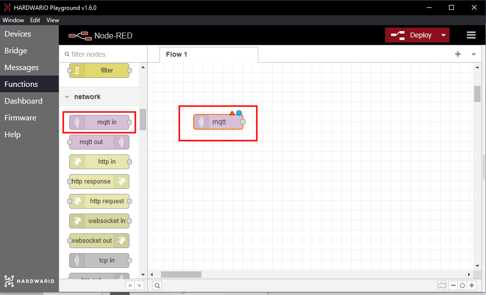
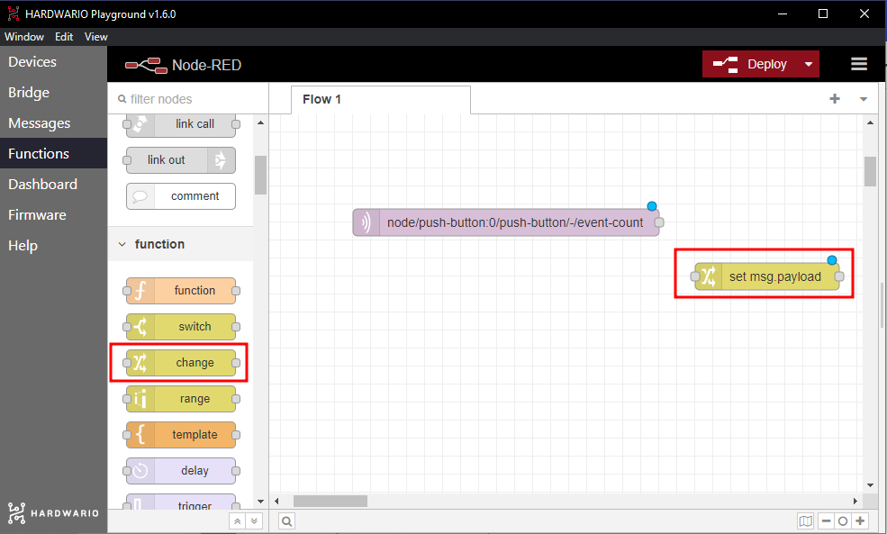
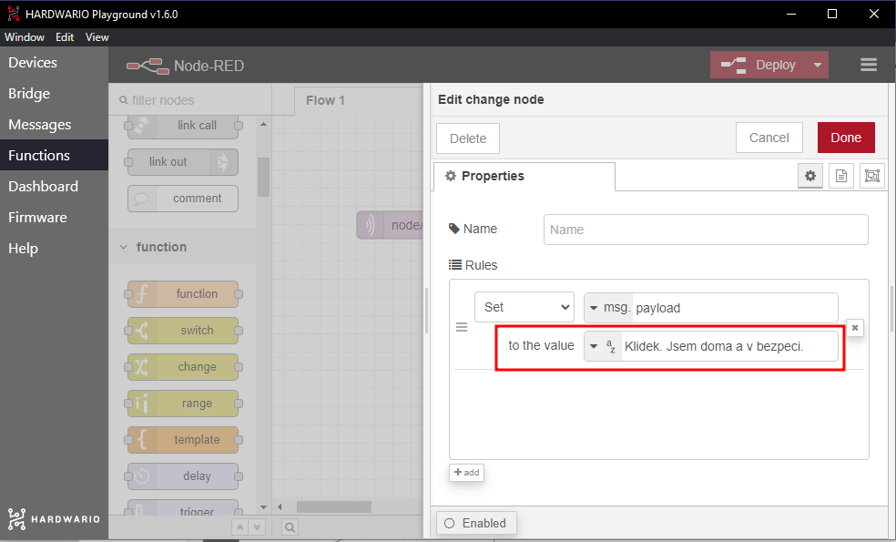
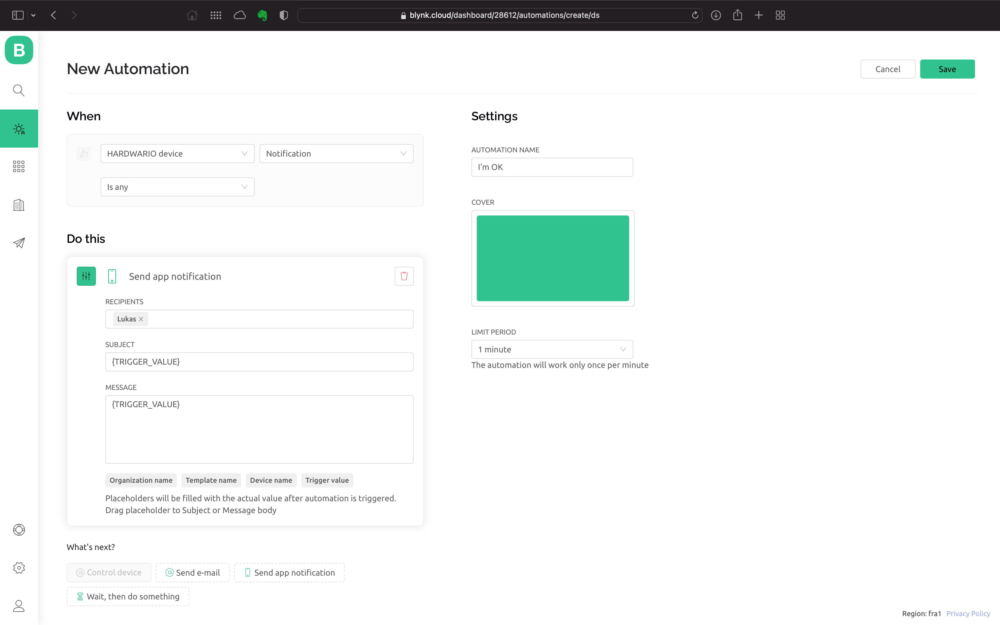
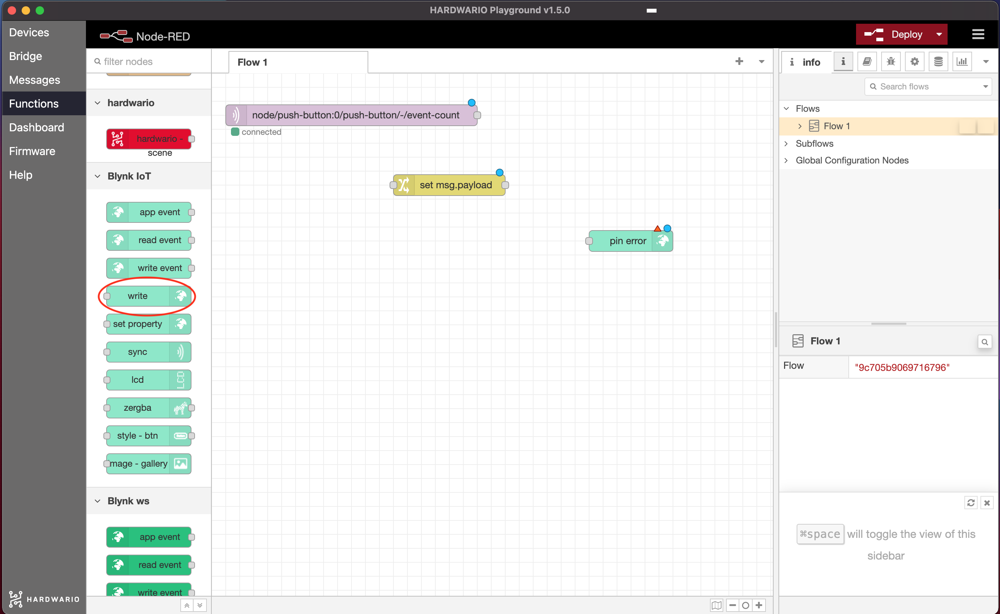
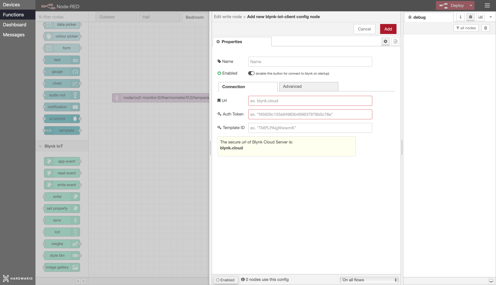
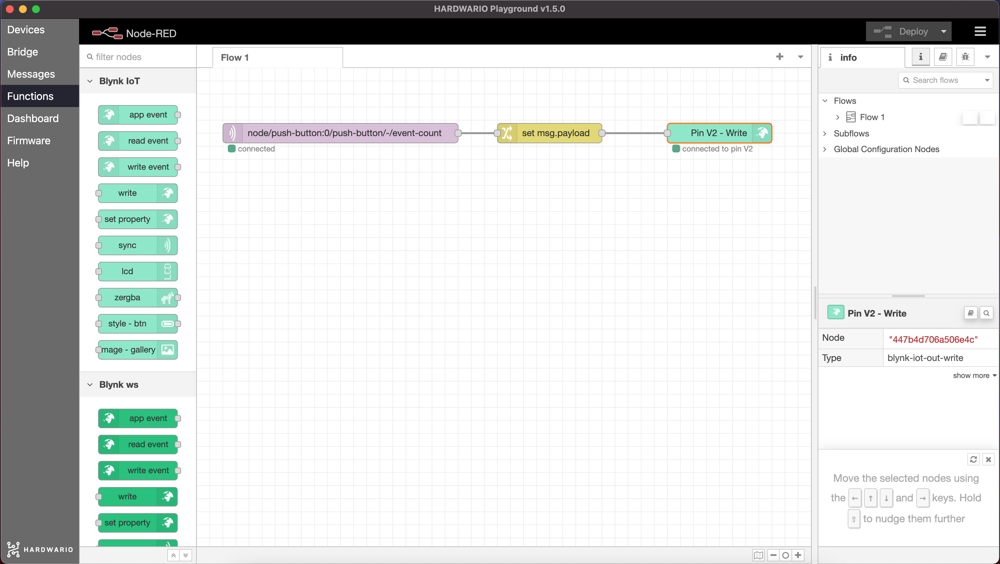
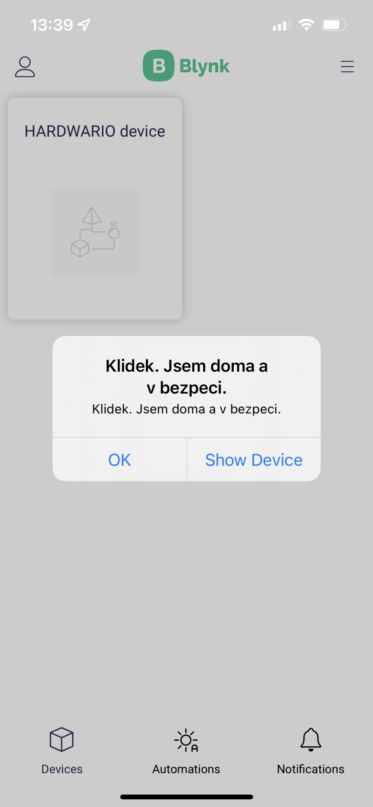

## Úvod

Rodiče vám každý den volají, jestli už jste ze školy doma? Je to sice otravné, ale prostě o vás mají starost. Vyrobte si tlačítko, kterým jim po příchodu domů pošlete jednoduchou zprávu do mobilu. 📲

V tomto projektu se naučíte, **jak tlačítkem poslat zprávu do mobilu rodičů**. 👩👱

Budete potřebovat jen **krabičku s tlačítkem** a **USB dongle**. Vystačíte si se základní sadou HARDWARIO, tedy [**Start Set**](https://www.hardwario.store/p/start-set/).


## Rozjeďte to v Node-RED

1. Sestavte a spárujte Start Set. Do modulu Core Module potřebujete firmware **radio push button**. Pokud nevíte, jak si firmware stáhnout nebo co to je, [najdete to tady](https://docs.hardwario.com/tower/firmware-development/hardwario-extension-tutorial/#flash-firmware).

2. V Playgroundu klikněte na **záložku Functions**, kde je programovací plocha [Node-RED](https://docs.hardwario.com/tower/desktop-programming/node-red-programming/).

3. Na plochu Node-RED umístěte světle fialovou bublinu, neboli uzel. Najdete ho vlevo jako **MQTT** v sekci Input.



4. V uzlu nastavíte klíčovou funkci: stisknutí tlačítka. Na uzel dvakrát klikněte a **do pole Topic zkopírujte tento řádek**:

```
node/push-button:0/push-button/-/event-count
```


Potvrďte tlačítkem **Done**.

**Tip:** Místo kopírování řádku odsud můžete příště jednoduše zkopírovat řádek, který se po stisknutí tlačítka objeví **v záložce Messages**.


## Nastavte si zprávu

1. Zprávu nastavíte také tady v Node-RED. Kamkoli vedle světle fialového uzlu MQTT přetáhněte **žlutý uzel s názvem Change ze sekce Function**.




2. Na uzel dvakrát klikněte a do pole **Rules** (pravidla) napište svou zprávu pro rodiče. Jen pozor, Blynk nezobrazuje háčky a čárky. Malá inspirace:
	- *Klidek. Jsem doma a v bezpeci.*
	- *Mame doma celebritu… Delam si srandu. To jsem ja.*
	- *Pokousali me psi, uneslo me UFO, ale uz jsem doma.*




Potvrďte tlačítkem **Done** a oba uzly propojte tažením myši od jedné bubliny ke druhé. 🐁


## Připravte si aplikaci Blynk IoT

1. Pokud ještě účet nemáte, vytvořte si ho v aplikaci [Blynk IoT](https://blynk.io). Postup najdete v [tomto návodu](https://docs.hardwario.com/tower/platform-integrations/blynk-app/), kde se dozvíte i to, jak se vytvářejí šablony a datastreamy. Budete potřebovat obojí.

2. Dále vytvořte šablonu zařízení, opět podle [stejného návodu](https://docs.hardwario.com/tower/platform-integrations/blynk-app/). Pokud už máte šablonu z předchozích projektů, klidně ji použijte.

3. Teď nastavte nový datastream. V detailu šablony klikněte na záložku **Datastreams** a vpravo nahoře na **Edit**. Objeví se tlačítko **+ New Datastream**. Klikněte na něj, vyberte **Virtual Pin** a otevře se dialogové okno:


4. Pojmenujte nový datastream a vyberte jeden z volných pinů. V notifikaci na mobilu chceme zobrazit vaši vlastní zprávu, proto **jako datový typ zvolte String** (textový řetězec).

5. Dole v dialogovém okně ještě rozbalte **Advanced settings** a zaškrtněte poslední volbu **Expose to Automation**, aby šel datastream použít v automatizacích. V nabídce vedle zvolte **Sensor** a zaškrtněte také **Available in Conditions**. Datastream vytvoříte kliknutím na **Create**.


6. Práci uložte tlačítkem **Save** vpravo nahoře.

## Založte zařízení

Pokud ještě zařízení nemáte, založte si ho z vytvořené šablony. Postup popisujeme [v návodu, který už znáte](https://docs.hardwario.com/tower/platform-integrations/blynk-app/).

## Vytvořte automatizaci

1. Přepněte se do sekce **Automation** a klikněte na tlačítko **+ Create Automation**.


2. Z nabízených možností vyberte **Device State**. Automatizace se vyhodnotí pokaždé, když do aplikace pošlete zprávu.


3. Nastavení automatizace je jednoduché: v sekci **When** nastavíte, kdy se má automatizace spustit, a v sekci **Do this**, co se má potom stát.

4. Nejdřív nastavte sekci **When**: vyberte své zařízení a **vytvořený datastream**. Objeví se třetí nabídka, tu nechte nastavenou na **Is Any**.

5. V sekci **Do This** klikněte na **Send app notification** a nastavte příjemce. Pro zjednodušení zadejte sebe. Do polí **Subject** a **Message** přetáhněte myší položku **Trigger value**. Je to proměnná, ve které bude uložený text vaší zprávy.

6. Nakonec nezapomeňte vyplnit **název automatizace**. V nabídce **Limit period** můžete nastavit, za jak dlouho nejdříve může po jedné notifikaci přijít další.




7. Automatizaci uložte tlačítkem **Save**.


## Nastavte mobilní aplikaci

1. Půjčte si od mámy nebo táty telefon a udělejte ho ještě o kousek chytřejší. 🤓 Aby se jim vaše zpráva zobrazila, musí mít v mobilu **aplikaci Blynk IoT**. Stáhnete ji z [App Store](https://apps.apple.com/us/app/blynk-iot/id1559317868) nebo [Google Play](https://play.google.com/store/apps/details?id=cloud.blynk).

2. Po instalaci se přihlaste svým účtem.


## Propojte mobil s krabičkou

1. Vraťte se k počítači. Na ploše Node-RED přidejte za oba uzly **zelený uzel Write**. Najdete ho vlevo v sekci **Blynk IoT** (pozor, ne Blynk ws).




2. Uzel otevřete dvojklikem. Vpravo uvidíte **malou tužku**. Klikněte na ni a otevře se nové okno. Do pole **Url** vložte ``blynk.cloud`` a do polí **Auth Token** a **Template ID** zkopírujte hodnoty z detailu zařízení ve webové aplikaci na počítači.




Nastavení potvrďte tlačítkem **Add**.

3. Vyplňte číslo virtuálního pinu vytvořeného datastreamu a vše uložte tlačítkem **Done**.

4. **Uzel s Blynkem propojte se žlutým uzlem, ve kterém jste nastavili zprávu.** Teď máte zařízení naprogramované tak, aby se stisknutí tlačítka na krabičce ➡️ proměnilo ve zprávu, ➡️ která doputuje až do mobilu vašich rodičů. 👾




❗ Celý flow spusťte a potvrďte červeným tlačítkem **Deploy** vpravo nahoře. 🚨

## A… akce!

1. Stiskněte tlačítko. Rodičům v mobilu **vyskočí zpráva**. 💪




2. Rodiče si o vás budou myslet, že máte talent, a vy si navíc ušetříte jejich každodenní telefonáty. 🎉 **A to je prostě tak chytré, až je to IoT.** 🕺
