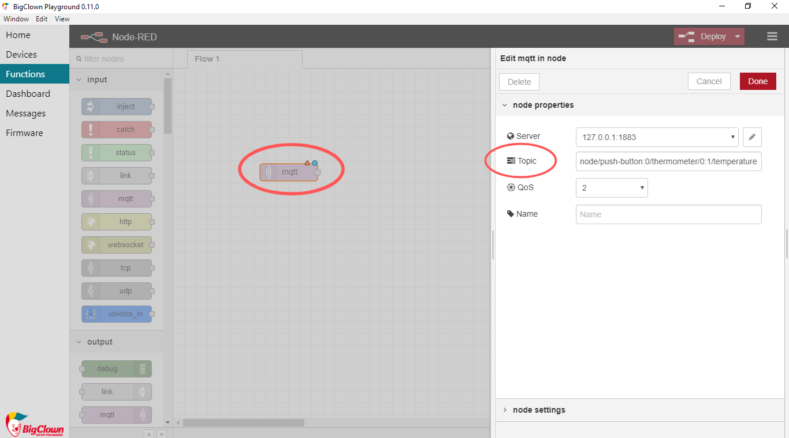
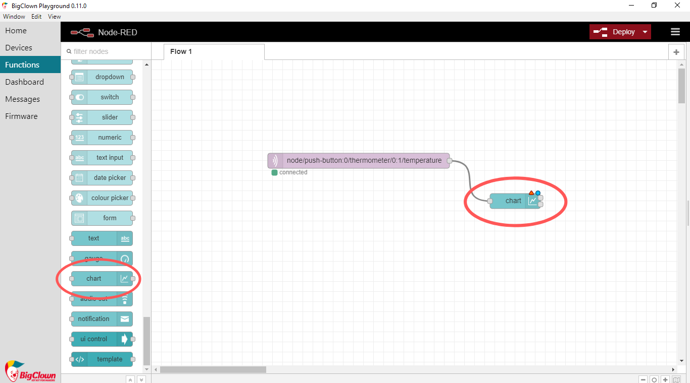
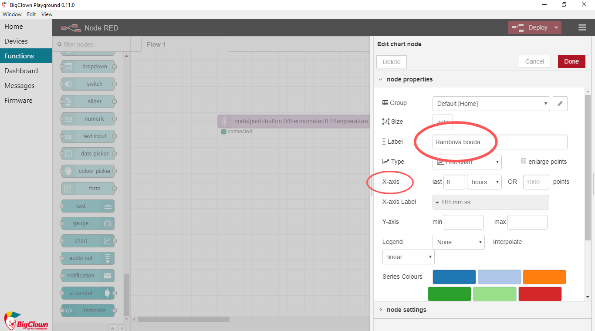
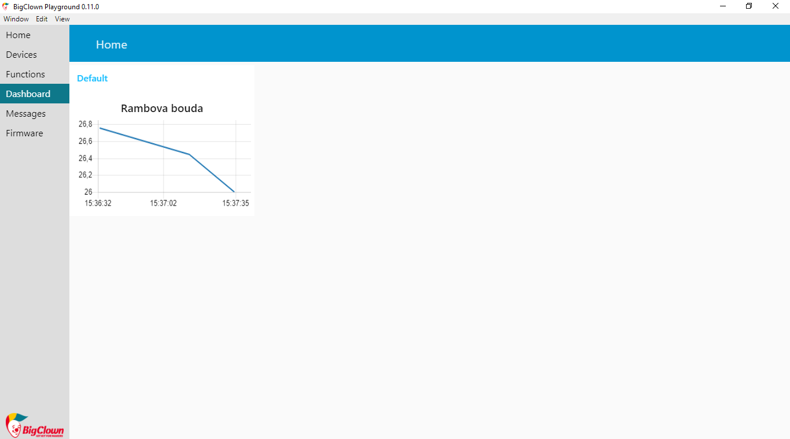

## Úvod


Zima, že by ani psa nevyhnal? Hlídejte teplotní pohodlí svého nejlepšího přítele a sledujte teplotu v jeho boudě. 🐶


S tímto projektem se naučíte **měřit teplotu s IoT a zobrazit ji v grafu**. Stačí vám základní sada HARDWARIO, tedy [**Start Set**](https://www.hardwario.store/p/start-set/). Uvidíte, že vám pes poděkuje. Třeba tím, že bude míň nepořádku. Nebo tak nějak. 🐩


## Připravte si krabičku

1. Start Set sestavte a spárujte. Do modulu Core Module potřebujete firmware **radio push button**. Pokud nevíte, jak si firmware stáhnout nebo co to je, [najdete to tady](https://docs.hardwario.com/tower/firmware-development/hardwario-extension-tutorial/#flash-firmware)

2. Změny teploty uvidíte v Playgroundu v záložce **Messages**.


## Nastavte si Node-RED

1. Programovat začnete v Node-RED. Nejdřív v Playgroundu klikněte na záložku **Functions**.

2. Na čistou plochu přetáhněte světle fialový node (bublinu) s názvem **MQTT**. Najdete ho v sekci Input.

3. Node otevřete dvojklikem. V řádku **Topic** určíte, co má barevný ukazatel zobrazovat. Teď to bude teplota. Proto do řádku zkopírujte zprávu s teplotou ze záložky Messages (bez čísla). Nebo klidně použijte tuto:

```
node/push-button:0/thermometer/0:1/temperature
```



Potvrďte tlačítkem **Done**.

4. Vedle něj umístěte druhý, světle modrý node s názvem **Chart** (graf). Najdete ho v sekci Dashboard. Tímto nodem určíte, jak se naměřená teplota zobrazí na obrazovce. Oba nody propojte. 👌



5. Na node Chart dvakrát klikněte. V řádku **X-axis** nastavíte, za jak dlouhé období bude graf teplotu ukazovat. Zvolte, kolik potřebujete.
V řádku **Label** graf libovolně pojmenujte.



Potvrďte tlačítkem **Done**.


6. Teď stiskněte červené tlačítko **Deploy** v pravém horním rohu obrazovky. 🚨 Tím celý flow aktivujete.

❗ **Pozor:** Po každé změně v nodech musíte Deploy stisknout znovu.

7. Přepněte se na záložku **Dashboard**. Tady je váš graf. 👏


## A akce!

1. Krabičku přilepte kobercovou páskou **dovnitř boudy na stěnu**. 🏡

2. Sledujte, **jak se mění teplota**, když je pes venku a když je uvnitř. Pes totiž boudu trochu zahřívá. 🐕
**Náš tip:** Až teploty klesnou, vyložte boudu dekou nebo slámou.

3. Když je pod −15 °C, na nic nečekejte a **pusťte psa dovnitř domu**, aspoň do předsíně. ❄

4. Uvidíte, že **pes bude spokojený**! 👌
