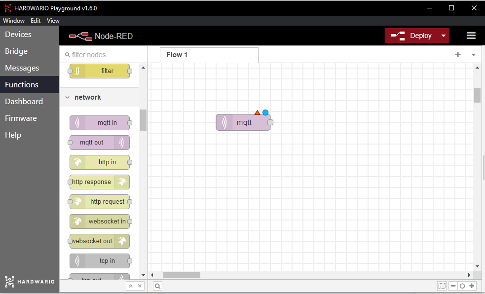

## Úvod

Node-RED je jednoduchý, ale mocný nástroj a my si nyní ukážeme jak vytvořit jednoduchý dadshborad a zobrazovat v něm informace o počtu stisknutí tlačítka, teplotě a stavu naklonění. 

## Kolikrát jsem stiskl tlačítko?

Abychom mohli zobrazovat hodnotu stisknutí, musíme jí nejprve někde vzít.

1. Pokud nemáme, tak si spustíme **HARDWARIO Playgroun**. Z předešlého návodu víme že se nám zobrazuje v **Messages** a pokud zde klikneme na řádek s topicem `node/motion-detector:0/push-button/-/event-count` tak se nám tento zkopíruje do schránky, což nám ještě potvrdí vyskakovací info panel.

> Pokud bychom měli spárovaných více **Push button** modulů, tak se nám budou lišit v čísle za \`motion-detector:\`

2. Nyní se přesunem do **Functions**. Jde o vloženou aplikaci **Node-RED**. Existuje k ní skvělá dokumentace, podpora i obrovská komunita uživatelů. Funguje na principu **vizuálního programování** - na plochu si přidáváte funkční bloky, kterým říkáme **nody**, a jejich spojením **vytvoříte funkční aplikaci** (flow).
3. Smažte dva nody, které máte na ploše.
4. Začneme přidáním nodu **mqtt in**. Najdete jej vlevo v sekci **network**. Přetáhněte jej na plochu.

5. Dvakrát na něj klikněte, otevře se vám nastavovací okno nodu, ve kterém potřebujeme vyplnit pole **topic**. To určí, jaké zprávy chceme v této flow přijímat.
6. Vraťte se v Playgroundu do záložky **Messages** a najděte zprávu s teplotou. Kromě hodnoty teploty vidíte vedle i identifikaci zprávy, vypadá takto: `node/push-button:0/thermometer/0:1/temperature` a jedná se o **topic**. 
7. Zkopírujte si tento topic, přejděte zpět do sekce **Functions**, vložte jej do pole **Topic** a uložte nastavení tlačítkem **Done**.
8. Nyní vložte na plochu node **Gauge**, ten najdete mezi nody v sekci **dashboard**.
9. Dvakrát na něj klikněte, ať se otevře jeho nastavení. Nyní změníme jen hodnotu **max** v sekci **Range** na **50**. Uložte nastavení tlačítkem **Done**.
10. Nyní oba nody propojte. Je to snadné, stačí stisknout šedý čtverec jednoho nodu a myší jej natáhnout k šedému čtverci druhého nodu.
11. Tlačítkem **Deploy** vpravo nahoře nyní můžete spustit aplikaci a přepnout se do záložky **Dashboard** v Playgroundu.
12. Dýchněte na zařízení, abyste vyvolali okamžitou zprávu o teplotě a IoT! V grafu uvidíte aktuální teplotu.