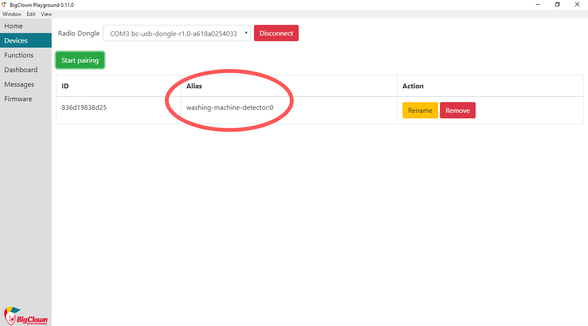
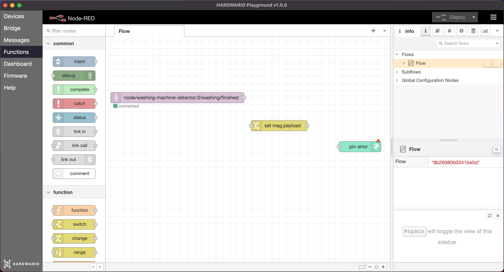
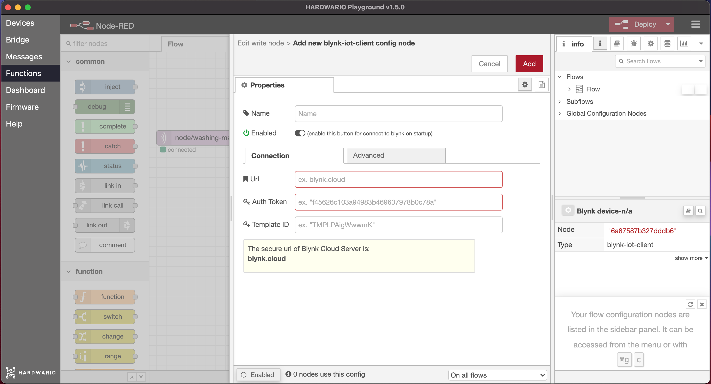

import Image from '@theme/IdealImage';

## Úvod

Zvyšte rodinné pračce IQ. 🤖 S krabičkou IoT naprogramujete upozornění, ze kterého se rodiče dozvědí, že pračka doprala.

V tomto projektu se naučíte **nastavit krabičku tak, aby poznala, kdy pračka dopere**, a poslala o tom **upozornění na mobil**. 📱 👈

Budete potřebovat jen **krabičku s tlačítkem** a **USB dongle**. Vystačíte si proto se základní sadou HARDWARIO [**Start Set**](https://www.hardwario.store/p/start-set/).


## Stáhněte si nový firmware


1. Do modulu Core Module nahrajte nový firmware **bcf-radio-washing-machine-monitor** (najdete ho mezi ostatním firmwarem v Playgroundu). Díky tomuto firmwaru bude krabička citlivěji vnímat otřesy pračky. 🔃

**Náš tip:** Nevíte, jak si firmware stáhnout nebo co to je? [Najdete to tady](https://docs.hardwario.com/tower/firmware-development/hardwario-extension-tutorial/#flash-firmware).

2. [Spárujte modul Core Module s USB donglem](https://docs.hardwario.com/tower/platform-integrations/homekit-and-siri/#pair-the-device). Hned po spárování uvidíte, že se alias modulu Core Module změnil na **washing-machine-detector**. 👌



## Rozjeďte to v Node-RED

1. V Playgroundu klikněte na **záložku Functions**, kde je programovací plocha [Node-RED](https://docs.hardwario.com/tower/desktop-programming/node-red-programming). 🤖

2. Začněte jako vždy: na plochu nejdřív umístěte **uzel MQTT** ze sekce Input.
Dvakrát na něj klikněte a do řádku **Topic** zkopírujte tento topic, přes který krabička ohlásí, že se pračka přestala otřásat:

```
node/washing-machine-detector:0/washing/finished
```

<div class="container">
  <div class="row">
    <Image img={require('./img/smart-washing-machine/smart-washing-machine-1.webp')} alt="Dialog Edit mqtt in node s topicem konce praní vloženým do zvýrazněného pole Topic"/>
  </div>
</div>

Potvrďte tlačítkem **Done**.

3. Vedle něj umístěte **uzel Change** ze sekce Function.

<div class="container">
  <div class="row">
    <Image img={require('./img/smart-washing-machine/smart-washing-machine-2.webp')} alt="Plocha Node-RED s uzlem Change vedle uzlu MQTT pro washing-machine-detector"/>
  </div>
</div>

4. V uzlu Change **nastavíte zprávu**, která rodičům po doprání přijde do mobilu. Myslete na to, že by měla být bez háčků a čárek.
Malá inspirace:
    - Mate tam ciste pradlo.
    - Doprala jsem. Dostanu ted tyden dovolene?
    - Doprano, tak me nechte byt. Vase pracka.

<div class="container">
  <div class="row">
    <Image img={require('./img/smart-washing-machine/smart-washing-machine-3.webp')} alt="Dialog Edit change node: msg.payload nastaven na text upozornění"/>
  </div>
</div>

Potvrďte tlačítkem **Done**.

## Připravte si aplikaci Blynk IoT

1. Pokud ještě účet nemáte, vytvořte si ho v aplikaci [Blynk IoT](https://blynk.io). Postup najdete v [tomto návodu](https://docs.hardwario.com/tower/platform-integrations/blynk-app/), kde se dozvíte i to, jak se vytvářejí šablony a datastreamy. Budete potřebovat obojí.

2. Dále vytvořte šablonu zařízení, opět podle [stejného návodu](https://docs.hardwario.com/tower/platform-integrations/blynk-app/). Pokud už máte šablonu z předchozích projektů, klidně ji použijte.

3. Teď nastavte nový datastream. V detailu šablony klikněte na záložku **Datastreams** a vpravo nahoře na **Edit**. Objeví se tlačítko **+ New Datastream**. Klikněte na něj, vyberte **Virtual Pin** a otevře se dialogové okno:


4. Pojmenujte nový datastream a vyberte jeden z volných pinů. V notifikaci na mobilu chceme zobrazit vaši vlastní zprávu, proto **jako datový typ zvolte String** (textový řetězec).

5. Dole v dialogovém okně ještě rozbalte **Advanced settings** a zaškrtněte poslední volbu **Expose to Automation**, aby šel datastream použít v automatizacích. V nabídce vedle zvolte **Sensor** a zaškrtněte také **Available in Conditions**. Datastream vytvoříte kliknutím na **Create**.


6. Práci uložte tlačítkem **Save** vpravo nahoře.

## Založte zařízení

Pokud ještě zařízení nemáte, založte si ho z vytvořené šablony. Postup popisujeme [v návodu, který už znáte](https://docs.hardwario.com/tower/platform-integrations/blynk-app/).

## Vytvořte automatizaci

1. Přepněte se do sekce **Automation** a klikněte na tlačítko **+ Create Automation**.


2. Z nabízených možností vyberte **Device State**. Automatizace se vyhodnotí pokaždé, když do aplikace pošlete zprávu.


3. Nastavení automatizace je jednoduché: v sekci **When** nastavíte, kdy se má automatizace spustit, a v sekci **Do this**, co se má potom stát.

4. Nejdřív nastavte sekci **When**: vyberte své zařízení a **vytvořený datastream**. Objeví se třetí nabídka, tu nechte nastavenou na **Is Any**.

5. V sekci **Do This** klikněte na **Send app notification** a nastavte příjemce. Pro zjednodušení zadejte sebe. Do polí **Subject** a **Message** přetáhněte myší položku **Trigger value**. Je to proměnná, ve které bude uložený text vaší zprávy.

6. Nakonec nezapomeňte vyplnit **název automatizace**. V nabídce **Limit period** můžete nastavit, za jak dlouho nejdříve může po jedné notifikaci přijít další.


7. Automatizaci uložte tlačítkem **Save**.

## Nastavte mobil

1. Je čas ukrást mámě nebo tátovi na chvíli mobil a nastavit jim Blynk IoT. Pokud s Blynkem ještě neumíte, [**podívejte se na návod**](https://docs.hardwario.com/tower/platform-integrations/blynk-app/).

2. V Blynku se přihlaste svým účtem.

## Dokončete programování

1. Vraťte se k počítači. Na ploše Node-RED přidejte za oba uzly **zelený uzel Write**. Najdete ho vlevo v sekci **Blynk IoT** (pozor, ne Blynk ws).



2. Dvakrát klikněte na uzel a pak na **tužku**. ✏


3. Otevře se okno pro připojení k Blynku. Do pole **Url** zadejte ``blynk.cloud`` a do polí **Auth Token** a **Template ID** zkopírujte hodnoty z detailu zařízení ve webové aplikaci na počítači.



Nastavení potvrďte tlačítkem **Add**.

4. Vyplňte číslo virtuálního pinu vytvořeného datastreamu a vše uložte tlačítkem **Done**.

5. Teď už zbývá jen uzly **propojit** a červeným tlačítkem **Deploy** vpravo nahoře vyslat povel do vesmíru. 👏


## Roztočte to!

1. **Krabičku položte na pračku** a přilepte ji malým kouskem izolepy, aby nespadla.

2. **Krabička pozná, že pračka doprala**, protože se přestala otřásat, a pošle o tom zprávu mámě nebo tátovi na mobil.
Paráda, ne? A rázem žijete v **chytré domácnosti**! 🤡


