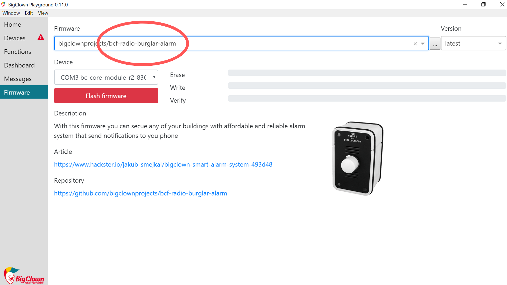

import Image from '@theme/IdealImage';

## Úvod

Leze ti mladší brácha do pokoje? Jedeš na dovolenou a bojíš se, že ti někdo ukradne tvůj poklad? Nastav si alarm proti všem nenechavcům. 👮

V tomhle projektu se naučíš vytvořit **detektor cizí přítomnosti, který ti pošle upozornění na mobil**. 👁️

Pokud máš Starter Set, budeš k němu potřebovat ještě [**PIR Module**](https://www.hardwario.store/cz/p/pir-module). Kompletní výbavu najdeš v sadě [Motion Set](https://www.hardwario.store/cz/p/motion-set).


## Stáhni si nový firmware

1. Pokud to ještě nemáš, Motion Set si sestav.
2. Na Core Module nahraj speciální firmware, a to bcf-radio-burglar-alarm (najdeš ho mezi ostatním firmwarem v Playgroundu). Díky tomuhle firmwaru krabička odhalí zloděje. 👂



**Náš tip**: Nevíš, jak si firmware stáhnout nebo co to je? [Zjistíš to tady](https://docs.hardwario.com/tower/firmware-development/firmware-quick-start/).

1. Core Module spáruj s USB Donglem. Hned po spárování uvidíš, že tvůj Core Module změnil Alias na **Burglar alarm**.

<div class="container">
  <div class="row">
    <Image img={require('./img/thief-trap/thief-trap-2.webp')}/>
  </div>
</div>

❓ **Věděl jsi**? Burglar znamená v angličtině zloděj. Burglarem byl třeba Bilbo Pytlík z Hobita, když kradl v dračí pokladnici. 🐉

## Připrav Blynk IoT pro notifikace

Krabička se propojí s tvým smartphonem díky aplikaci **Blynk IoT**, kde ti alarm přijde jako push notifikace. 📱

1. Pokud ještě žádný nemáš, vytvoř si účet v [Blynk IoT](https://docs.hardwario.com/tower/platform-integrations/blynk-app/). V [tomhle návodu](https://docs.hardwario.com/tower/platform-integrations/blynk-app/) zjistíš, jak si nastavit účet, šablonu zařízení (device template) a zařízení (device) — budeš potřebovat všechny tři. Klidně můžeš použít i šablonu z některého z předchozích projektů.

2. V Blynk IoT se push notifikace neumisťuje na plochu telefonu jako widget — posílá se jako **Event** definovaný na tvé šabloně. V detailu šablony otevři záložku **Events** a přidej nový event (například ho pojmenuj `thief` a dej mu zprávu, kterou chceš dostat, třeba "Someone's in your room"). Pak pro tenhle event zapni **Notifications**, aby ti ho Blynk doručil na mobil. [Návod](https://docs.hardwario.com/tower/platform-integrations/blynk-app/) tě nastavením šablony provede.

3. Alarm chceš taky zapínat a vypínat z mobilu, aby nepípal, když jsi doma. 🔕 Na stejnou šablonu přidej **Datastream** (virtuální pin) a v aplikaci na něj umísti widget **switch** (přepínač) — přepínač posílá `1` (zapnuto) nebo `0` (vypnuto). Tuhle hodnotu si za chvíli načteš zpátky v Node-RED.

4. Stáhni si do mobilu aplikaci **Blynk IoT** z [App Store](https://apps.apple.com/us/app/blynk-iot/id1559317868) nebo [Google Play](https://play.google.com/store/apps/details?id=cloud.blynk) a přihlas se stejným účtem. Zkontroluj, že má aplikace povolené notifikace, aby ti mohl alarm naskočit. 🚨

## Načti přepínač zapnutí alarmu v Node-RED

1. V Playgroundu klikni na **záložku Functions**, kde je programovací plocha [Node-RED](https://docs.hardwario.com/tower/desktop-programming/node-red-programming/). 🤖
2. Začni programovat a rovnou do toho skoč po hlavě. První node bude totiž obsahovat malý javascriptík. Na plochu ho vložíš pomocí nodu **Function** ze stejnojmenné sekce.

Dvakrát na něj klikni a do pole Label napiš název nodu: Int parser.

Do pole Function pak zkopíruj tento jednoduchý javascript:

```
msg.payload = parseInt(msg.payload);
return msg;
```


<div class="container">
  <div class="row">
    <Image img={require('./img/thief-trap/thief-trap-3.webp')}/>
  </div>
</div>

3. Teď přidej node, se kterým budeš moct sledování zlodějů zapínat a vypínat. To aby mobil nezačal plašit, až budeš doma ty. 🔕
   Uděláš to pomocí **nodu Switch** ze sekce Dashboard.


<div class="container">
  <div class="row">
    <Image img={require('./img/thief-trap/thief-trap-4.webp')}/>
  </div>
</div>
4. Na node dvakrát klikni a změň jeho **Label** na Spouštěč. Potom uprav **On Payload** a **Off Payload** na 1 a 0 (viz obrázek).

Potvrď tlačítkem **Done**.


<div class="container">
  <div class="row">
    <Image img={require('./img/thief-trap/thief-trap-5.webp')}/>
  </div>
</div>

5. Alarm chceš zapínat i z mobilu. Přidej node ze sekce **Blynk IoT**, který načítá datastream (node **read / input**), a nasměruj ho na virtuální pin přepínače zapnutí alarmu, který jsi vytvořil na šabloně.

6. Dvakrát na něj klikni, ať ho otevřeš. Vpravo uvidíš **malou tužtičku**. Klikni na ni a otevře se ti nové okno. Do pole **Url** napiš `blynk.cloud` a do polí **Auth Token** a **Template ID** zkopíruj hodnoty z detailu zařízení ve webové aplikaci Blynk IoT na svém počítači. Potvrď tlačítkem **Add**. (Tohle samé propojení použiješ pro každý Blynk IoT node v tomhle projektu.)

7. Za Dashboard switch i za Blynk IoT read node postav javascriptí **node Function**. Díky němu si projekt pamatuje, jestli je zrovna alarm zapnutý — ať už ho nastavíš z počítače (Dashboard) nebo z mobilu (Blynk IoT).

V řádku **Name** vyplň Stav nastavení upozornění a do pole **Function** zkopíruj tento kódík:

```
if(msg.payload == "1")
{
 flow.set("alarmOn", 1);
}
else
{
 flow.set("alarmOn", 0);
}
return msg;
```

<div class="container">
  <div class="row">
    <Image img={require('./img/thief-trap/thief-trap-10.webp')}/>
  </div>
</div>

8. Pak celý tenhle flow pospojuj. Ještě ale neodcházej, čeká tě nastavení dvou dalších miniflow.


## Naprogramuj hlavní senzor

1. Celý projekt funguje na principu pohybového čidla – když ti do pokoje vnikne zloděj, krabička si ho všimne a alarm aktivuje.

A díky měření okolní teploty může alarm měnit svůj stav tak, aby se udržel v low power módu – prostě aby moc neždímal baterky v krabičce. 🔋

V dalším flow tedy začni starým dobrým **nodem MQTT** ze sekce Input. V něm nastav jako **Topic** měření teploty:

```
node/burglar-alarm:0/thermometer/0:1/temperature
```

<div class="container">
  <div class="row">
    <Image img={require('./img/thief-trap/thief-trap-11.webp')}/>
  </div>
</div>

2. Hned za něj postav další node Function. Do pole Name napiš Stav alarmu a kód použij tento:


```
msg.payload = flow.get("alarmOn");
return msg;
```

Díky tomuhle node bude senzor aktivní jenom v případě, že ho spustíš tlačítkem v Blynku nebo na počítači.

<div class="container">
  <div class="row">
    <Image img={require('./img/thief-trap/thief-trap-12.webp')}/>
  </div>
</div>

3. A do třetice (všeho nejlepšího) hoď na plochu node MQTT ze sekce

**Output** (bacha na to ❗).

V něm nastav jako Topic _node/burglar-alarm:0/alarm/-/set/state_, přes který senzor pošle na alarm svůj stav. A pokud máš v Blynku nebo dashboardu zapnutý spínáč, alarm se aktivuje. 👮
4. Pak tyhle tři krasavce **pospojuj**.

<div class="container">
  <div class="row">
    <Image img={require('./img/thief-trap/thief-trap-13.webp')}/>
  </div>
</div>


## Nastav si svoji zprávu

1. V posledním miniflow si nastavíš zprávu, která ti přijde na mobil, když alarm někoho zachytí. 📩

Nejdřív si na plochu postav **MQTT node ze sekce Input**. V něm nastav jako **Topic** node/burglar-alarm:0/pir/-/event-count. Znamená to, že node se aktivuje, pokud bude aktivní a někdo kolem něj projde. Prostě vychytané pohybové čidlo.

<div class="container">
  <div class="row">
    <Image img={require('./img/thief-trap/thief-trap-14.webp')}/>
  </div>
</div>

2. Za něj patří javascriptík, tedy **node Function**. Jako **Name** nastav _Zpráva_ a kód máš tady:


```
msg.payload = "Nekdo je ve tvem pokoji"
return msg;
```

**Náš tip**: Hlášku v kódu si klidně přepiš, ale nezapomeň na to, že Blynk nepřečte háčky ani čárky. Holt cizinec no. 🤷


<div class="container">
  <div class="row">
    <Image img={require('./img/thief-trap/thief-trap-15.webp')}/>
  </div>
</div>

3. Nakonec sem hoď node ze sekce **Blynk IoT**, který umí spustit tvůj event (node **log event**). Použije propojení, které jsi nastavil dřív (Url `blynk.cloud`, Auth Token + Template ID), takže na tužtičku už klikat nemusíš. Dvakrát na něj klikni a nastav ho tak, aby spouštěl **Event**, který jsi vytvořil na šabloně (jeho kód, např. `thief`). Právě tohle promění zachycený pohyb v push notifikaci na tvém mobilu.

4. **Spoj** tyhle prvky tak, aby se z pohybu ➡️ stala tvoje zpráva ➡️ která spustí Blynk IoT event ➡️ jenž ti přijde na mobil. 👾 A konečně zmáčkni červené tlačítko **Deploy**.

## A... akce!

1. Až budeš chtít alarm spustit, **nastav switch** na počítači (v záložce Dashboard) nebo na mobilu. Obě tlačítka spolupracují, proto stačí nastavit buď jedno, nebo druhé.


<div class="container">
  <div class="row">
    <Image img={require('./img/thief-trap/thief-trap-18.webp')}/>
  </div>
</div>

2. Postav svou krabičku ke dveřím. Až krabička zachytí pohyb, **vyšle ti do mobilu upozornění**.


Zlodějové, střezte se, zákon je tu! 😱
