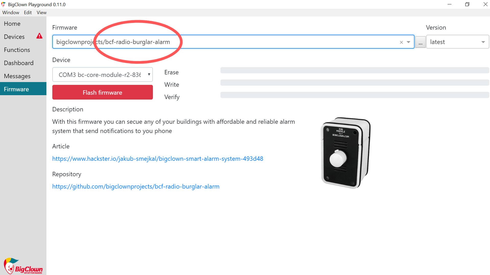

import Image from '@theme/IdealImage';

## Úvod

Leze vám mladší bratr do pokoje? Jedete na dovolenou a bojíte se, že vám někdo ukradne poklad? Nastavte si alarm proti všem nenechavcům. 👮

V tomto projektu se naučíte vytvořit **detektor cizí přítomnosti, který vám pošle upozornění na mobil**. 👁️

Pokud máte Sadu Start, budete k ní potřebovat ještě [**PIR Module**](https://www.hardwario.store/cz/p/pir-module). Kompletní výbavu najdete v [Sadě Motion](https://www.hardwario.store/cz/p/motion-set).


## Stáhněte si nový firmware

1. Pokud jste to ještě neudělali, sestavte Sadu Motion.
2. Do modulu Core Module nahrajte speciální firmware **twr-radio-burglar-alarm** (najdete ho mezi ostatním firmwarem v Playgroundu). Díky tomuto firmwaru krabička odhalí zloděje. 👂



**Náš tip**: Nevíte, jak si firmware stáhnout nebo co to je? [Najdete to tady](https://docs.hardwario.com/tower/desktop-programming/firmware-flashing/).

3. Spárujte modul Core Module s USB donglem. Hned po spárování uvidíte, že se alias modulu Core Module změnil na **burglar-alarm**.

<div class="container">
  <div class="row">
    <Image img={require('./img/thief-trap/thief-trap-2.webp')} alt="Záložka Devices v Playgroundu: řádek spárovaného zařízení se zvýrazněným aliasem burglar-alarm:0"/>
  </div>
</div>

❓ **Věděli jste?** Anglické slovo burglar znamená lupič. Takovým burglarem byl třeba Bilbo Pytlík z Hobita, když kradl v dračí pokladnici. 🐉

## Připravte Blynk IoT na notifikace

Krabička se s vaším telefonem propojí přes aplikaci **Blynk IoT**, kam vám alarm přijde jako push notifikace. 📱 Node-RED pošle text alarmu do Blynku a automatizace v Blynku z každé nové zprávy udělá notifikaci.

1. Pokud ještě nemáte účet v [Blynk IoT](https://blynk.io), založte si ho. Na tento projekt stačí bezplatný tarif: v době psaní návodu zahrnuje push notifikace v aplikaci a až pět automatizací.

2. Vytvořte šablonu zařízení (template). Jak na to, ukazuje [rychlý návod Blynku](https://docs.blynk.io/en/getting-started/template-quick-setup). Můžete také použít šablonu z některého předchozího projektu.

3. Alarm budete chtít zapínat a vypínat i z mobilu, aby nepípal, když jste doma. 🔕 V šabloně otevřete záložku **Datastreams**, klikněte na **New Datastream** a vyberte **Virtual Pin**. Datastream pojmenujte (třeba `Alarm`), vyberte pin V2 a zvolte typ **Integer** s rozsahem **0–1**. Přepínač v mobilu bude posílat `1` (zapnuto) nebo `0` (vypnuto) a tuto hodnotu za chvíli načtete v Node-RED.

4. Přidejte druhý datastream typu **Virtual Pin**, tentokrát pro zprávu alarmu. Pojmenujte ho (třeba `Zprava`), vyberte pin V3 a jako datový typ (**Data Type**) zvolte **String**, protože notifikace ponese váš vlastní text. V jeho nastavení povolte, aby ho automatizace mohly použít jako spouštěč: v části **Automations** zapněte **Use as Condition**. Datastream vytvořte a šablonu uložte.

5. Ze šablony založte zařízení: v sekci **Devices** přidejte nové zařízení, vyberte svou šablonu a zařízení pojmenujte. Na jeho záložce **Device Info** najdete **Auth Token**, který budete potřebovat v Node-RED.

## Vytvořte automatizaci

1. V Blynku otevřete **Automations** a založte novou automatizaci. Jako podmínku (**When**) zvolte **Device State**, pak své zařízení, datastream pro zprávu (V3) a **Is Any**. Automatizace tak zareaguje na každou zprávu, i když bude stejná jako minulá.

2. V části **Do this** přidejte akci, která pošle notifikaci do mobilní aplikace (**Send In-App Notifications**), a jako příjemce zvolte sebe. Do textu notifikace vložte zástupný symbol **Trigger value** (`{TRIGGER_VALUE}`). Blynk za něj dosadí text, který mu pošle Node-RED.

3. Automatizaci pojmenujte. **Limit period** určuje, za jak dlouho se automatizace smí spustit znovu: zvolte co nejkratší dobu, jinak vám o dalším pohybu krátce po prvním nepřijde zpráva. Automatizaci uložte.

4. Stáhněte si do mobilu aplikaci **Blynk IoT** z [App Store](https://apps.apple.com/us/app/blynk-iot/id1559317868) nebo [Google Play](https://play.google.com/store/apps/details?id=cloud.blynk) a přihlaste se stejným účtem. Zkontrolujte, že má aplikace povolené notifikace, aby vám alarm mohl naskočit. 🚨

5. V mobilu otevřete zařízení a nastavte jeho dashboard: přidejte widget **Button**, přepněte ho do režimu **Switch** a přiřaďte mu datastream alarmu (V2).

## Načtěte v Node-RED přepínač alarmu

1. V Playgroundu klikněte na **záložku Functions**, kde je programovací plocha [Node-RED](https://docs.hardwario.com/tower/desktop-programming/node-red-programming/). 🤖
2. Pusťte se do programování rovnou po hlavě. První uzel totiž bude obsahovat malý kousek JavaScriptu. Na plochu ho vložíte jako uzel **Function** ze stejnojmenné sekce.

Dvakrát na něj klikněte a do pole **Name** napište název uzlu: Int parser.

Do pole Function pak zkopírujte tento jednoduchý kód:

```
msg.payload = parseInt(msg.payload);
return msg;
```


<div class="container">
  <div class="row">
    <Image img={require('./img/thief-trap/thief-trap-3.webp')} alt="Plocha Node-RED s uzlem Function"/>
  </div>
</div>

3. Teď přidejte uzel, kterým budete hlídání zapínat a vypínat, aby mobil nespouštěl poplach, když jste doma vy. 🔕
   Použijte k tomu **uzel Switch** ze sekce Dashboard.


<div class="container">
  <div class="row">
    <Image img={require('./img/thief-trap/thief-trap-4.webp')} alt="Plocha Node-RED: widget Switch ze sekce Dashboard vedle uzlu Function"/>
  </div>
</div>
4. Na uzel dvakrát klikněte a změňte jeho **Label** na Spouštěč. Potom nastavte **On Payload** a **Off Payload** na 1 a 0 (viz obrázek).

Potvrďte tlačítkem **Done**.


<div class="container">
  <div class="row">
    <Image img={require('./img/thief-trap/thief-trap-5.webp')} alt="Dialog Edit switch node: zvýrazněná pole Label, On Payload 1 a Off Payload 0"/>
  </div>
</div>

5. Alarm budete zapínat i z mobilu. Přidejte uzel **write event** ze sekce **Blynk IoT** (ne ze sekce **Blynk ws**, ta patří ke starému Blynku, který už nefunguje). Ten přijímá hodnotu datastreamu alarmu z aplikace.

6. Dvakrát na něj klikněte, aby se otevřel. Vedle pole **Connection** uvidíte **malou tužku**. Klikněte na ni a otevře se nové okno. Do pole **Url** zadejte `blynk.cloud` a do polí **Auth Token** a **Template ID** zkopírujte hodnoty z webové aplikace Blynk na počítači: Auth Token najdete na záložce **Device Info** zařízení, Template ID v detailu šablony. Potvrďte tlačítkem **Add**. Pak do pole **Virtual Pin** zadejte 2 (pro V2) a potvrďte tlačítkem **Done**. (Stejné propojení použijete pro každý uzel Blynk IoT v tomto projektu.)

7. Aby přepínač v mobilu ukazoval totéž co přepínač na Dashboardu, přidejte uzel **write** ze stejné sekce **Blynk IoT**. Vyberte v něm stejné propojení, do pole **Virtual Pin** zadejte 2 a potvrďte tlačítkem **Done**.

8. Za uzel Switch z Dashboardu i za uzel Blynk IoT write event umístěte **uzel Function** s JavaScriptem. Díky němu si projekt pamatuje, jestli je alarm zrovna zapnutý, ať už ho zapnete z počítače (Dashboard), nebo z mobilu (Blynk IoT).

V řádku **Name** vyplňte Stav nastavení upozornění a do pole **Function** zkopírujte tento kód:

```
if(msg.payload == "1")
{
 flow.set("alarmOn", 1);
}
else
{
 flow.set("alarmOn", 0);
}
return msg;
```

<div class="container">
  <div class="row">
    <Image img={require('./img/thief-trap/thief-trap-10.webp')} alt="Flow v Node-RED se zvýrazněným uzlem Function pro stav nastavení upozornění vedle uzlů switch a Blynk write event"/>
  </div>
</div>

9. Pak celý flow propojte: write event ➡️ Int parser ➡️ Spouštěč ➡️ write. Uzel write event i Spouštěč navíc propojte s uzlem Stav nastavení upozornění. Ještě ale neodcházejte, čekají vás další dva miniflow.


## Naprogramujte hlavní senzor

1. Celý projekt funguje na principu pohybového čidla: když vám do pokoje vnikne zloděj, krabička si ho všimne a spustí alarm.

Díky měření okolní teploty může alarm přepínat svůj stav tak, aby zůstal v úsporném režimu a zbytečně nevybíjel baterie v krabičce. 🔋

V dalším flow tedy začněte starým dobrým **uzlem mqtt in** ze sekce network. Jako **Topic** v něm nastavte měření teploty:

```
node/burglar-alarm:0/thermometer/0:1/temperature
```

<div class="container">
  <div class="row">
    <Image img={require('./img/thief-trap/thief-trap-11.webp')} alt="Flow v Node-RED se zvýrazněným uzlem MQTT pro teploměr burglar-alarm"/>
  </div>
</div>

2. Hned za něj umístěte další uzel Function. Do pole Name napište Stav alarmu a vložte tento kód:


```
msg.payload = flow.get("alarmOn");
return msg;
```

Díky tomuto uzlu bude senzor aktivní jen tehdy, když ho zapnete přepínačem v Blynku nebo na počítači.

<div class="container">
  <div class="row">
    <Image img={require('./img/thief-trap/thief-trap-12.webp')} alt="Flow v Node-RED se zvýrazněným uzlem Function pro stav alarmu vedle uzlu MQTT pro teplotu"/>
  </div>
</div>

3. A do třetice všeho dobrého umístěte na plochu uzel MQTT, tentokrát **mqtt out** ze sekce network (pozor, out, ne in ❗).

V něm nastavte jako Topic _node/burglar-alarm:0/alarm/-/set/state_, přes který flow pošle alarmu jeho stav. Pokud máte v Blynku nebo na Dashboardu zapnutý přepínač, alarm se aktivuje. 👮
4. Pak tyhle tři krasavce **propojte**.

<div class="container">
  <div class="row">
    <Image img={require('./img/thief-trap/thief-trap-13.webp')} alt="Flow v Node-RED: teplota, stav alarmu a zvýrazněný výstupní uzel MQTT s topicem pro nastavení stavu alarmu"/>
  </div>
</div>


## Nastavte si zprávu

1. V posledním miniflow si nastavíte zprávu, která vám přijde na mobil, když alarm někoho zachytí. 📩

Nejdřív na plochu umístěte **uzel mqtt in ze sekce network** a jako **Topic** v něm nastavte node/burglar-alarm:0/pir/-/event-count. Uzel se tak aktivuje, když je alarm zapnutý a někdo kolem krabičky projde. Prostě vychytané pohybové čidlo.

<div class="container">
  <div class="row">
    <Image img={require('./img/thief-trap/thief-trap-14.webp')} alt="Flow v Node-RED se zvýrazněným vstupním uzlem MQTT pro event-count senzoru PIR"/>
  </div>
</div>

2. Za něj patří kousek JavaScriptu, tedy **uzel Function**. Jako **Name** nastavte _Zpráva_ a použijte tento kód:


```
msg.payload = "Nekdo je ve vasem pokoji"
return msg;
```

**Náš tip**: Hlášku v kódu si klidně přepište, jen nezapomeňte, že Blynk nepřečte háčky ani čárky. Holt cizinec. 🤷


<div class="container">
  <div class="row">
    <Image img={require('./img/thief-trap/thief-trap-15.webp')} alt="Flow v Node-RED se zvýrazněným uzlem Function pro zprávu vedle uzlu event-count senzoru PIR"/>
  </div>
</div>

3. Nakonec sem umístěte uzel **write** ze sekce **Blynk IoT**. Použije propojení, které jste nastavili dřív (Url `blynk.cloud`, Auth Token + Template ID), takže na tužku už klikat nemusíte. Dvakrát na něj klikněte, vyberte toto propojení a do pole **Virtual Pin** zadejte 3, tedy pin datastreamu pro zprávu. Potvrďte tlačítkem **Done**. Právě díky tomu se zachycený pohyb promění v push notifikaci: uzel zapíše zprávu do datastreamu a automatizace ji pošle dál na váš mobil.

4. **Propojte** uzly tak, aby se z pohybu ➡️ stala vaše zpráva, ➡️ která odejde do Blynk IoT ➡️ a dorazí vám na mobil. 👾 Nakonec stiskněte červené tlačítko **Deploy**.

## A… akce!

1. Až budete chtít alarm zapnout, **zapněte přepínač** na počítači (na záložce Dashboard) nebo v mobilu. Oba přepínače spolupracují, takže stačí použít jeden z nich.


<div class="container">
  <div class="row">
    <Image img={require('./img/thief-trap/thief-trap-18.webp')} alt="Záložka Dashboard v Playgroundu se zapnutým přepínačem alarmu"/>
  </div>
</div>

2. Postavte krabičku ke dveřím. Jakmile zachytí pohyb, **pošle vám do mobilu upozornění**.


Zlodějové, střezte se, zákon je tu! 😱
