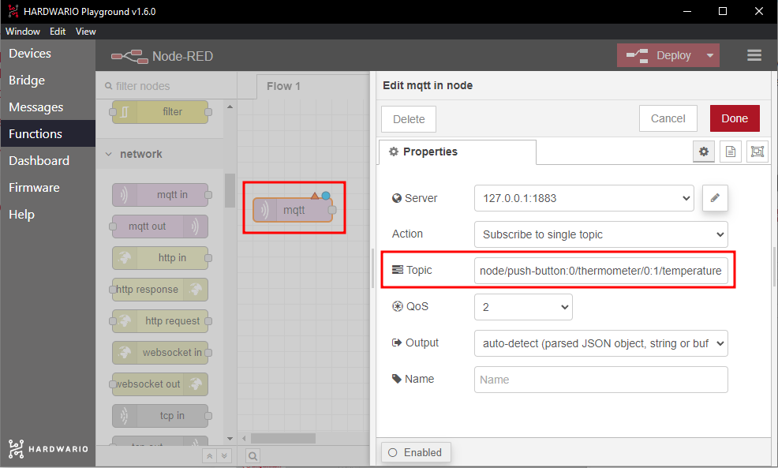
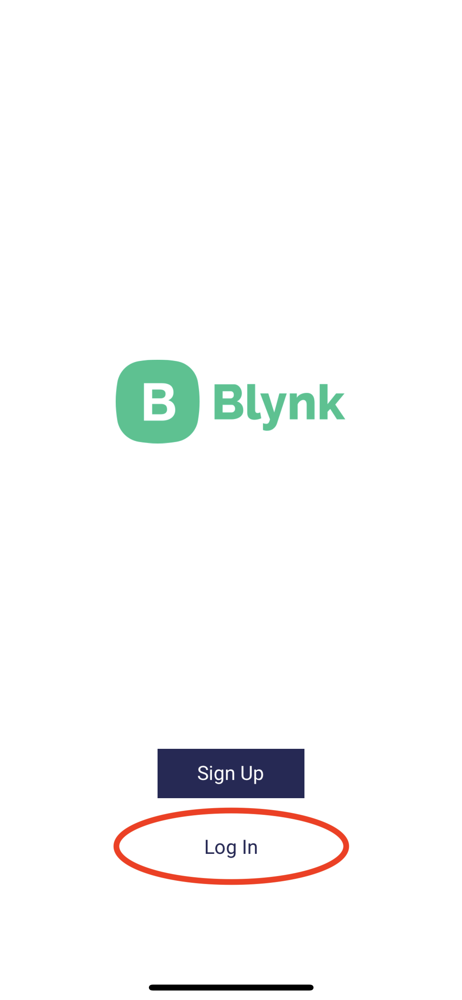
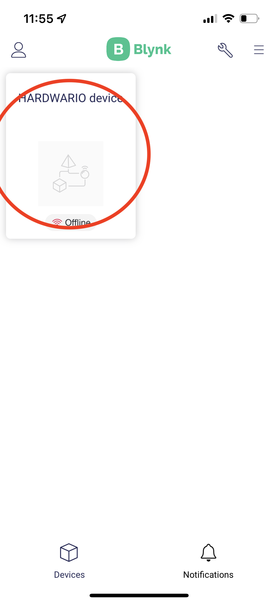
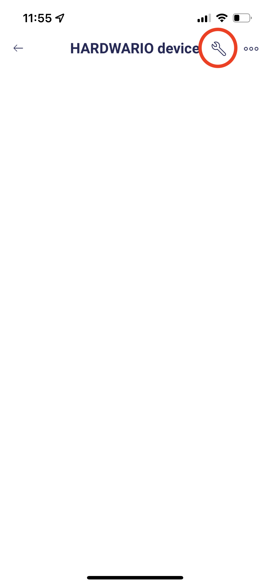
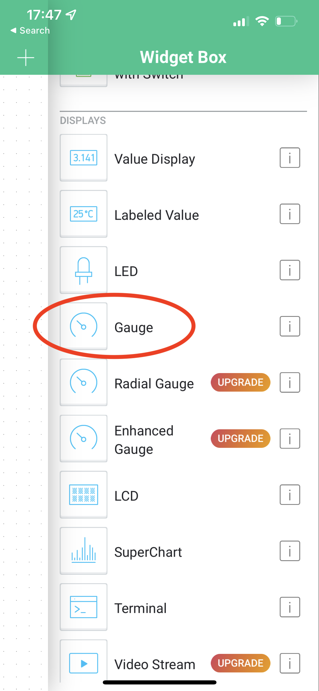
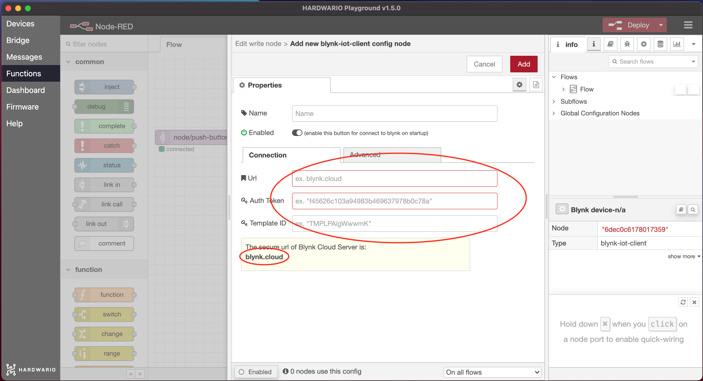

## Úvod

Tento projekt odhalí všechna tajemství vaší školy, ať už někdo loví duchy, nebo hledá žhavé místo na příští rande. Změřte se třídou teplotu v různých koutech školy a zkuste objevit ten největší extrém. 😱

S tímto projektem se naučíte **měřit teplotu pomocí IoT a zobrazit ji v mobilu**. Postačí vám základní sada HARDWARIO, tedy [**Start Set**](https://www.hardwario.store/p/start-set/).

Hru **navrhněte učiteli fyziky** jako zpestření hodiny, nebo si ji s kamarády zahrajte jen tak po škole.

**V téhle hře jde o vítězství.** Kdo najde nejchladnější nebo nejteplejší místo ve škole, je **král**! 👑 Pokud máte ve třídě krabiček víc, pracujte samostatně nebo v malých skupinkách. Pokud máte jen jednu, střídejte se.


## Připravte si krabičku

1. Sestavte a spárujte Start Set. Do modulu Core Module potřebujete firmware **radio push button**. Pokud nevíte, jak si firmware stáhnout nebo co to je, [najdete to tady](https://docs.hardwario.com/tower/firmware-development/hardwario-extension-tutorial/#flash-firmware).

2. Změny teploty uvidíte v Playgroundu v záložce **Messages**.


## Nastavte si Node-RED

1. Nejnižší nebo nejvyšší teplotu budete zaznamenávat na vlastním ukazateli. Začněte na počítači bublinami v [Node-RED](https://docs.hardwario.com/tower/firmware-development/hardwario-extension-tutorial/#flash-firmware). Nejdřív v Playgroundu klikněte na záložku **Functions**.

2. Na prázdnou plochu umístěte světle fialový uzel (bublinu) s názvem **MQTT**. Najdete ho v sekci Input.

3. Uzel otevřete dvojklikem. V řádku **Topic** určíte, co má ukazatel zobrazovat. Teď to bude teplota, proto do řádku zkopírujte zprávu s teplotou ze záložky Messages (bez čísla). Nebo klidně použijte tuto:

```
node/push-button:0/thermometer/0:1/temperature
```



Potvrďte tlačítkem **Done**.

## Připravte si aplikaci Blynk IoT

1. Pokud ještě účet nemáte, vytvořte si ho v aplikaci [Blynk IoT](https://docs.hardwario.com/tower/platform-integrations/blynk-app/). Postup najdete v [tomto návodu](https://docs.hardwario.com/tower/platform-integrations/blynk-app/), kde se dozvíte i to, jak se vytvářejí šablony a datastreamy. Budete potřebovat obojí.

2. Dále vytvořte šablonu zařízení, opět podle [stejného návodu](https://docs.hardwario.com/tower/platform-integrations/blynk-app/). Pokud už máte šablonu z předchozích projektů, klidně ji použijte.

3. Teď nastavte nový datastream. V detailu šablony klikněte na záložku **Datastreams** a vpravo nahoře na **Edit**. Objeví se tlačítko **+ New Datastream**. Klikněte na něj, vyberte **Virtual Pin** a otevře se dialogové okno:


4. Pojmenujte nový datastream a vyberte jeden z volných pinů. Teplotu budete měřit jako desetinné číslo, proto zvolte typ **Double** a jednotku (unit) nastavte na **Celsius**. Nezapomeňte nastavit rozsah teplot, které budete měřit, například **0–50**.

5. Datastream vytvoříte kliknutím na **Create**.


6. Práci uložte tlačítkem **Save** vpravo nahoře.

## Založte zařízení

Pokud ještě zařízení nemáte, založte si ho z vytvořené šablony. Postup popisujeme [v návodu, který už znáte](https://docs.hardwario.com/tower/platform-integrations/blynk-app/).

## Spusťte aplikaci v mobilu

**Aplikaci Blynk IoT** si do mobilu stáhněte z [App Store](https://apps.apple.com/us/app/blynk-iot/id1559317868) nebo [Google Play](https://play.google.com/store/apps/details?id=cloud.blynk) a přihlaste se svými údaji.



Hned po přihlášení uvidíte vytvořené zařízení:



Klepněte na něj. Teď nastavíme dashboard, na kterém se bude zobrazovat naměřená hodnota:

1. Pod ikonou **klíče** vpravo nahoře najdete stránku s nastavením dashboardu.



2. Tlačítkem **+** nebo klepnutím kamkoli na plochu přidáte nový graf nebo jiný prvek dashboardu. Teď použijeme **Gauge**.



3. Klepnutím na přidaný widget otevřete jeho nastavení. Nejdůležitější je vybrat ***Datastream*** ze své šablony pro zvolený virtuální pin. Můžete také doplnit název a změnit barvu.


4. Aplikace je hotová. Teď do ní začneme posílat data. 💪

## Propojte mobil s krabičkou

1. Vraťte se k počítači. Na ploše Node-RED přidejte za uzel MQTT zelený **uzel Write**. Najdete ho vlevo v sekci Blynk IoT.


2. Uzel otevřete dvojklikem. Vpravo uvidíte **malou tužku**. Klikněte na ni a otevře se nové okno. Do pole **Url** vložte ``blynk.cloud`` a do polí **Auth Token** a **Template ID** zkopírujte hodnoty z detailu zařízení ve webové aplikaci na počítači.



Nastavení potvrďte tlačítkem **Add**. Z uzlu ale ještě neodcházejte. 👈

3. Do řádku **Virtual Pin** napište číslo pinu, který jste zvolili v Blynku, bez písmene „V“.
Potvrďte tlačítkem **Done**.


4. Teď **oba uzly propojte** a klikněte na červené tlačítko **Deploy** vpravo nahoře. 🚨


## Trumfněte svou třídu

1. Sami nebo ve skupině **vytipujte, které místo ve škole může být nejteplejší nebo nejchladnější**. 🔥 ⛄

2. Každý jednotlivec nebo skupina má na průzkum **jen 15 minut**. 🔦 Ať je to napínavé.

3. Vezměte krabičku na vybrané místo a **teplotu sledujte v mobilu**. Než se teplota na ukazateli projeví, může to chvíli trvat.


4. Vyzkoušejte několik míst a na závěr vyhlaste nejextrémnější výsledky. **Gratulujeme vítězům!** 🎇
