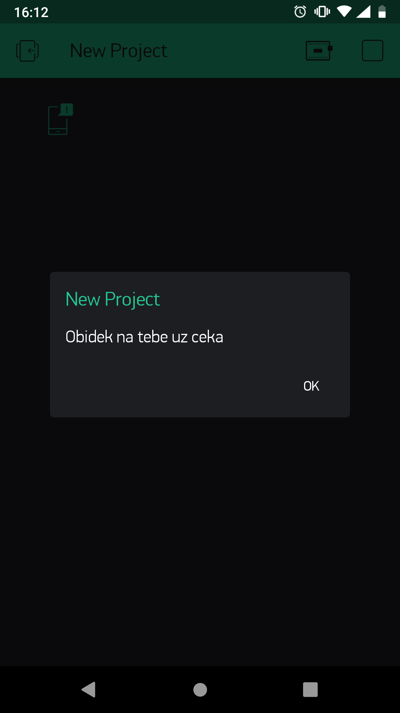

import Image from '@theme/IdealImage';

## Introduction


Have you already built the basic version of the button your mum uses to call you for dinner? Congratulations. 👍 This upgrade takes the project further: the message changes with the time of day, and you can even reply to it.

In this project, you will learn how to **set different messages for different times of day**, send a special notification **by holding the button down** and program a simple **reply**. 👌

You'll find the basic version of the project here: [Build an IoT button your mum can use to call you for dinner](/projects/button-for-parents/).

You will need the **box with a button** and the **USB dongle**, so the basic HARDWARIO [**Start Set**](https://www.hardwario.store/p/start-set/) is all you need.


## Prepare Node-RED

1. Assemble the Start Set and pair it. The Core Module needs the good old **twr-radio-push-button** firmware again.

<div class="container"> <div class="row"> <Image img={require('./img/button-for-parents-upgrade/button-for-parents-upgrade-1.webp')} alt="Playground Devices tab with the paired device listed under the alias push-button:0"/> </div> </div>

## Set up the notification

1. Set up the notification flow much as in the [basic version of the project](/projects/button-for-parents/).
Place an **mqtt in** node from the **network** section on the workspace, with the press count in its Topic field. Next to it, place a **write node** from the **Blynk IoT** section and set it up exactly as in the basic version: the same connection (Url, Auth Token, Template ID) and the same virtual pin. The automation you already have in Blynk then sends the notification to the phone.

❗ **Leave out the change node for now**; you'll see why in a moment.

So far it looks like this:

<div class="container"> <div class="row"> <Image img={require('./img/button-for-parents-upgrade/button-for-parents-upgrade-2.webp')} alt="MQTT event-count node and the Blynk notify node placed on the canvas, not yet connected"/> </div> </div>

2. This time, put a different node between the two: one you copy JavaScript into. You'll find it as the **function** node in the section of the same name.

<div class="container"> <div class="row"> <Image img={require('./img/button-for-parents-upgrade/button-for-parents-upgrade-3.webp')} alt="Function node highlighted in the palette and placed between the MQTT and notify nodes"/> </div> </div>

3. Into this node goes **the code that lets you control time**. ⏳ In it, you set the hours during which you'll get the breakfast 🍳, lunch 🍗 and dinner 🍕 messages. Smart JavaScript, isn't it?

In the node settings, copy the following code into the **On Message** tab. When you look at the code, you'll see that some parts are highlighted in color. That's where you set the **mealtimes** and **your own messages**. Change the colored parts to suit you; just remember that accented letters such as č or á won't work.

```
var date = new Date(); var hour = date.getHours();
if(hour >= 8 && hour < 11) { msg.payload = "Pojd na snidani, ospalce"; return msg; } else if(hour >= 11 && hour < 17) { msg.payload = "Obidek na tebe uz ceka"; return msg; } else if(hour >= 17 && hour < 21) { msg.payload = "Podava se vrchol dne, vecere"; return msg; }
```

<div class="container"> <div class="row"> <Image img={require('./img/button-for-parents-upgrade/button-for-parents-upgrade-4.webp')} alt="Edit function node dialog with the time-checking meal message JavaScript on the On Message tab"/> </div> </div>

4. In the same window, give the node a name in the **Name** field, for example _Time & message setting_.
<div class="container"> <div class="row"> <Image img={require('./img/button-for-parents-upgrade/button-for-parents-upgrade-5.webp')} alt="Edit function node dialog with the node named in the highlighted Name field"/> </div> </div>
Confirm with **Done**.

## Set up a long press

1. On we go. Now set what the button does when your parents **hold it down**. You can control that too. 👌
Place **another mqtt in node** from the **network** section on the workspace.

2. This time, give it a different **Topic**, so the button reacts to a long press.
```
node/push-button:0/push-button/-/hold-count
```
<div class="container"> <div class="row"> <Image img={require('./img/button-for-parents-upgrade/button-for-parents-upgrade-6.webp')} alt="Edit mqtt in node dialog with the push-button hold-count topic in the highlighted Topic field"/> </div> </div>

3. After it, place the **change** node you already know from the basic version. In it, set your own message, which is sent when your parents hold the button down. It's handy for calling you about anything other than food 🙂, for example: _Come downstairs, lazybones!_

<div class="container"> <div class="row"> <Image img={require('./img/button-for-parents-upgrade/button-for-parents-upgrade-7.webp')} alt="Edit change node dialog setting msg.payload to the hold-button message Pojd dolu, lenochu!"/> </div> </div>

4. After this node, add one more, in which you can click the message away. The message will also pop up on your computer, not just on your phone.

It's the **notification** node in the **dashboard** section.

<div class="container"> <div class="row"> <Image img={require('./img/button-for-parents-upgrade/button-for-parents-upgrade-8.webp')} alt="Notification node named show notification placed after the set msg.payload node in the hold flow"/> </div> </div>

5. In the node, choose OK / Cancel Dialog in the **Layout** field and confirm with **Done**.

<div class="container"> <div class="row"> <Image img={require('./img/button-for-parents-upgrade/button-for-parents-upgrade-9.webp')} alt="Edit notification node dialog with Layout set to OK / Cancel Dialog"/> </div> </div>

6. Wire everything up as in the picture: both flows lead to the write node and to the notification node. Then press **Deploy**.

<div class="container"> <div class="row"> <Image img={require('./img/button-for-parents-upgrade/button-for-parents-upgrade-10.webp')} alt="Both button flows wired to the notify and show dialog nodes, with the Deploy button highlighted"/> </div> </div>

## Action!

1. Just like last time, hand the upgraded box **to your mum and dad**.

2. Explain that a **short press** calls you to eat…


3. …and if they want to call you for anything else, they have to **hold the button down**. 👇



At least you won't be disappointed when, instead of food, you get a family meeting served up. Yuck, a different menu, please!
