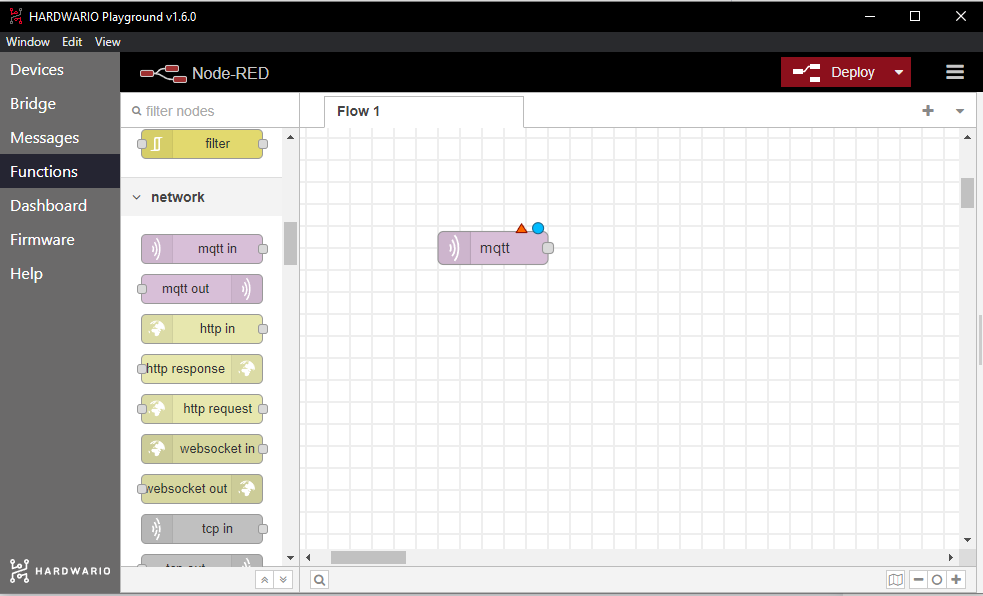
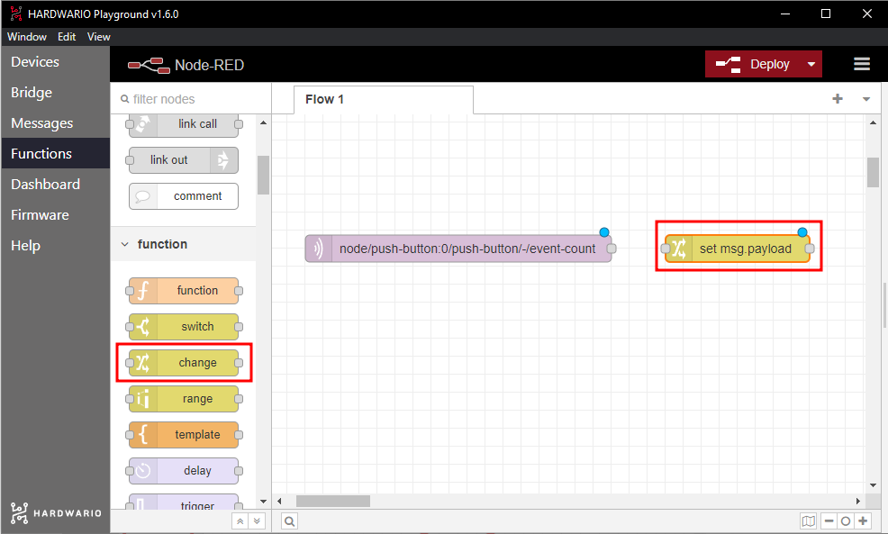

## Introduction

You know the feeling: you're deep in a game or listening to loud music, and when your mum calls you for dinner, you have no idea. So build your parents a smart button that lets them call you through your phone, without shouting all over the house.

In this project, you will learn **how to send a message to a phone with a button**, from anywhere in the house. 👌

You will need the **box with a button** and the **USB dongle**, so the basic HARDWARIO [**Start Set**](https://www.hardwario.store/p/start-set/) is all you need.


## Get it started in Node-RED

1. Assemble the Start Set and pair it. The Core Module needs the **twr-radio-push-button** firmware.
2. In Playground, click the **Functions tab**. This is where you set up the box to do whatever you want.
3. Let's start programming. 🤞 Place a light purple bubble, called a node, on the Node-RED workspace. You'll find it on the left as **mqtt in** in the **network** section.



**If you're opening the program for the first time:** this node is already on the workspace, preset as **node/#**. You can delete the second, dark green bubble.

4. In the node, you set up the key function: the button press. Double-click the node and **copy this line into the Topic field**:

```
node/push-button:0/push-button/-/event-count
```


Confirm with **Done**.

**Tip:** Do you see the **Messages** tab in Playground? It shows every event, line by line. Press the button on the box and… ta-da, the same line appears:
```
node/push-button:0/push-button/-/event-count
```
What does that mean? Next time, you can copy lines into the Topic field straight from the Messages tab.

## Write your own message

1. You set the message here in Node-RED too. Anywhere next to the light purple MQTT input, place the **yellow change node from the function section**.



2. The change node decides what happens when the button is pressed, for example that a message is sent. Let your imagination run wild and write your own (just remember that Blynk doesn't show accented letters such as č or á). A little inspiration:
	- Grub's up!
	- Feeding time
	- Fill your belly with real mana
	- Your health potion is ready

Just double-click the node and write the message on the second line of the **Rules** field.


Confirm with **Done**.

3. On the edge of each node there's a small grey dot. Click it, hold the mouse button and drag to the side, and you'll pull a wire out of the node. That's how nodes are connected.
Try it out. **Connect the two nodes** by dragging the mouse from one bubble to the other. Easy. 🙆


## Prepare the Blynk IoT app

The box with the button connects to a smartphone through the **Blynk IoT** app. Node-RED sends the text of the message to Blynk, and a Blynk automation turns every new message into a push notification.

1. If you don't have a [Blynk IoT](https://blynk.io) account yet, create one. The free plan is enough for this project: at the time of writing, it includes push notifications in the app and up to five automations.

2. The next step is to create a device template. [Blynk's quick guide](https://docs.blynk.io/en/getting-started/template-quick-setup) shows you how. If you have a template from an earlier project, feel free to use it.

3. Now set up a new datastream. In the template details, open the **Datastreams** tab, click **New Datastream** and choose **Virtual Pin**. The datastream settings open.

4. Name the new datastream (for example `Message`) and pick one of the free pins, for example V2. The notification on your phone should show your own message, so **choose String as the Data Type** (a text string).

5. In the datastream settings, also allow automations to use it as a condition: in the **Automations** section, turn on **Use as Condition**. Create the datastream by clicking **Create**.

6. Save the template with the **Save** button in the top right corner.

## Create a device

If you don't have one yet, create a device from the template: in **Devices**, add a new device, choose your template and give the device a name. You'll find its **Auth Token** on the device's **Device Info** tab. You'll need it in Node-RED.

## Create an automation

1. Switch to the **Automations** section and create a new automation.

2. Choose **Device State** as the condition. The automation then runs every time Node-RED sends Blynk a new message.

3. Setting up the automation is simple: under **When**, you decide when it runs, and under **Do this**, what happens next.

4. Start with **When**. Choose your device and **the datastream you created**. A third dropdown appears: leave it set to **Is Any**. The automation then reacts to every message, even when it's the same as the last one.

5. Under **Do this**, add the action that sends a notification to the mobile app (**Send In-App Notifications**) and choose yourself as the recipient. Put the **Trigger value** placeholder (`{TRIGGER_VALUE}`) in the notification text. Blynk replaces it with the text of your message.

6. Finally, don't forget to **name** the automation. **Limit period** sets how soon the automation may run again. Choose the shortest option, otherwise a second message sent soon after the first won't arrive.

7. Save the automation by clicking **Save**.

## Set up the app on your phone

😎 Download the **Blynk IoT app** to your phone from the [App Store](https://apps.apple.com/us/app/blynk-iot/id1559317868) or [Google Play](https://play.google.com/store/apps/details?id=cloud.blynk). Sign in with the same account and allow notifications, so the message can pop up.

## Connect your phone to the box

1. Go back to your computer. On the Node-RED workspace, add the **green write node** after the two nodes. You'll find it on the left in the **Blynk IoT** section (the **Blynk ws** section belongs to the old Blynk, which no longer works).
2. Double-click the node to open it. Next to **Connection** you'll see **a small pencil**. Click it and a new window opens.
3. In the **Url** field, enter `blynk.cloud`.
4. Into the **Auth Token** and **Template ID** fields, copy the values from the Blynk web app on your computer: the Auth Token is on the device's **Device Info** tab, the Template ID in the template details.
5. Confirm the settings with **Add**.
6. In the **Virtual Pin** field, enter the number of the datastream's pin (2 for V2) and save everything with **Done**.
7. **Connect the write node to the node where you set your message.** You've now programmed the device so that pressing the button on the box ➡️ turns into a message ➡️ that travels all the way to your phone. 👾

❗ Start the whole flow with the red **Deploy** button in the top right corner. 🚨

## Action!

1. Press the button and… magic! 🎇 **The message appears on your phone!** 🙌
2. Give the button to your mum or dad. Amazed, aren't they? Family peace before dinner is saved. 🤓
