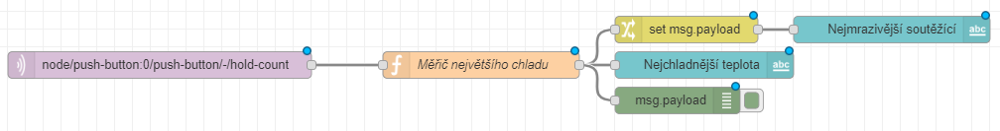
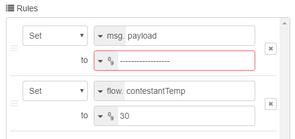
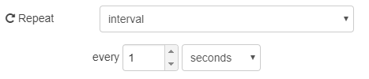
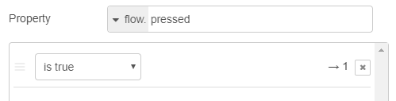
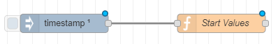
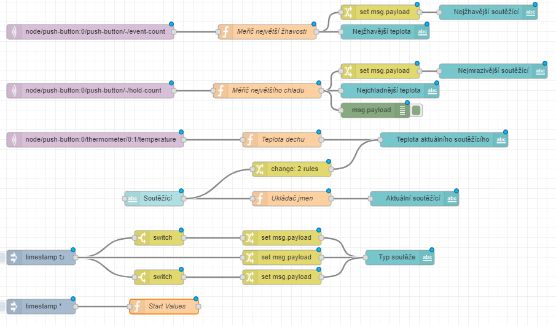
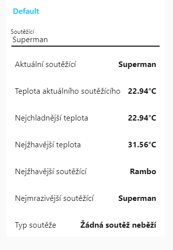

import Image from '@theme/IdealImage';

## Introduction

Are you up for it? Build one project with two favorite competitions and switch between them whenever you like! Your party is guaranteed to be fun. 🕺

In this project, you will learn how to **save the highest measured value, set up several types of competition in one project and switch between them**.

You'll find the basic version of the project here: [IoT party game: do you have dragon fire or frosty breath inside you?](/projects/dragons-fire/)

Once again, the basic HARDWARIO [**Start Set**](https://www.hardwario.store/p/start-set) is all you need.


## Prepare Node-RED

1. Assemble the Start Set and pair it. The Core Module needs the good old **twr-radio-push-button** firmware again.
<div class="container">
  <div class="row">
    <Image img={require('./img/push-the-button/push-the-button-playground-devices-connected.webp')} alt="Playground Devices tab with the paired Core Module listed under the alias push-button:0"/>
  </div>
</div>

## Measure the hottest breath

Build this flow to find out who in your group is the **hottest dragon**. 🐉 The highest temperature starts being measured after a **short press of the button**.


**Need a hint?**

- The **mqtt in** node from the **network** section has the short button press in its Topic field:

```
node/push-button:0/push-button/-/event-count
```

- The JavaScript code in the **Function** node looks like this:

```
var hottestTemp = flow.get("hottestTemp");
var pressed = flow.get("pressed") || false;

flow.set("holded", false);
flow.set("pressed", !pressed);

if(!flow.get("pressed")) {
  if(flow.get("contestantTemp") > hottestTemp) {
    flow.set("hottestTemp", flow.get("contestantTemp"));
    msg.payload = flow.get("hottestTemp");
    return msg;
  }
}
```
- The lower **Text** node records the highest temperature. Don't forget to enter `{{msg.payload}}°C` in its Value format field.
- The **Change** node shows the participant with the hottest breath. Set flow. contestantName in it.

- The flow ends with an ordinary **Text** node.

## Measure the coldest breath

Place another flow below the previous one. With it, you'll find out which of you breathes so cold you could **rival the Night King**. ❄ The lowest temperature only starts being measured after a **long press of the button**.

**Our tip**: You don't have to build a similar flow from scratch: just copy the nodes and edit them. **Ctrl+C and Ctrl+V** is all it takes, even for several nodes at once. Hooray! 🙌



**Need a hint?**

- This time, the Topic field in the **MQTT** node matches a long button press:

```
node/push-button:0/push-button/-/hold-count
```

- This time, the code in the **Function** node looks like this:

```
var coldestTemp = flow.get("coldestTemp");
var holded = flow.get("holded") || false;

flow.set("pressed", false);

flow.set("holded", !holded);

if(!flow.get("holded")) {
  if(flow.get("contestantTemp") < coldestTemp) {
    flow.set("coldestTemp", flow.get("contestantTemp"));
    msg.payload = flow.get("coldestTemp"); return msg;
  }
}

```

- **Both Text nodes are the same as in the previous flow**; just change hottest to coldest.

- **The Change node is the same as in the previous flow.**

❗ **Our tip**: Something not working the way it should? Add a Debug node to the workspace to help you track down any bugs. 🐞

## Set up continuous measurement

Create a new flow and place it below the other two. This flow measures every attempt, and the table also remembers the participants' names.


**Need a hint?**

- The Topic field in the **MQTT** node holds the temperature measurement:

```
node/push-button:0/thermometer/0:1/temperature
```

- The code in the **Function** node looks like this:

```
var temp = msg.payload;

if(flow.get("pressed")) {
  if(flow.get("contestantTemp") < temp) {
    flow.set("contestantTemp", temp); return msg;
  }
}
else if(flow.get("holded")) {
  if(flow.get("contestantTemp") > temp) {
    flow.set("contestantTemp", temp);
    return msg;
  }
}
```

- The dark blue **Text** node shows the temperature the box measures for the current contestant, in degrees Celsius: `{{msg.payload}}°C`

- The **Text input** node (the light blue one) has zero in its Delay field, so you have to confirm each contestant's name in the table with the Enter key.

- The **Change** node has two rules. The first leaves the value empty until the first temperature arrives. The second sets the average temperature to 30 °C, so warmer results will be above 30 °C and cooler ones below it.



- The **Function** node with the code that stores the names looks as simple as this:

```
flow.set("contestantName", msg.payload);
return msg;
```

- The last **Text** node is an ordinary text node that announces the current contestant. Voilà!

## Set the type of competition

Too easy? Then add one more **timestamp flow** that switches the type of game! A short press of the button measures the hottest breath, a long press the coldest. Brilliant! 👍


### Need a hint?

- The first node is called **inject**, and you'll find it in the **common** section. Every second, it checks which competition is running: from the long or short button press it knows whether you're competing for the coldest or the hottest breath, and then it displays that competition.


Set it to repeat every second.



- **The upper Switch node** reacts to a short button press and contains _is true_.



- **The lower Switch node** reacts to holding the button down and also contains _is true_.


- All three Change nodes contain a message. The upper one announces the **hottest breath competition**:


The middle one says that **no competition is running right now**:


The lower one announces the **coldest breath competition**:


- The final **Text** node announces the type of competition.

## Set the default values

Hold on to your hats, we're heading into the final. The last flow sets the **default values**: 30 °C as the optimum temperature, a very low starting value for the highest temperature and a very high starting value for the lowest temperature. The real measured temperatures are then compared with these values.




### Need a hint?

- The **Inject** node has a box ticked that sets the default values a moment after you press the Deploy button.


- The **Function** node contains the JavaScript that sets the default values.

```
flow.set("contestantTemp", 30);
flow.set("hottestTemp", 0);
flow.set("coldestTemp", 100);
return msg;
```

## Admire your work

This is how great your workspace looks now. Enjoy the view like the first time you saw the sea… 🌊 Just a moment longer… and another… Then press your good old friend **Deploy** in the top right corner.



## Let's compete!

1. As you've probably noticed, the box tells two kinds of press apart: a short press starts the **hottest breath competition**, a long press the **coldest breath competition**.

### How to compete
- Open the **Dashboard** tab in Playground.
- First, type the contestant's name
- and confirm it with **Enter**.
- Then choose the type of competition with a **short or long press of the button**. 👇
- When the contestant has had their go, end the competition and save the result with **a press of the same length**.
- Do the same for the next contestants, one at a time.


2. At this level too, **any help is allowed**! Find out what heats your breath up the most and what cools it right down. Fingers crossed, dragons! 💪
