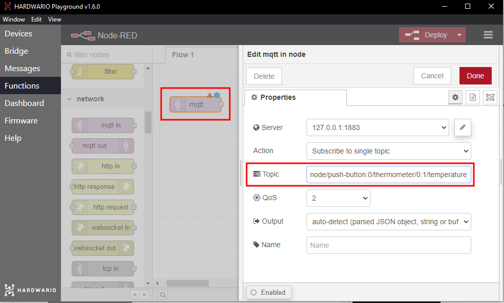
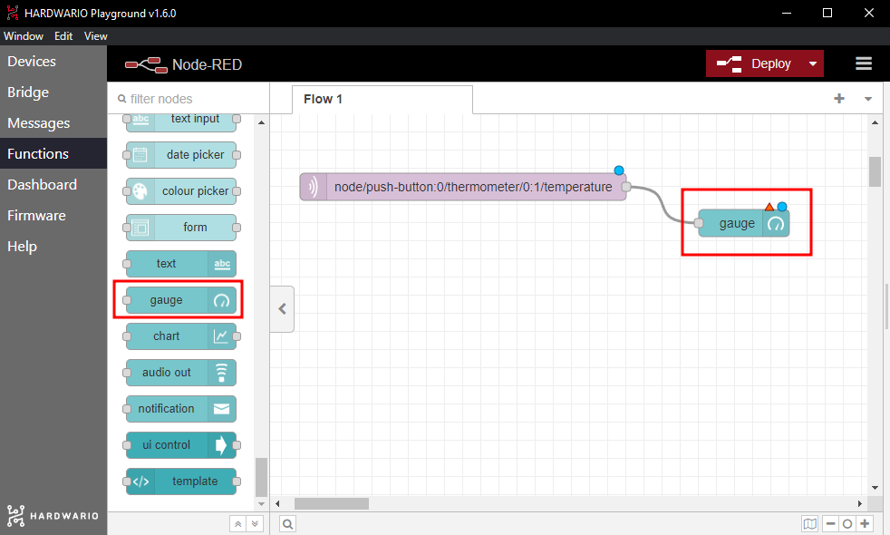
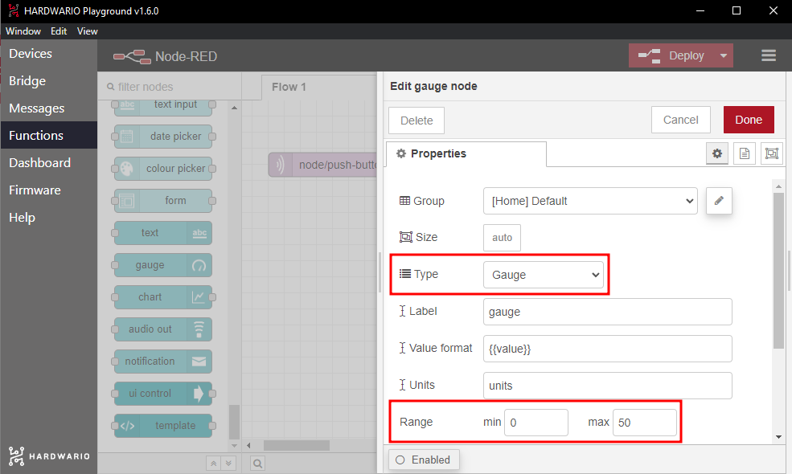
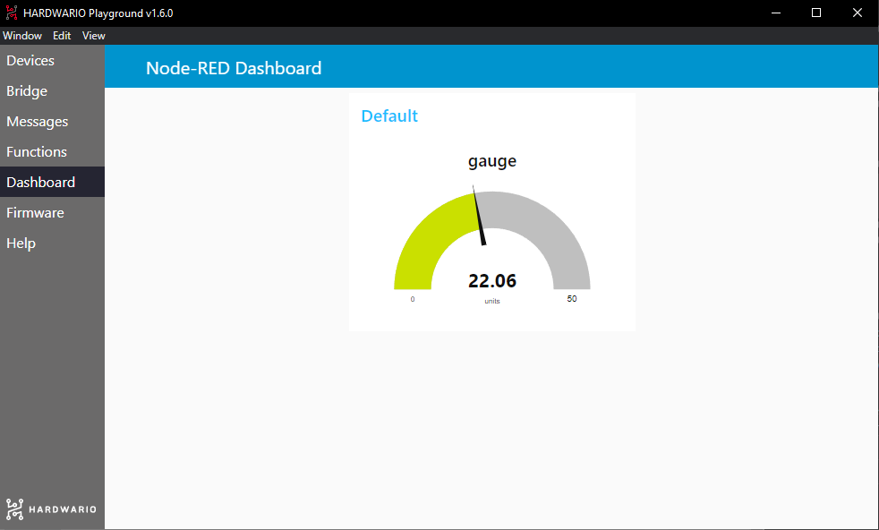

Have fun with your friends with IoT. Which of you has the hottest or coldest breath? You decide what will help you win. As they say, anything goes!😱

This project teaches you how to **measure temperature with IoT**. All you need is the basic HARDWARIO [Start Set](https://www.hardwario.store/p/start-set/).


## Prepare the box

1. Put the Start Set together and pair it: You need the **radio push button** firmware for the Core Module. 
2. In Playground, open the **Messages** tab. Here you will see temperature changes. The temperature is measured automatically, either regularly after 15 seconds, or when there is a major change. And that is what we will use.


## Set up Node-RED

1. Messages may not be enough for you.✌️ Set up your own colour temperature indicator with the bubbles in Node-RED. Firstly, click on the **Functions** tab in Playground.
2. From the Input section, take the light purple **MQTT** node (bubble) and place it onto the empty desktop.
3. Double-click the node. In the **Topic** line specify what you want the colour indicator to display. This now represents temperature. Copy the temperature message from the Messages tab (without a number) to the line. Alternatively, use this:


```
node/push-button:0/thermometer/0:1/temperature
```



Confirm by clicking the **Done** button.

4. Next to the MQTT node place a second one, this time a blue **Gauge** node. This node can be found in the Dashboard section. This node is used to determine how the measured temperature is displayed on screen: as an indicator. Link both nodes together.



5. Double-click on the Gauge node. In the **Type** line, set how the graph will be displayed (Gauge is best). In the **Range** line, adjust the minimum and maximum value of the indicator (try 0 and 50).



Confirm by clicking the **Done** button.

**Tip**: In the **Label** line, rename your indicator.

6. Now click the **Deploy** button 🚨 in the top right corner to get everything up and running.

**❗ Beware:** Every time you change the nodes you have to press Deploy again.

7. Click on **Dashboard**. Your temperature indicator will be displayed. 😲



## Start the game with your friends

1. **Sit with your friends at a table.**
2. First of all, measure who's hiding their **dragons fire**. 🔥 **One by one breathe on the box**. All aids are allowed; try warming up your breath with what you have on hand. Go wild and try anything and everything. 🙌
❓ **Try**: What makes your breath warmer? Hot tea or chilli peppers?

3. After the first round, discover who has the **frostiest breath**. ❄ Who can cool their breath down the most?
❓  **Try:** What makes your breath colder? An ice cube or cool chewing gum?

4. **Write down the best results** and try to beat them the next time you play.
