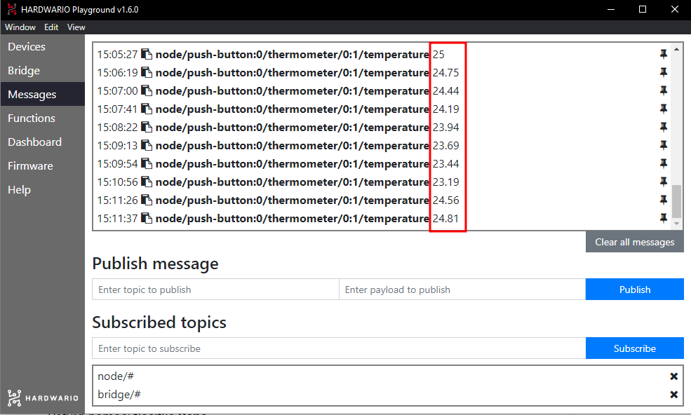
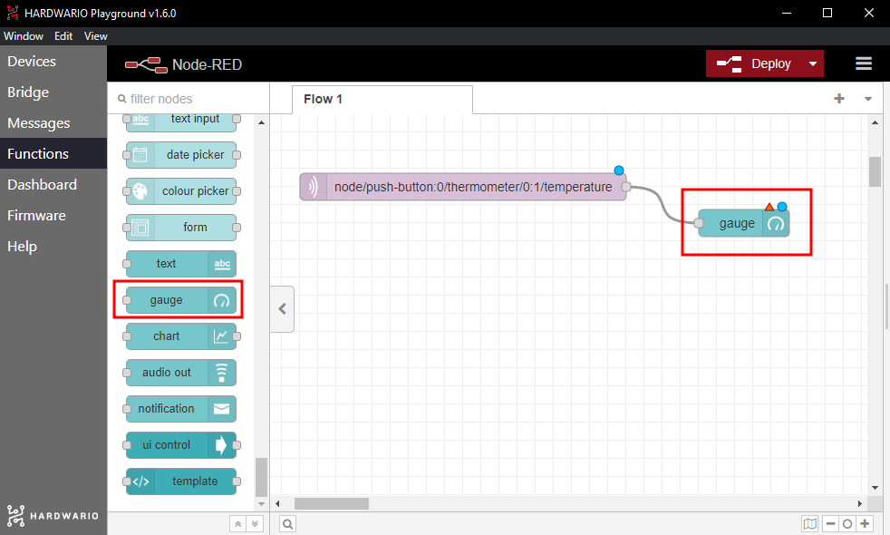
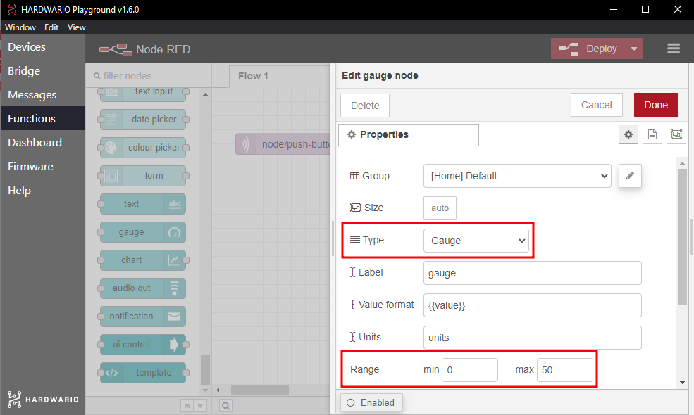
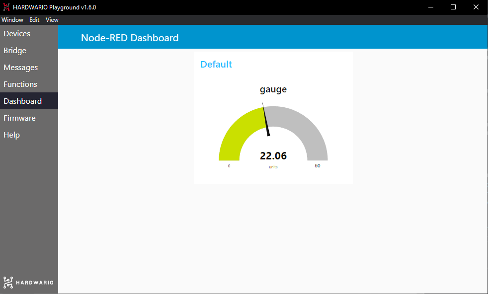

## Introduction

Have some IoT fun with your friends. Which of you has the hottest breath, and which the coldest? How you help yourself win is up to you. Anything goes. 😱

In this project, you will learn **how to measure temperature with IoT**. All you need is the basic HARDWARIO [**Start Set**](https://www.hardwario.store/p/start-set/).


## Prepare the box

1. Assemble the Start Set and pair it. The Core Module needs the **twr-radio-push-button** firmware.

2. In Playground, open the **Messages** tab. That's where you'll see the temperature changes. The box sends the temperature on its own: regularly every 15 minutes, and straight away whenever it changes by at least 0.2 °C. That's exactly what we'll use.




## Set up Node-RED

1. The Messages tab may not be enough for you. ✌️ Build your own colorful temperature gauge from bubbles in Node-RED. First, click the **Functions** tab in Playground.

2. Place a light purple node (bubble) called **mqtt in** on the empty workspace. You'll find it in the **network** section.

3. Double-click the node to open it. In the **Topic** field, you decide what the colorful gauge will show: this time, the temperature. So copy the temperature message from the Messages tab into the field (without the number), or simply use this one:
```
node/push-button:0/thermometer/0:1/temperature
```


Confirm with **Done**.

4. Next to the node, place a second one, this time the blue **gauge** node. You'll find it in the **dashboard** section. This node decides how the measured temperature appears on screen: as a gauge. Connect the two nodes.



5. Double-click the gauge node. In the **Type** field, you set how the gauge looks (Gauge works best). In the **Range** field, you set its minimum and maximum value (try 0 and 50).



Confirm with **Done**.
**Our tip:** You can rename your gauge in the **Label** field.

6. Now press the red **Deploy** button in the top right corner of the screen. 🚨 That starts the whole flow.
❗ **Watch out**: every time you change the nodes, you have to press Deploy again.

7. Switch to the **Dashboard** tab. That's where you'll find your gauge. 😲



## Start the game with your friends

1. **Sit around a table with your friends.**

2. First, find out who's hiding **dragon fire** inside. 🔥 **Take turns breathing on the box**. Any help is allowed: try warming up your breath with whatever you have to hand. Try anything and everything. 🙌
❓ **Try it:** What warms your breath more, hot tea or chilli peppers?

3. After the first round comes the **frosty round**. ❄ Who can cool their breath down to make it **the coldest**?
❓ **Try it:** What cools your breath more, an ice cube or minty chewing gum?

4. **Write down the records** and try to beat them next time you play.
