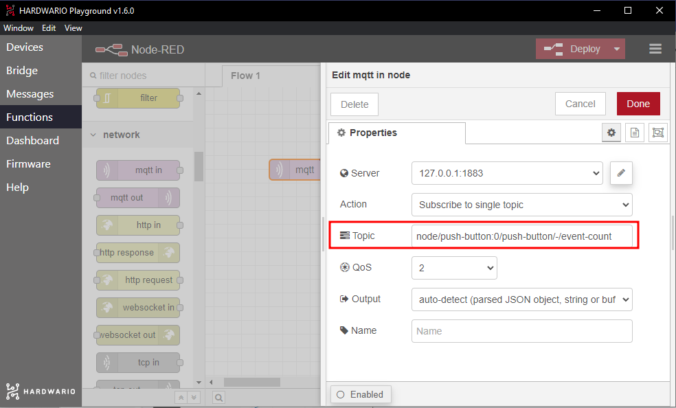

## Introduction

Do your parents call you every day to check whether you're home from school yet? It's annoying, but they just worry about you. Build a button that sends them a simple message to their phone when you get home. 📲

In this project, you will learn **how to send a message to your parents' phone with a button**. 👩👱

All you need is the **box with a button** and the **USB dongle**, so the basic HARDWARIO [**Start Set**](https://www.hardwario.store/p/start-set/) will do.


## Get it started in Node-RED

1. Assemble the Start Set and pair it. The Core Module needs the **twr-radio-push-button** firmware. If you don't know how to download the firmware or what it is, [you'll find out here](https://docs.hardwario.com/tower/desktop-programming/firmware-flashing/).

2. In Playground, click the **Functions tab**, where you'll find the [Node-RED](https://docs.hardwario.com/tower/desktop-programming/node-red-programming/) programming workspace.

3. Place a light purple bubble, also called a node, on the Node-RED workspace. You'll find it on the left as **mqtt in** in the **network** section.


4. In the node, you set up the key function: the button press. Double-click the node and **copy this line into the Topic field**:

```
node/push-button:0/push-button/-/event-count
```




Confirm with **Done**.

**Tip:** Next time, instead of copying the line from here, you can simply copy the line that appears **in the Messages tab** after you press the button.


## Set up your message

1. You set up your message here in Node-RED too. Anywhere next to the light purple MQTT node, drag the **yellow node called change from the function section**.


2. Double-click the node and write your message for your parents in the **Rules** field. Just be careful: Blynk doesn't show accented letters such as č or á. A little inspiration:
	- *Relax. I'm home and safe.*
	- *A celebrity has arrived… Just kidding. It's me.*
	- *I was bitten by dogs and kidnapped by a UFO, but I made it home.*


Confirm with **Done** and connect the two nodes by dragging the mouse from one bubble to the other. 🐁


## Prepare the Blynk IoT app

The message reaches your parents' phone as a push notification from the **Blynk IoT** app. Node-RED sends the text of the message to Blynk, and a Blynk automation turns every new message into a notification.

1. If you don't have an account yet, create one in [Blynk IoT](https://blynk.io). The free plan is enough for this project: at the time of writing, it includes push notifications in the app and up to five automations.

2. Next, create a device template. [Blynk's quick guide](https://docs.blynk.io/en/getting-started/template-quick-setup) shows you how. If you already have a template from an earlier project, feel free to use it.

3. Now set up a new datastream. In the template details, open the **Datastreams** tab, click **New Datastream** and choose **Virtual Pin**. The datastream settings open.

4. Name the new datastream (for example `Message`) and pick one of the free pins, for example V2. The notification on the phone should show your own message, so **choose String as the Data Type** (a text string).

5. In the datastream settings, also allow automations to use it as a condition: in the **Automations** section, turn on **Use as Condition**. Create the datastream by clicking **Create**.

6. Save the template with the **Save** button in the top right corner.

## Create a device

If you don't have a device yet, create one from the template: in **Devices**, add a new device, choose your template and give the device a name. You'll find its **Auth Token** on the device's **Device Info** tab. You'll need it in Node-RED.

## Create an automation

1. Switch to the **Automations** section and create a new automation.

2. Choose **Device State** as the condition. The automation then runs every time Node-RED sends Blynk a new message.

3. Setting up the automation is simple: under **When**, you set when it runs, and under **Do this**, what happens next.

4. Start with **When**: choose your device and **the datastream you created**. A third menu appears: leave it set to **Is Any**. The automation then reacts to every message, even when it's the same as the last one.

5. Under **Do this**, add the action that sends a notification to the mobile app (**Send In-App Notifications**) and choose yourself as the recipient. Put the **Trigger value** placeholder (`{TRIGGER_VALUE}`) in the notification text. Blynk replaces it with the text of your message.

6. Finally, don't forget to fill in the **automation name**. **Limit period** sets how soon the automation may run again. Choose the shortest option, otherwise a second message sent soon after the first won't arrive.

7. Save the automation with **Save**.


## Set up the mobile app

1. Borrow your mum's or dad's phone and make it a little bit smarter. 🤓 To see your message, they need the **Blynk IoT app** on their phone. You can download it from the [App Store](https://apps.apple.com/us/app/blynk-iot/id1559317868) or [Google Play](https://play.google.com/store/apps/details?id=cloud.blynk).

2. After installing it, sign in with your account. The free plan has only one user, so you sign in with your own account on your parents' phone too. Allow the app to show notifications, so the message can pop up.


## Connect the phone to the box

1. Go back to your computer. On the Node-RED workspace, add the **green write node** after the two nodes. You'll find it on the left in the **Blynk IoT** section (careful, not Blynk ws: that belongs to the old Blynk, which no longer works).

2. Double-click the node to open it. Next to **Connection** you'll see **a small pencil**. Click it and a new window opens. In the **Url** field enter `blynk.cloud`, and into the **Auth Token** and **Template ID** fields copy the values from the Blynk web app on your computer: the Auth Token is on the device's **Device Info** tab, the Template ID in the template details.

Confirm the settings with **Add**.

3. In the **Virtual Pin** field, enter the number of the datastream's pin (2 for V2) and save everything with **Done**.

4. **Connect the write node to the yellow node where you set your message.** You've now programmed the device so that pressing the button on the box ➡️ turns into a message ➡️ that travels all the way to your parents' phone. 👾

❗ Start the whole flow with the red **Deploy** button in the top right corner. 🚨

## And… action!

1. Press the button. A **message pops up** on your parents' phone. 💪

2. Your parents will think you're a genius, and you'll be spared their daily phone calls. 🎉 **And that's just so smart, it must be IoT.** 🕺
