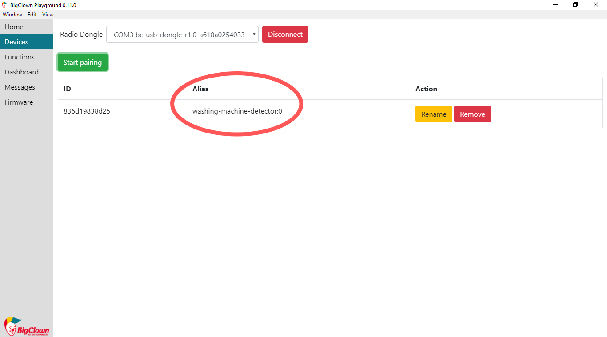
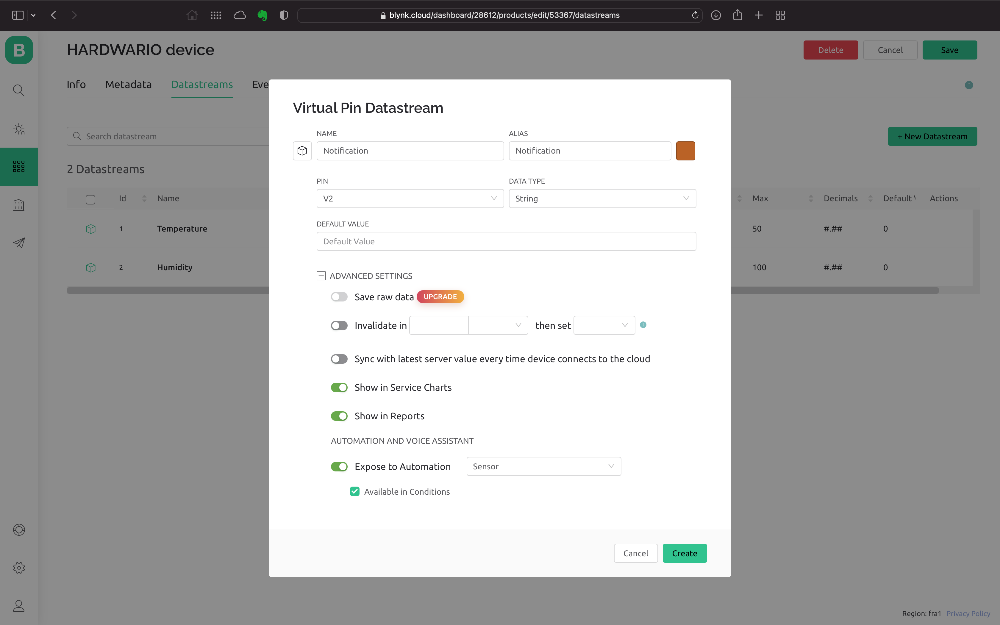
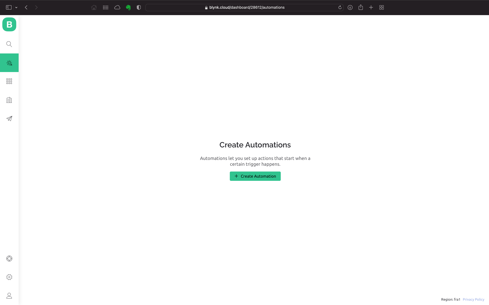
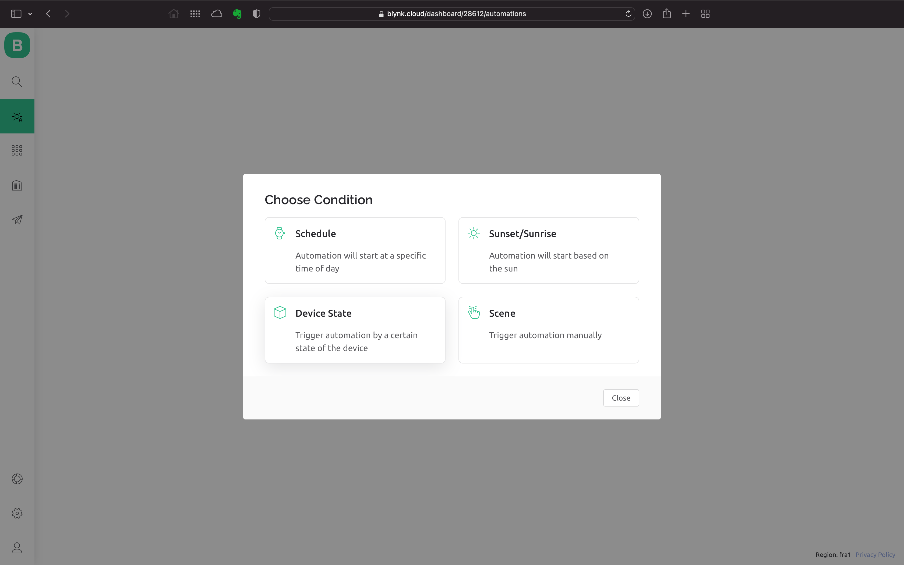
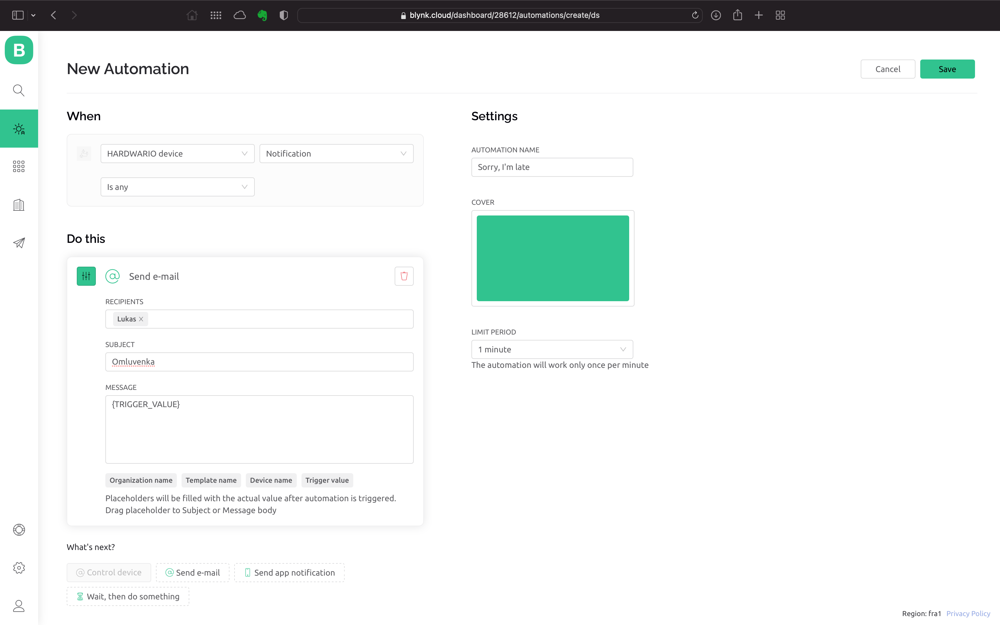
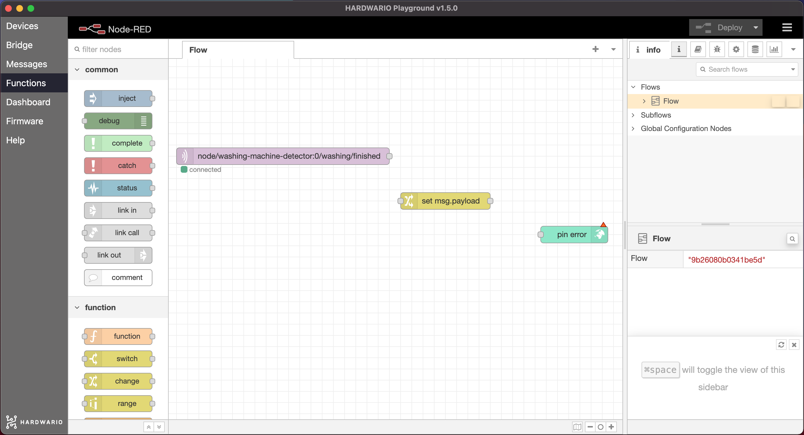
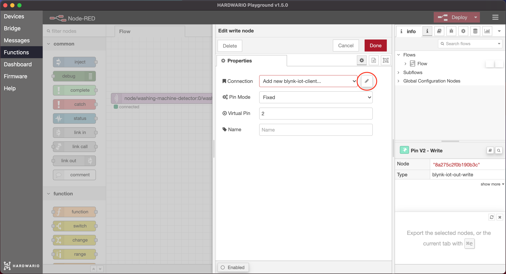
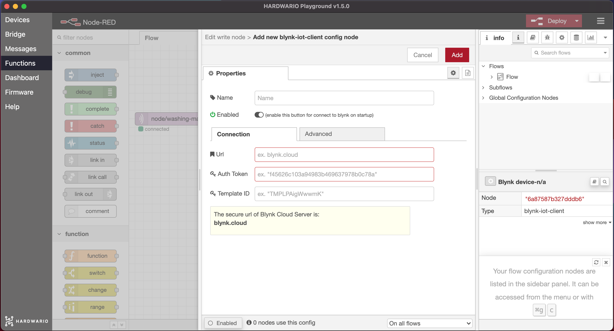
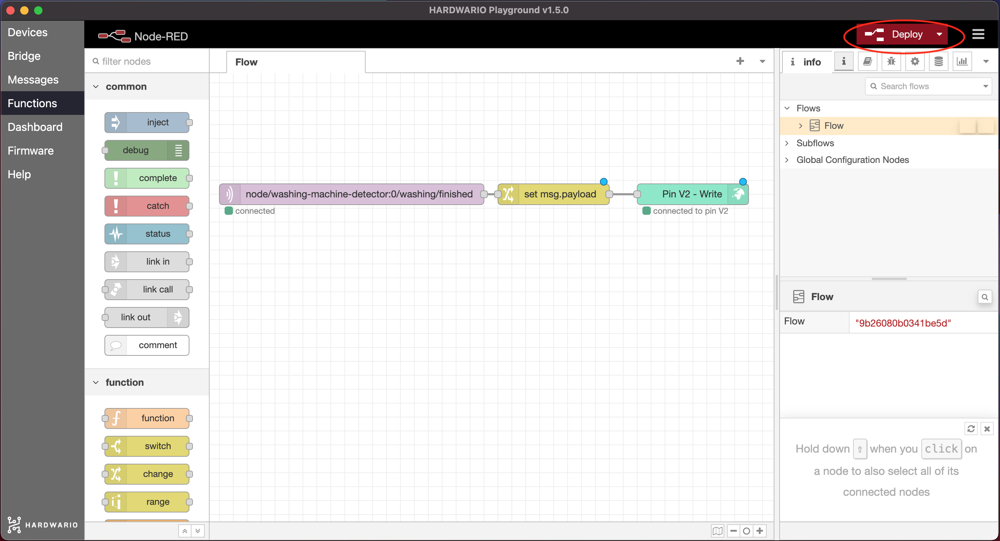
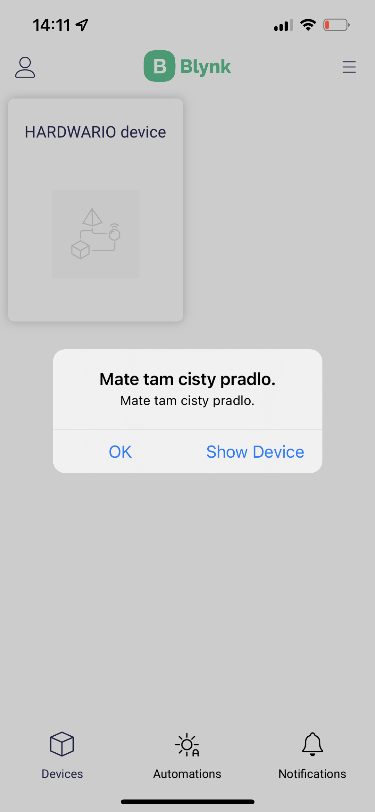

import Image from '@theme/IdealImage';

## Introduction

Raise the IQ of your family washing machine. 🤖 Using the IoT box, programme a notification to let your parents know that the load has been finished.

In this project, you will learn to set up the box so that it recognizes when the washing machine is finished and sends a notification to the mobile. 📱 👈

All you need is the box with the button and the USB dongle. You will be all set with the basic HARDWARIO kit - the [Start Set](https://www.hardwario.store/p/start-set/).


## Download new firmware

1. Upload new firmware to the Core Module - **bcf-radio-washing-machine-monitor** (you will find it among other firmware in the Playground). Thanks to this firmware, the box will be more sensitive 1to vibrations of the washing machine. 🔃

**Our tip:** If you don’t know how to download the firmware or what it is, [you will find out here](https://docs.hardwario.com/tower/firmware-development/hardwario-extension-tutorial/#flash-firmware).

1. [Pair the Core Module with the USB Dongle](https://docs.hardwario.com/tower/platform-integrations/homekit-and-siri/#pair-the-device) Right after pairing it, you will see that your Core Module changed Alias to **washing-machine-detector**. 👌



## Get it started in the Node-RED

1. In the Playground, click on the **Functions tab**, where the [Node-RED](https://docs.hardwario.com/tower/desktop-programming/node-red-programming) programming desktop is located. 🤖
2. Start as usual: first, place the **MQTT node** from the Input section on the desktop.

Double-click on it and copy **Topic** in the field. With this, the box will know when the washing machine stops shaking:

```
node/washing-machine-detector:0/washing/finished
```

<div class="container">
  <div class="row">
    <Image img={require('./img/smart-washing-machine/smart-washing-machine-1.webp')} alt="Edit mqtt in node dialog with the washing finished topic pasted into the highlighted Topic field"/>
  </div>
</div>

Confirm it with the **Done** button.

3. Place the **Change node** from the Functions section next to it.

<div class="container">
  <div class="row">
    <Image img={require('./img/smart-washing-machine/smart-washing-machine-2.webp')} alt="Node-RED workspace with a Change node placed next to the washing-machine-detector MQTT node"/>
  </div>
</div>


4. Inside the Change node, **set up a message** that will be sent to your parents’ mobile after the washing is done. The message should be free of diacritics.
   Here’s a little inspiration:
       - There’s clean laundry for you.
       - I am finished. Do I get a week holiday now?
       - Done and leave me alone. Your washing machine.

<div class="container">
  <div class="row">
    <Image img={require('./img/smart-washing-machine/smart-washing-machine-3.webp')} alt="Edit change node dialog: msg.payload set to the notification message text"/>
  </div>
</div>

Confirm it with the **Done** button.

## Prepare the Blynk IoT app

1. If you don’t have one yet, create an account in the [Blynk IoT](https://blynk.io) app. See [this guide](https://docs.hardwario.com/tower/platform-integrations/blynk-app/) for how to do it — it also covers how to create templates and datastreams. You’ll need both.

2. The second step is to create a device template. You’ll find how to do it [in the same guide](https://docs.hardwario.com/tower/platform-integrations/blynk-app/). You can also reuse a template from previous projects if you have one.

3. Now set up a new Datastream. On the template detail, click the **Datastreams** tab. In the top right, click **Edit**. A **+ New Datastream** button appears — click it, choose **Virtual Pin**, and a dialog opens:


4. Set a name for the new Datastream and pick one of the free Pins. We’ll want to send your own custom message in the mobile notification, so **choose the String data type** (a text string).

5. At the bottom of the dialog, also expand **Advanced settings** and tick the last option, **Expose to Automation**, so we can use it in automations. In the selector next to it, choose **Sensor** and also tick **Available in Conditions**. Create the Datastream by clicking **Create**.



6. In the top right, save your work with the **Save** button.

## Create a device

If you don’t have one yet, create a device from the template you made. We describe how to do it [in the guide you already know](https://docs.hardwario.com/tower/platform-integrations/blynk-app/).

## Create an automation

1. Switch to the **Automation** section and click the **+ Create Automation** button.



2. From the available options, choose **Device State**. The automation evaluates every time you send a message to the app.



3. Setting up the automation is simple: you set when the automation should run — the **When** section — and what should happen next — the **Do this** section.

4. First, set up the **When** section. Choose your device and the **Datastream you created**. A third selector appears; leave it set to **Is Any**.

5. In the **Do This** section, click **Send app notification** and set the recipient. To keep it simple, set yourself. Into the **Subject** and **Message** fields, drag the **Trigger value** item with your mouse — it’s the variable that holds the text of your message.

6. Finally, don’t forget to set the **automation name**. In the **Limit period** select, you can limit how soon the next notification can arrive after one is sent.



7. Save the automation by clicking **Save**.

## Set up your mobile

1. It’s time to steal your mom’s or dad’s mobile and set up their own Blynk IoT. If you don’t know Blynk yet, [**check out the guide**](https://docs.hardwario.com/tower/platform-integrations/blynk-app/).

2. In Blynk, sign in with your account.

## Finish the programming

1. Go back to your computer. On the Node-RED canvas, add a green **Write node** after both nodes. You’ll find it on the left under the **Blynk IoT** section (Careful! Not Blynk ws).



2. Double-click the node. Then click the **pencil**. ✏



3. A window has opened for pairing with Blynk. Here set the **Url** to ``blynk.cloud``, and into the **Auth Token** and **Template ID** fields copy the values from the device detail in the web app on your computer.



Confirm the settings with the **Add** button.

4. Fill in the virtual Pin number of the Datastream you created and save everything with the **Done** button.

5. All that’s left is to **connect** it and send a command to the space with the red **Deploy** button on the top right. 👏



## Give it a spin!

1. **Put the box on the washing machine.** Stick it with a small piece of tape to prevent it from falling.

2. **The box will recognize when the washing machine finishes**, because it will stop shaking. It will send a message to your mom’s or dad’s mobile.
Cool, huh? All of a sudden, you are **living in a smart household**! 🤡


