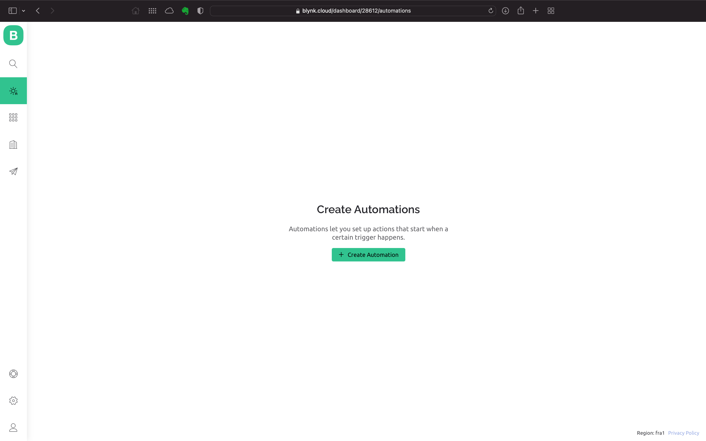
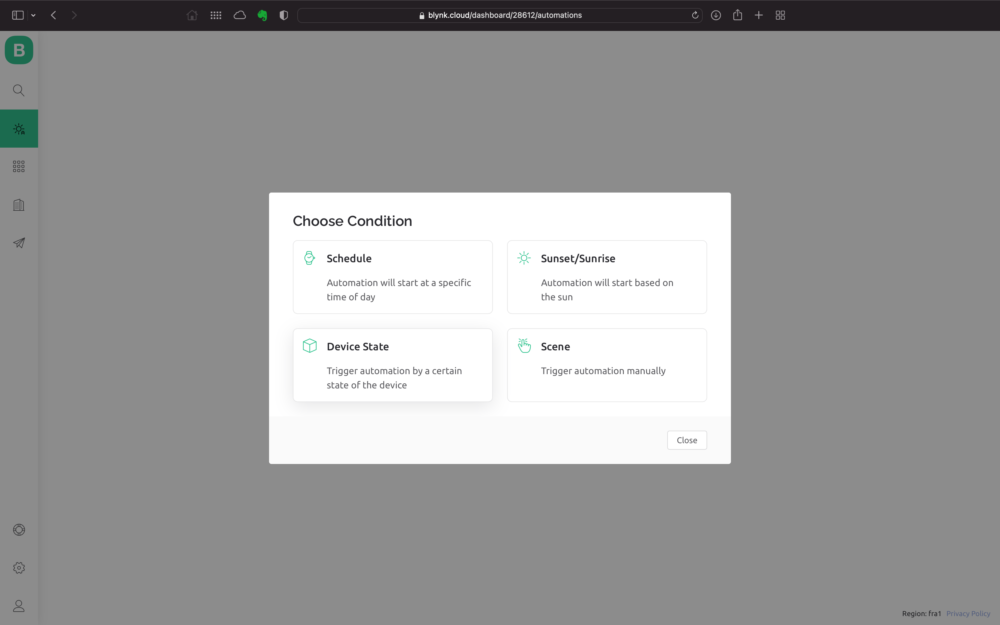
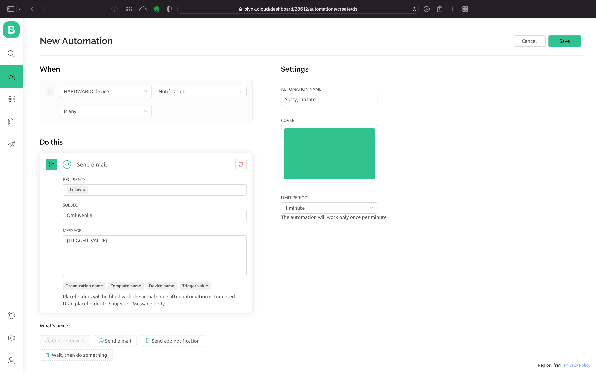
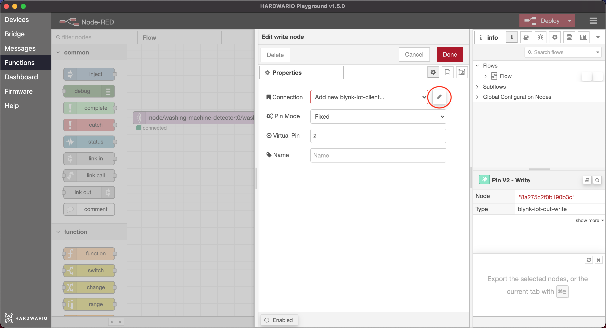
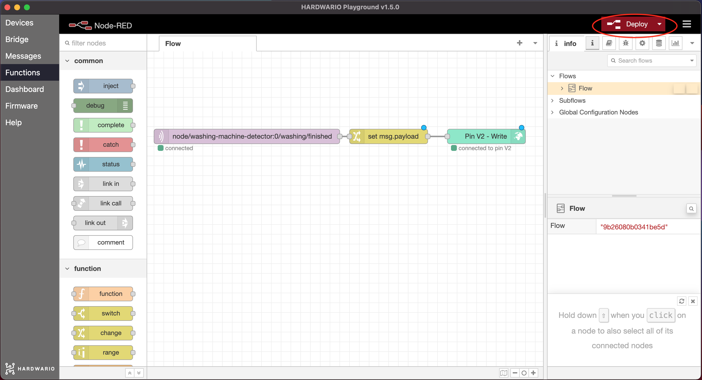
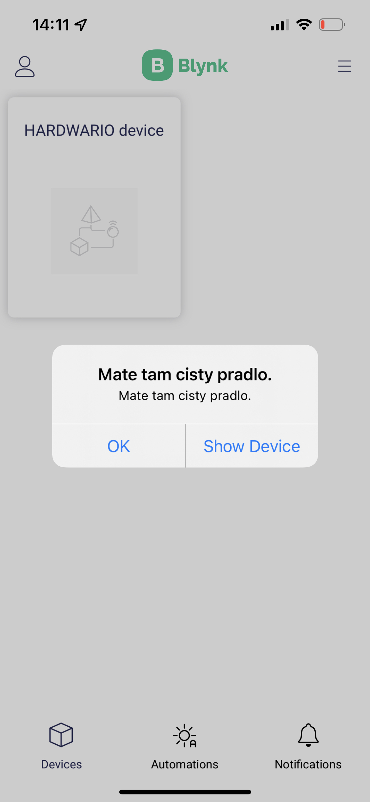

import Image from '@theme/IdealImage';

## Introduction

Raise your family washing machine's IQ. 🤖 With the IoT box, you'll program a notification that tells your parents the laundry is done.

In this project, you will learn to **set up the box to recognize when the washing machine has finished** and **send a notification to a phone**. 📱 👈

You only need a **box with a button** and a **Radio Dongle**, so the basic HARDWARIO [**Start Set**](https://www.hardwario.store/p/start-set/) is all you need.


## Download the new firmware

1. Flash the new **bcf-radio-washing-machine-monitor** firmware to the Core Module (you'll find it among the other firmware in Playground). It makes the box more sensitive to the washing machine's vibrations. 🔃

**Our tip:** Don't know how to get the firmware or what it is? [Find out here](https://docs.hardwario.com/tower/desktop-programming/firmware-flashing/).

2. [Pair the Core Module with the Radio Dongle](https://docs.hardwario.com/tower/desktop-programming/radio-network-management/#pairing-new-devices). Right after pairing, you'll see the Core Module's alias change to **washing-machine-detector**. 👌


## Get it going in Node-RED

1. In Playground, click the **Functions tab**, home of the [Node-RED](https://docs.hardwario.com/tower/desktop-programming/node-red-programming) programming canvas. 🤖
2. Start as always: first place an **mqtt in** node from the network section on the canvas.

Double-click it and copy this topic into the **Topic** field. The box uses it to report that the washing machine has stopped shaking:

```
node/washing-machine-detector:0/washing/finished
```

<div class="container">
  <div class="row">
    <Image img={require('./img/smart-washing-machine/smart-washing-machine-1.webp')} alt="Edit mqtt in node dialog with the washing finished topic pasted into the highlighted Topic field"/>
  </div>
</div>

Confirm with **Done**.

3. Next to it, place a **Change** node from the Function section.

<div class="container">
  <div class="row">
    <Image img={require('./img/smart-washing-machine/smart-washing-machine-2.webp')} alt="Node-RED workspace with a Change node placed next to the washing-machine-detector MQTT node"/>
  </div>
</div>


4. In the Change node, **set the message** your parents will get on their phone when the laundry is done. Leave out accented letters.
A little inspiration:
    - Your clean laundry is waiting.
    - I'm done. Do I get a week off now?
    - Washing's done, so leave me alone. Your washing machine.

<div class="container">
  <div class="row">
    <Image img={require('./img/smart-washing-machine/smart-washing-machine-3.webp')} alt="Edit change node dialog: msg.payload set to the notification message text"/>
  </div>
</div>

Confirm with **Done**.

## Prepare the Blynk IoT app

1. If you don't have an account yet, create one in the [Blynk IoT](https://blynk.io) app. [This guide](https://docs.hardwario.com/tower/platform-integrations/blynk-app/) shows how, and also how to create templates and datastreams. You'll need both.

2. Next, create a device template, again following [the same guide](https://docs.hardwario.com/tower/platform-integrations/blynk-app/). If you already have a template from previous projects, feel free to reuse it.

3. Now set up a new datastream. In the template detail, click the **Datastreams** tab and then **Edit** in the top right. A **+ New Datastream** button appears. Click it, choose **Virtual Pin**, and a dialog opens:


4. Name the new datastream and pick one of the free pins. We want the phone notification to show your own message, so **choose String as the data type** (a text string).

5. At the bottom of the dialog, also expand **Advanced settings** and tick the last option, **Expose to Automation**, so the datastream can be used in automations. In the menu next to it, choose **Sensor** and also tick **Available in Conditions**. Create the datastream by clicking **Create**.


6. Save your work with the **Save** button in the top right.

## Create a device

If you don't have a device yet, create one from your template. We describe how [in the guide you already know](https://docs.hardwario.com/tower/platform-integrations/blynk-app/).

## Create an automation

1. Switch to the **Automation** section and click the **+ Create Automation** button.



2. From the options offered, choose **Device State**. The automation runs every time you send a message to the app.



3. Setting up the automation is simple: in the **When** section you set when it should run, and in the **Do this** section what should happen next.

4. Set up the **When** section first: choose your device and the **datastream you created**. A third menu appears; leave it set to **Is Any**.

5. In the **Do This** section, click **Send app notification** and set the recipient. To keep it simple, choose yourself. With your mouse, drag the **Trigger value** item into the **Subject** and **Message** fields. It's the variable that holds the text of your message.

6. Finally, don't forget to fill in the **automation name**. In the **Limit period** menu, you can set how soon another notification may follow the previous one.



7. Save the automation with the **Save** button.

## Set up the phone

1. Time to steal your mom's or dad's phone for a minute and set up Blynk IoT on it. If you're new to Blynk, [**check out the guide**](https://docs.hardwario.com/tower/platform-integrations/blynk-app/).

2. Sign in to Blynk with your account.

## Finish the programming

1. Go back to your computer. On the Node-RED canvas, add a **green Write node** after the two nodes. You'll find it on the left in the **Blynk IoT** section (careful, not Blynk ws).


2. Double-click the node, then click the **pencil**. ✏



3. A window opens for connecting to Blynk. Enter ``blynk.cloud`` in the **Url** field, and copy the values from the device detail in the web app on your computer into the **Auth Token** and **Template ID** fields.


Confirm the settings with **Add**.

4. Fill in the virtual pin number of the datastream you created and save everything with **Done**.

5. All that's left is to **wire the nodes together** and send the command off into space with the red **Deploy** button in the top right. 👏



## Give it a spin!

1. **Put the box on the washing machine** and stick it down with a small piece of tape so it doesn't fall off.

2. **The box recognizes when the washing machine has finished**, because it stops shaking, and sends a message to your mom's or dad's phone.
Cool, right? Suddenly you're **living in a smart home**! 🤡


