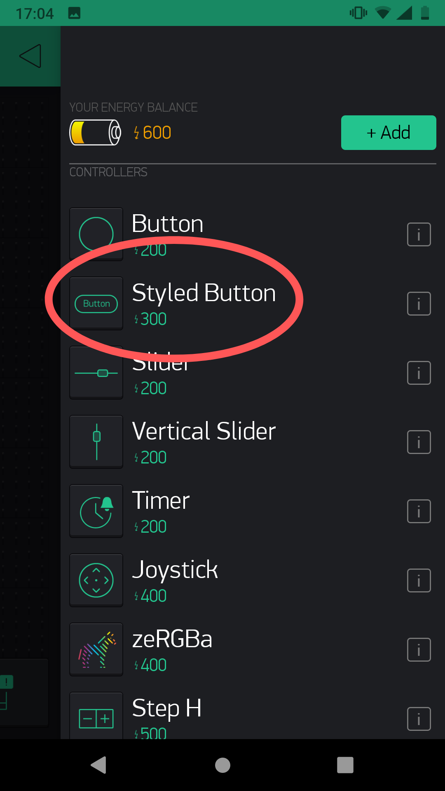
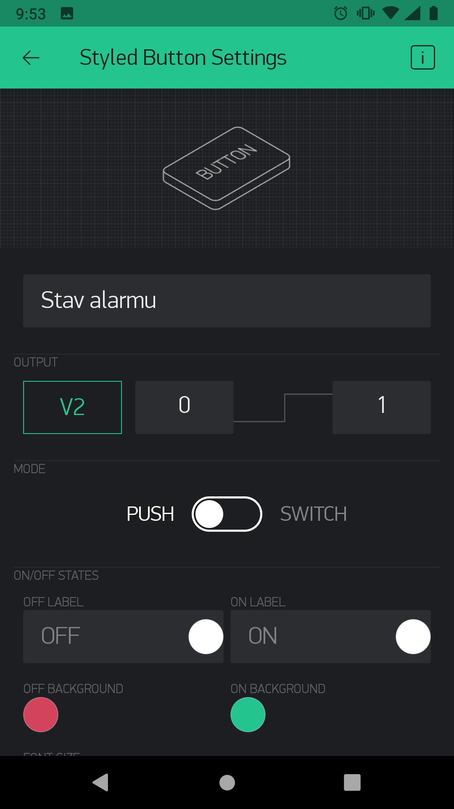
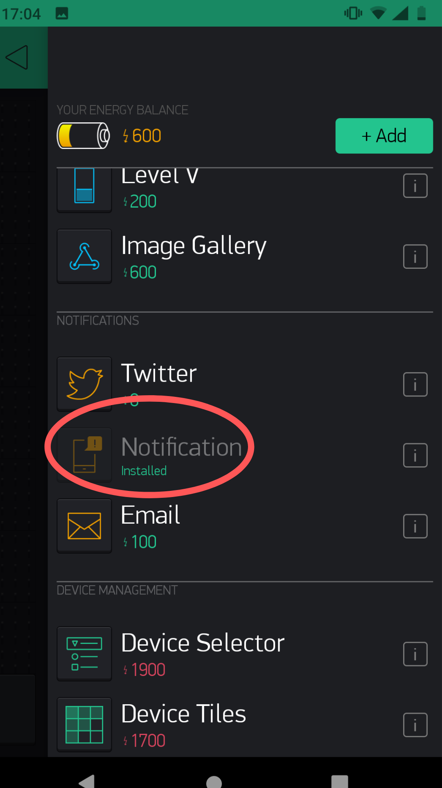
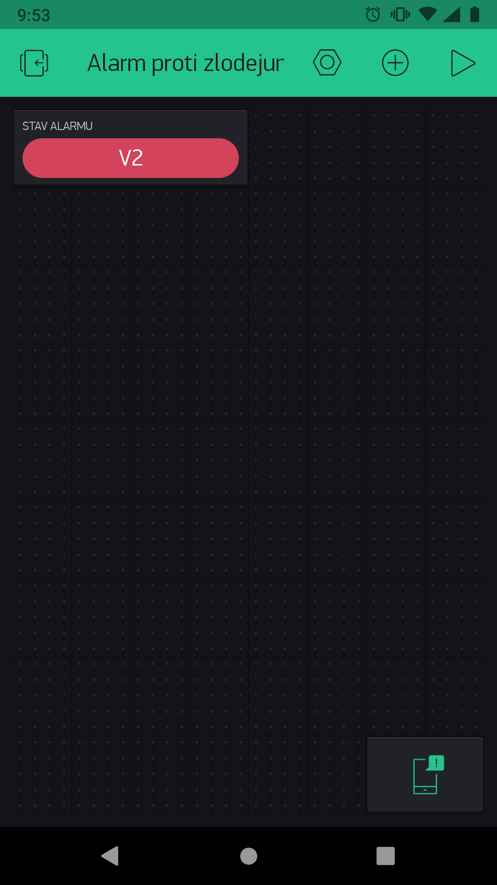
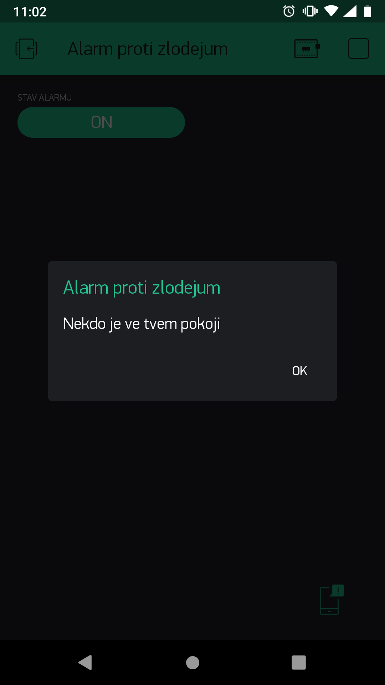

import Image from '@theme/IdealImage';

## Introduction

Is your younger brother entering your room? Are you going on holiday and afraid someone will steal your treasure? Set up an alarm against all thieves. 👮

Under this project, you will learn how to create a ** that sends notifications to your mobile if someone else is in your room**. 👁️

If you already have the Start Set, you will only need the [**PIR Module**](https://shop.hardwario.com/p/pir-module/). Alternatively, the [Motion  Set](https://www.hardwario.store/p/motion-set) contains all the equipment you need.


## Download the new firmware

1. If you haven´t done so yet, put the Motion  Set together.

2. Load special firmware onto the Core Module, namely bcf-radio-burglar-alarm (you will find it among the other firmware in Playground). With this firmware the box will reveal intruders and burglars.👂


**Our tip**: You don’t know how to download the firmware or what is it? [You'll find out here](https://docs.hardwario.com/tower/firmware-development/firmware-quick-start/).

1. Pair the Core Module with a USB Dongle. Right after pairing, you will see that your Core Module has changed the Alias to **Burglar alarm**.

<div class="container">
  <div class="row">
    <Image img={require('./img/thief-trap/thief-trap-2.webp')}/>
  </div>
</div>

❓ **Did you know**? In English, a burglar is a sort of thief. For example, Bilbo Baggins from the Hobbit was a thief. He stole from the dragon's treasury! 🐉


## Start the app on your mobile

1. **Continue on your mobile.**. The box connects to your smartphone thanks to the **Blynk app**. 📱 [Find out how Blynk works.](https://hardwario.academy/how-to-connect-blynk/)

2. Select the embellished **Styled button** from the menu. 🚨 The button is placed on the project desktop and switches the motion  on and off.



3. Clicking on the button takes you to settings.

**Name** the detector in the upper line.

Directly below this, select the **PIN**. Click on it. Choose **virtual** and **select the number as you wish**. Make sure you remember it! You will need to enter it on your computer. Save the PIN and continue setting the button.

The rest is up to your artistic talents. 🎨 You can choose the color of the button when it is off and on, its shape and other details.

When you have completed everything,<b> </b>**return to the desktop** by clicking on the arrow in the top left.



4. Click on the desktop to add another feature. In this case, it concerns the **notification**.



5. Your desktop now looks like this. Start the project with the **Play** button in the top right. ▶️



6. **Tap the button**, it should switch from ON mode to OFF mode.


## Set the switching button in Node-RED

1. In Playground, click the **Functions tab** where the [Node-RED](https://docs.hardwario.com/tower/desktop-programming/node-red-programming/) programming desktop is.🤖
2. Start programming and jump right in. The first node will contain a small javascript code. Place it on the desktop using the ** Function node** from under the section of the same name.

Double-click on it and type the node name in the Label field: Int parser.

Subsequently, copy the following simple javascript code into the Function field:

```
msg.payload = parseInt(msg.payload); return msg;
```

<div class="container">
  <div class="row">
    <Image img={require('./img/thief-trap/thief-trap-3.webp')}/>
  </div>
</div>

3. Now add a node with which you can turn the thief monitoring on and off. This is to keep the phone from bleeping when you are home. 🔕 Do it using the **Switch node** under the Dashboard section.

<div class="container">
  <div class="row">
    <Image img={require('./img/thief-trap/thief-trap-4.webp')}/>
  </div>
</div>

4. Double-click on the node and change its **Label** to Trigger. Then adjust **On Payload** and **Off Payload** to 1 and 0 (as shown in the screenshot).

Confirm with the **Done** button.

<div class="container">
  <div class="row">
    <Image img={require('./img/thief-trap/thief-trap-5.webp')}/>
  </div>
</div>

5. Behind this node, place the **Write** **node** from under the Blynk ws section.

<div class="container">
  <div class="row">
    <Image img={require('./img/thief-trap/thief-trap-6.webp')}/>
  </div>
</div>

6. Double-click on it. Fill in the **PIN** you entered for the project in Blynk. Enter the number without the initial V.


Then click on the small pencil symbol.✏

<div class="container">
  <div class="row">
    <Image img={require('./img/thief-trap/thief-trap-7.webp')}/>
  </div>
</div>

7. The connection settings will open. In the **URL** field, enter the web address from the field below. In the **Token** field, copy and paste the code you received by e-mail from Blynk.

Finally, name the project in the **Label** field for better orientation.

Confirm everything and return to the programming desktop.

<div class="container">
  <div class="row">
    <Image img={require('./img/thief-trap/thief-trap-8.webp')}/>
  </div>
</div>

8. Add a node a bit lower down with a similar name but a different function. This should be a **Write Event node** from under the Blynk ws section. Set the same **PIN** in it again. You do not have to click on the small pencil again, the nodes are connected and everything is set up by itself.

<div class="container">
  <div class="row">
    <Image img={require('./img/thief-trap/thief-trap-9.webp')}/>
  </div>
</div>

9. Behind this node, place another javascript **Function node**. With it, the project will show whether the button in Blynk is currently on or off.

In the **Name** line, fill in the Notification setting status and copy the following code into the **Function** field:

```
if(msg.payload == "1") { flow.set("alarmOn", 1); } else { flow.set("alarmOn", 0); } return msg;
```

<div class="container">
  <div class="row">
    <Image img={require('./img/thief-trap/thief-trap-10.webp')}/>
  </div>
</div>

10. Now connect the whole flow. Don't go just yet though. You still need to set up two more miniflows.


## Program the main sensor

1. The whole project works on the principle of a motion sensor – when an intruder or thief enters your room, the box notices it and activates the alarm.

By measuring the ambient temperature, the alarm can change its status to keep itself in a low power mode in order to not drain the batteries in the box too much.🔋

In the next flow, start with the good old **MQTT node** from under the Input section. In the node, set the temperature measurement as **Topic**:

```
node/burglar-alarm:0/thermometer/0:1/temperature
```

<div class="container">
  <div class="row">
    <Image img={require('./img/thief-trap/thief-trap-11.webp')}/>
  </div>
</div>

2. Place another Function node right behind it. In the Name field, write the Alarm Status and use the following code:


```
msg.payload = flow.get("alarmOn"); return msg;
```

Due to this node, the sensor will only be active if you trigger it by a button in Blynk or on a computer.

<div class="container">
  <div class="row">
    <Image img={require('./img/thief-trap/thief-trap-12.webp')}/>
  </div>
</div>

3. For the best bit of all, place the MQTT node from under the

**Output** section onto the desktop (watch it ❗).

In the node, set _node/burglar-alarm:0/alarm/-/set/state_ as the Topic, through which the sensor sends its status to the alarm. If the switch in Blynk or Dashboard is turned on, the alarm is activated. 👮


1. Subsequently **connect** these three elements together.

<div class="container">
  <div class="row">
    <Image img={require('./img/thief-trap/thief-trap-13.webp')}/>
  </div>
</div>

## Set up your message

1. In the last miniflow, you set up the message that is sent to your mobile when the alarm detects someone. 📩

Place the **MQTT node from under the Input section** onto your desktop. In the node, set the **Topic** as node/burglar-alarm:0/pir/-/event-count. This means that the node will be activated if it is active and someone passes by it. Simply, a smart motion sensor.

<div class="container">
  <div class="row">
    <Image img={require('./img/thief-trap/thief-trap-14.webp')}/>
  </div>
</div>

2. A short javascript code should follow it, namely a **Function node**. As the **Name** set _Message_ with this code right here:

```
msg.payload = "Someone's in your room" return msg;
```

**Our tip**: Feel free to rewrite the message in the code, but remember that Blynk does not read hooks (háčky) and accent marks (čárky). Otherwise it´s double Dutch! 🤷

<div class="container">
  <div class="row">
    <Image img={require('./img/thief-trap/thief-trap-15.webp')}/>
  </div>
</div>

3. Finally, place here the **Notify node** from under the Blynk ws section. This communicates with the mobile app notification. You'll find a Token filled in. Just make sure it matches the one that Blynk sent to your e-mail.

<div class="container">
  <div class="row">
    <Image img={require('./img/thief-trap/thief-trap-16.webp')}/>
  </div>
</div>

4. **Connect** these elements. Finally, press the **Deploy** button.

<div class="container">
  <div class="row">
    <Image img={require('./img/thief-trap/thief-trap-17.webp')}/>
  </div>
</div>

## Ready, steady… go!

1. When you want to trigger the alarm, **set the switch** on your computer (in the Dashboard tab) or on your mobile. Both buttons work together, so you can set either one or the other.

<div class="container">
  <div class="row">
    <Image img={require('./img/thief-trap/thief-trap-18.webp')}/>
  </div>
</div>

2. Place your box near the door. When the box detects movement, **it will send a notification to your mobile**.



Thieves beware! The law is here! 😱
