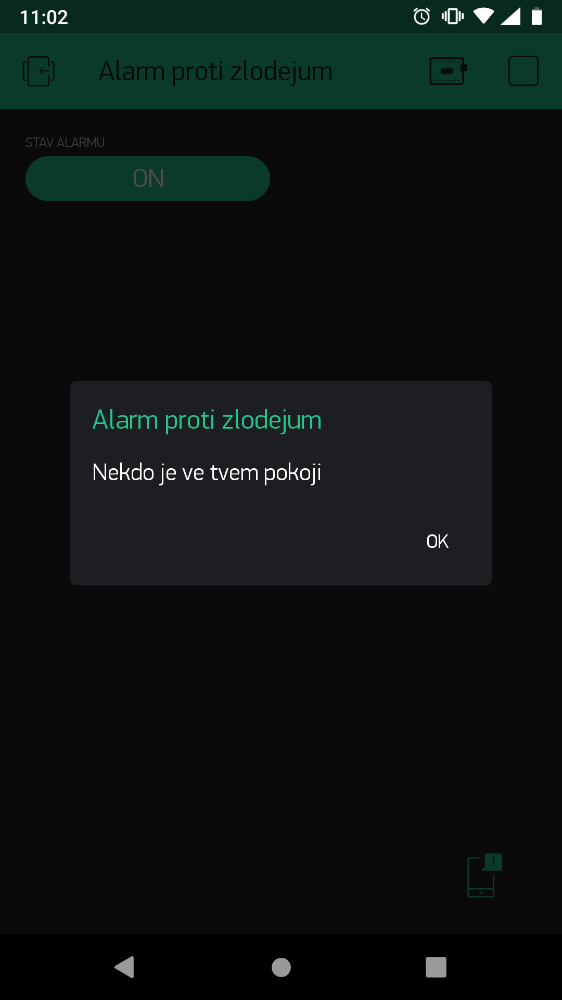

import Image from '@theme/IdealImage';

## Introduction

Does your younger brother sneak into your room? Going on vacation and worried someone will steal your treasure? Set up an alarm against all intruders. 👮

In this project, you will learn to build a **detector that alerts your phone when someone else is in your room**. 👁️

If you already have the Start Set, you will also need the [**PIR Module**](https://www.hardwario.store/p/pir-module/). The [Motion Set](https://www.hardwario.store/p/motion-set) has everything you need.


## Download the new firmware

1. If you haven't done so yet, assemble the Motion Set.

2. Flash the special **twr-radio-burglar-alarm** firmware to the Core Module (you'll find it among the other firmware in Playground). With this firmware, the box catches intruders. 👂


**Our tip**: Don't know how to get the firmware or what it is? [Find out here](https://docs.hardwario.com/tower/desktop-programming/firmware-flashing/).

3. Pair the Core Module with the Radio Dongle. Right after pairing, you'll see the Core Module's alias change to **burglar-alarm**.

<div class="container">
  <div class="row">
    <Image img={require('./img/thief-trap/thief-trap-2.webp')} alt="Playground Devices tab: the paired device row with alias burglar-alarm:0 highlighted"/>
  </div>
</div>

❓ **Did you know?** A burglar is a thief who breaks into buildings. In The Hobbit, Bilbo Baggins was hired as a burglar, and he really did steal from a dragon's treasure hoard. 🐉


## Prepare Blynk IoT for notifications

Your box connects to your phone through the **Blynk IoT** app, where the alarm arrives as a push notification. 📱 Node-RED sends the text of the alarm to Blynk, and a Blynk automation turns every new message into a notification.

1. If you don't have a [Blynk IoT](https://blynk.io) account yet, create one. The free plan is enough for this project: at the time of writing, it includes push notifications in the app and up to five automations.

2. Create a device template. [Blynk's quick guide](https://docs.blynk.io/en/getting-started/template-quick-setup) shows you how. You can also reuse a template from an earlier project.

3. You'll also want to turn the alarm on and off from your phone, so it doesn't beep while you're home. 🔕 In the template, open the **Datastreams** tab, click **New Datastream** and choose **Virtual Pin**. Name the datastream (for example `Alarm`), pick pin V2 and choose the **Integer** type with a range of **0–1**. The switch on your phone will send `1` (on) or `0` (off), and you'll read this value in Node-RED in a moment.

4. Add a second **Virtual Pin** datastream for the alarm message. Name it (for example `Message`), pick pin V3 and set the **Data Type** to **String**, because the notification will carry your own text. In its settings, let automations use it as a trigger: in the **Automations** section, turn on **Use as Condition**. Create the datastream and save the template.

5. Create a device from the template: in **Devices**, add a new device, choose your template and give the device a name. You'll find its **Auth Token** on the device's **Device Info** tab. You'll need it in Node-RED.

## Create the automation

1. Open **Automations** in Blynk and create a new automation. For the condition (**When**), choose **Device State**, then your device, the message datastream (V3) and **Is Any**. The automation will then react to every message, even when it's the same as the last one.

2. Under **Do this**, add the action that sends a notification to the mobile app (**Send In-App Notifications**) and choose yourself as the recipient. Put the **Trigger value** placeholder (`{TRIGGER_VALUE}`) in the message. Blynk replaces it with the text that Node-RED sends.

3. Name the automation. **Limit period** sets how soon the automation may run again: choose the shortest option, otherwise you won't get a message about movement that comes soon after the first. Save the automation.

4. Download the **Blynk IoT app** to your phone from the [App Store](https://apps.apple.com/us/app/blynk-iot/id1559317868) or [Google Play](https://play.google.com/store/apps/details?id=cloud.blynk) and sign in with the same account. Make sure notifications are allowed for the app so the alarm can pop up. 🚨

5. On your phone, open the device and set up its dashboard: add a **Button** widget, switch it to **Switch** mode and assign it the alarm datastream (V2).


## Read the alarm switch in Node-RED

1. In Playground, click the **Functions tab**, home of the [Node-RED](https://docs.hardwario.com/tower/desktop-programming/node-red-programming/) programming canvas. 🤖
2. Dive right into programming. The first node holds a small piece of JavaScript. Place it on the canvas as a **Function** node from the section of the same name.

Double-click it and type the node name in the **Name** field: Int parser.

Then copy this simple code into the Function field:

```
msg.payload = parseInt(msg.payload); return msg;
```

<div class="container">
  <div class="row">
    <Image img={require('./img/thief-trap/thief-trap-3.webp')} alt="Node-RED workspace with a Function node placed on the canvas"/>
  </div>
</div>

3. Now add a node for turning the guarding on and off, so your phone doesn't raise the alarm when you're home yourself. 🔕 Use the **Switch** node from the Dashboard section for this.

<div class="container">
  <div class="row">
    <Image img={require('./img/thief-trap/thief-trap-4.webp')} alt="Node-RED workspace: a Switch widget node from the Dashboard section placed next to the Function node"/>
  </div>
</div>

4. Double-click the node and change its **Label** to Trigger. Then set **On Payload** and **Off Payload** to 1 and 0 (see the screenshot).

Confirm with **Done**.

<div class="container">
  <div class="row">
    <Image img={require('./img/thief-trap/thief-trap-5.webp')} alt="Edit switch node dialog: Label, On Payload 1, and Off Payload 0 highlighted"/>
  </div>
</div>

5. You'll turn the alarm on from your phone, too. Add a **write event** node from the **Blynk IoT** section (not from **Blynk ws**, which belongs to the old Blynk that no longer works). It receives the value of the alarm datastream from the app.

6. Double-click it to open it. Next to **Connection** you'll see **a small pencil**. Click it and a new window opens. In the **Url** field enter `blynk.cloud`, and copy the **Auth Token** and **Template ID** from the Blynk web app on your computer: the Auth Token is on the device's **Device Info** tab, the Template ID in the template details. Confirm with **Add**. Then enter 2 in the **Virtual Pin** field (for V2) and confirm with **Done**. (You'll use the same connection for every Blynk IoT node in this project.)

7. So that the switch on your phone follows the one on the Dashboard, add a **write** node from the same **Blynk IoT** section. Select the same connection, enter 2 in the **Virtual Pin** field and confirm with **Done**.

8. Behind both the Dashboard switch and the Blynk IoT write event node, place a **Function** node with JavaScript. With it, the project remembers whether the alarm is currently on, whether you switched it on from the computer (Dashboard) or from your phone (Blynk IoT).

In the **Name** field, enter Notification setting status, and copy this code into the **Function** field:

```
if(msg.payload == "1") { flow.set("alarmOn", 1); } else { flow.set("alarmOn", 0); } return msg;
```

<div class="container">
  <div class="row">
    <Image img={require('./img/thief-trap/thief-trap-10.webp')} alt="Node-RED flow with the notification-status Function node highlighted next to the switch and Blynk write event nodes"/>
  </div>
</div>

9. Then wire up the whole flow: write event ➡️ Int parser ➡️ Trigger switch ➡️ write. Also connect both the write event node and the Trigger switch to the Notification setting status node. Don't leave just yet, though: two more mini flows are waiting for you.


## Program the main sensor

1. The whole project works like a motion detector: when an intruder gets into your room, the box notices and sets off the alarm.

Thanks to the ambient temperature measurement, the alarm can switch its state while staying in low-power mode, so it doesn't drain the batteries in the box. 🔋

So start the next flow with the good old **mqtt in** node from the network section. Set the temperature measurement as its **Topic**:

```
node/burglar-alarm:0/thermometer/0:1/temperature
```

<div class="container">
  <div class="row">
    <Image img={require('./img/thief-trap/thief-trap-11.webp')} alt="Node-RED flow with the burglar-alarm thermometer temperature MQTT node highlighted"/>
  </div>
</div>

2. Right behind it, place another Function node. Write Alarm status in the Name field and use this code:


```
msg.payload = flow.get("alarmOn"); return msg;
```

Thanks to this node, the sensor is active only when you switch it on in Blynk or on the computer.

<div class="container">
  <div class="row">
    <Image img={require('./img/thief-trap/thief-trap-12.webp')} alt="Node-RED flow with the alarm-status Function node highlighted next to the temperature MQTT node"/>
  </div>
</div>

3. Third time's the charm: place an MQTT node on the canvas, this time the **mqtt out** node from the network section (careful, out, not in ❗).

In it, set _node/burglar-alarm:0/alarm/-/set/state_ as the Topic. Through it, the flow sends the alarm its state. If the switch in Blynk or on the Dashboard is on, the alarm turns on. 👮


4. Then **wire up** these three.

<div class="container">
  <div class="row">
    <Image img={require('./img/thief-trap/thief-trap-13.webp')} alt="Node-RED flow: temperature, alarm-status, and the highlighted MQTT output node with the alarm set state topic connected"/>
  </div>
</div>

## Set up your message

1. In the last mini flow, you'll set up the message that reaches your phone when the alarm catches someone. 📩

First place an **mqtt in** node from the network section on the canvas and set its **Topic** to node/burglar-alarm:0/pir/-/event-count. The node fires when the alarm is on and someone walks past the box. Simply put, a smart motion detector.

<div class="container">
  <div class="row">
    <Image img={require('./img/thief-trap/thief-trap-14.webp')} alt="Node-RED flow with the PIR event-count MQTT input node highlighted"/>
  </div>
</div>

2. Next comes a little JavaScript, a **Function** node. Set its **Name** to _Message_ and use this code:

```
msg.payload = "Someone's in your room"; return msg;
```

**Our tip**: Feel free to change the message in the code, but remember that Blynk can't read accented letters. To Blynk, they're all Greek. 🤷

<div class="container">
  <div class="row">
    <Image img={require('./img/thief-trap/thief-trap-15.webp')} alt="Node-RED flow with the message Function node highlighted next to the PIR event-count node"/>
  </div>
</div>

3. Finally, place a **write** node from the **Blynk IoT** section. It uses the connection you set up earlier (Url `blynk.cloud`, Auth Token + Template ID), so you don't need the pencil again. Double-click it, select that connection and enter 3 in the **Virtual Pin** field, the pin of the message datastream. Confirm with **Done**. That's what turns the detected motion into a push notification: the node writes the message to the datastream, and the automation sends it on to your phone.

4. **Wire up** the nodes so that the motion ➡️ becomes your message, ➡️ which goes to Blynk IoT ➡️ and lands on your phone. 👾 Finally, press the red **Deploy** button.

## Ready, steady, go!

1. When you want to turn the alarm on, **flip the switch** on your computer (on the Dashboard tab) or on your phone. The two switches work together, so either one will do.

<div class="container">
  <div class="row">
    <Image img={require('./img/thief-trap/thief-trap-18.webp')} alt="Playground Dashboard tab with the arming switch turned on"/>
  </div>
</div>

2. Put your box by the door. As soon as it detects movement, **it sends an alert to your phone**.



Thieves, beware! The law is here! 😱
