## Introduction

This project will reveal all the secrets of your school, whether someone hunts ghosts or just wants to find a hot spot for their next date. Measure the temperature in different corners of your school with your classmates and try to be the one to discover the biggest extreme. 😱

With this project you'll learn to **measure temperature with IoT and show it on your phone**. All you need is the basic HARDWARIO set, the [**Start Set**](https://www.hardwario.store/p/start-set/).

**Suggest the game to your physics teacher** as a great way to liven up a lesson, or just do it with friends after school.

**This game is all about winning.** Whoever finds the coldest or hottest place in school is **the king**! 👑 If you have several boxes in your class, work individually or in small groups. If you only have one, take turns.


## Get your box ready

1. Put the Start Set together and pair it. For the Core Module you need the **radio push button** firmware. If you don't know how to download firmware or what it is, [find out here](https://docs.hardwario.com/tower/firmware-development/hardwario-extension-tutorial/#flash-firmware).

2. You can watch the temperature changes in the **Messages** tab in the Playground.

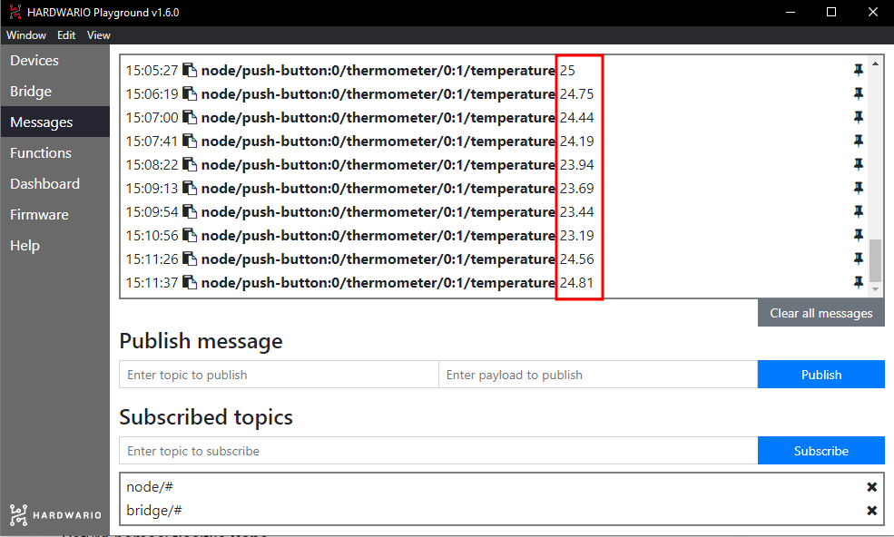

## Set up Node-RED

1. To record the lowest or highest temperature, set up your own indicator. On your computer, start with the bubbles in [Node-RED](https://docs.hardwario.com/tower/firmware-development/hardwario-extension-tutorial/#flash-firmware). First, click the **Functions** tab in the Playground.

2. Place a light purple node (a bubble) named **MQTT** on the empty canvas. You'll find it in the Input section.

3. Double-click the node to open it. In the **Topic** line you specify what you want the indicator to display. For now it will be temperature, so copy the temperature message from the Messages tab (without the number) into the line. Or just use this one:

```
node/push-button:0/thermometer/0:1/temperature
```

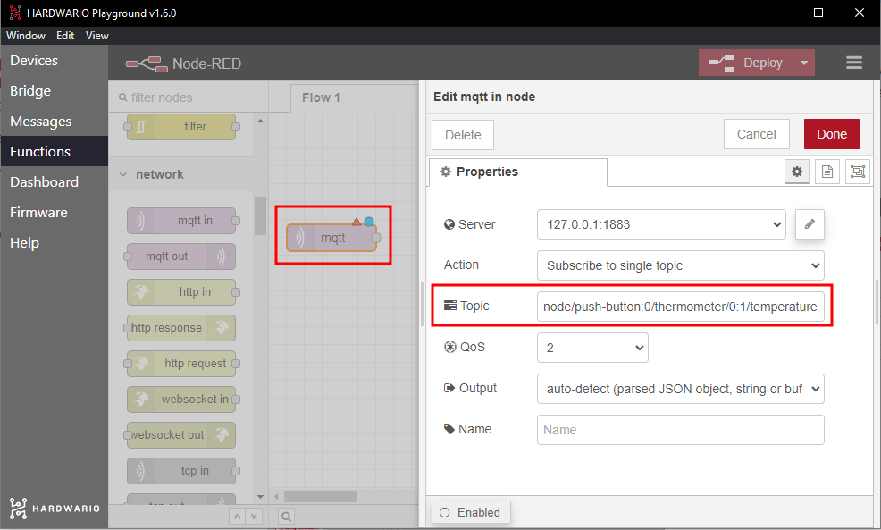

Confirm with the **Done** button.

## Prepare the Blynk IoT app

1. If you don't have one yet, create an account in the [Blynk IoT](https://docs.hardwario.com/tower/platform-integrations/blynk-app/) app. See [this guide](https://docs.hardwario.com/tower/platform-integrations/blynk-app/) for how to do it — it also covers how to create templates and datastreams. You'll need both.

2. The second step is to create a device template. You'll find how in [the same guide](https://docs.hardwario.com/tower/platform-integrations/blynk-app/). You can also reuse a template from previous projects if you have one.

3. Now set up a new Datastream. On the template detail, click the **Datastreams** tab. In the top right, click **Edit**. A **+ New Datastream** button appears — click it, choose **Virtual Pin**, and a dialog opens:

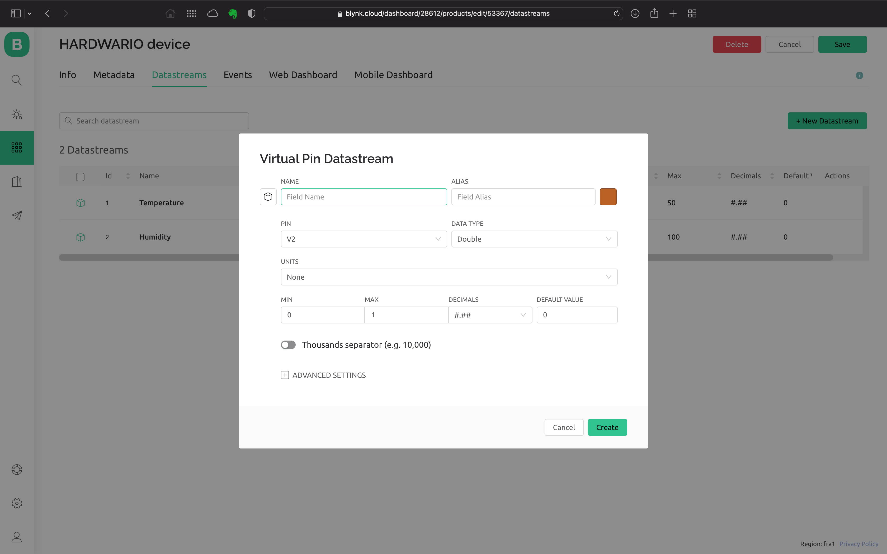

4. Set a name for the new Datastream and pick one of the free Pins. You'll measure temperature as a decimal number, so choose the **Double** type and set the unit to **Celsius**. Don't forget to set the temperature range you'll measure, for example **0 - 50**.

5. Create the Datastream by clicking **Create**.

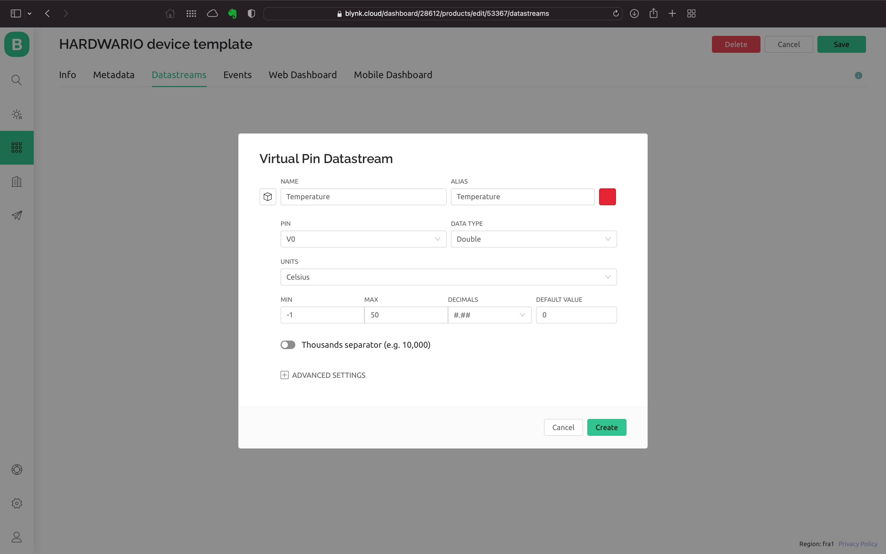

6. Save your work with the **Save** button in the top right.

## Create a device

If you don't have one yet, create a device from the template you made. We describe how in [the guide you already know](https://docs.hardwario.com/tower/platform-integrations/blynk-app/).

## Run the app on your mobile

Download the **Blynk IoT app** to your phone from the [App Store](https://apps.apple.com/us/app/blynk-iot/id1559317868) or [Google Play](https://play.google.com/store/apps/details?id=cloud.blynk). Sign in with your credentials.

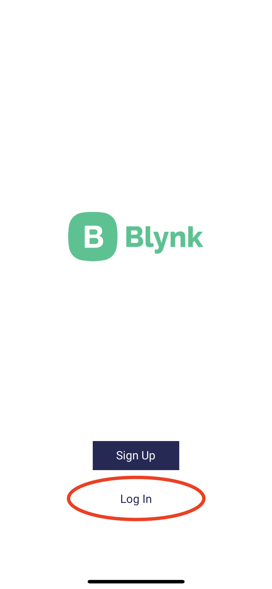

Right after signing in you'll see the device you created:

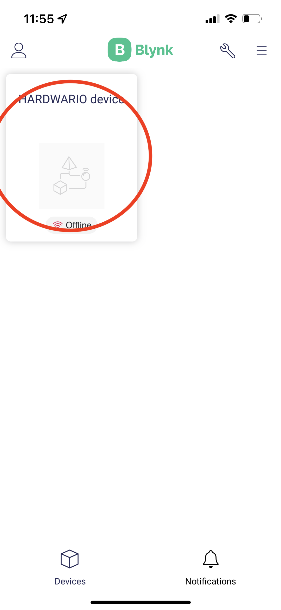

Tap it. Now let's set up the dashboard where we'll show the measured value:

1. Under the **key** in the top right you'll find the dashboard setup page.

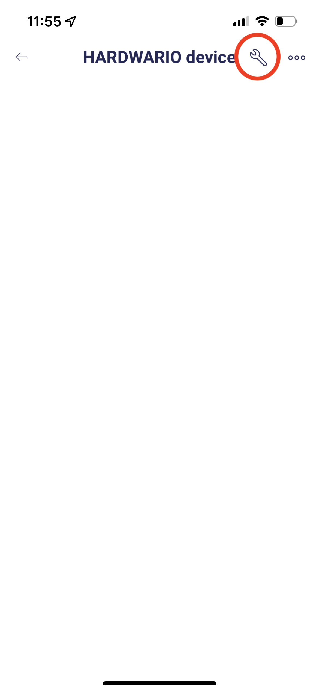

2. Use the **+** button, or tap somewhere on the canvas, to add a new chart or other dashboard element. We'll use a **Gauge** now.

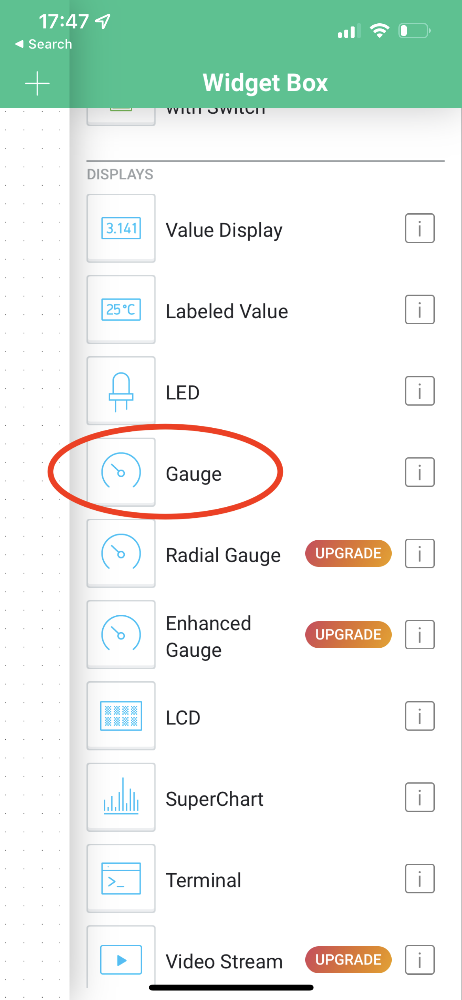

3. Tap the added widget to open its settings. The most important thing is to fill in the ***Datastream*** from your template for the chosen virtual Pin. You can also add a name and change the colour.

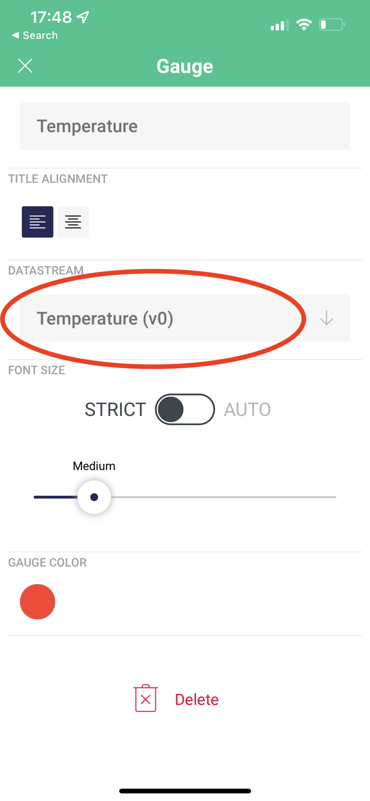

4. Your app is ready. Now let's start sending data to it. 💪

## Connect your mobile with the box

1. Go back to your computer. On the Node-RED canvas, add a green **Write node** after both nodes. You'll find it on the left under the Blynk IoT section.

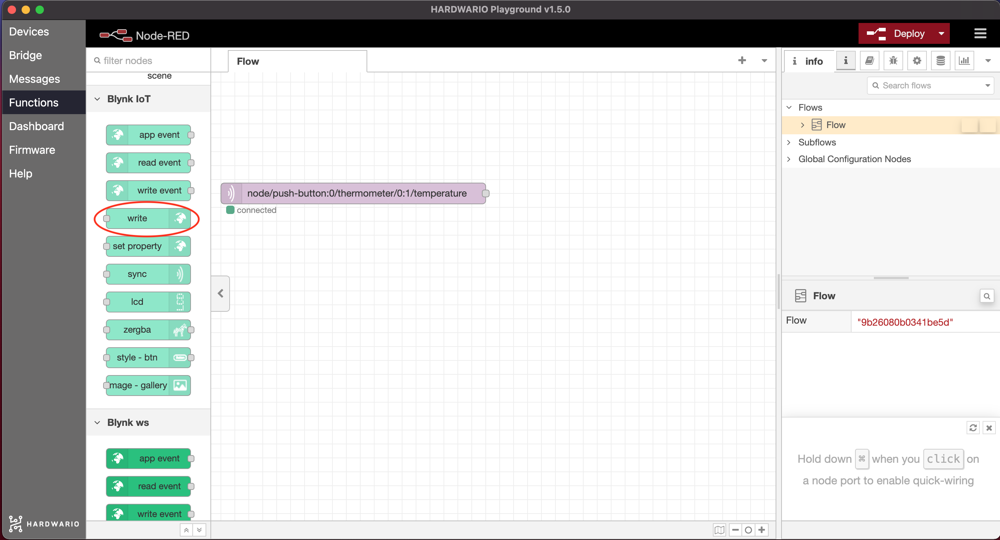

2. Double-click the node to open it. On the right you'll see a **small pencil**. Click it and a new window opens. In the **Url** field enter `blynk.cloud`, and into the **Auth Token** and **Template ID** fields copy the values from the device detail in the web app on your computer.

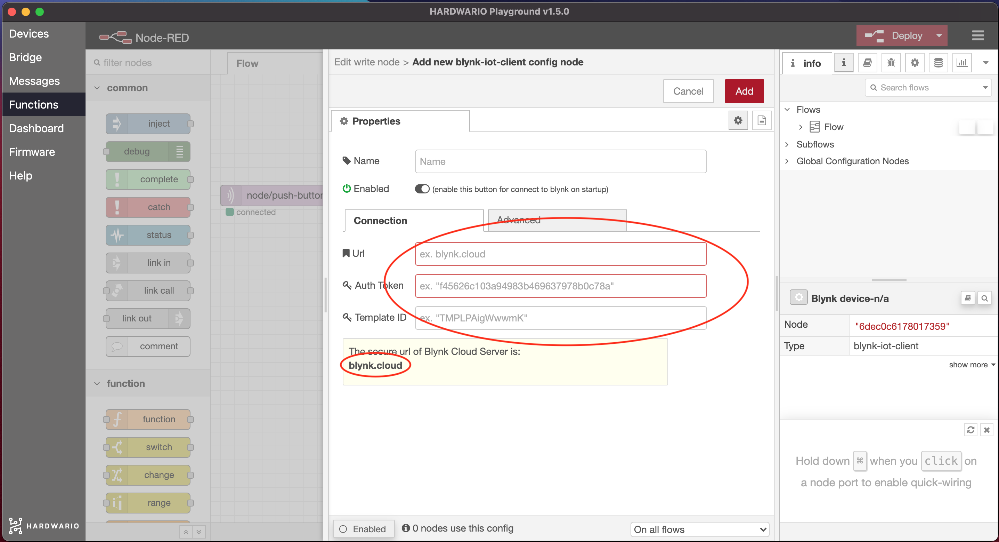

Confirm the setup with the **Add** button. But don't leave the node just yet. 👈

3. In the **Virtual Pin** line, write the number you chose as the PIN in Blynk. Don't use the letter "V". Confirm with the **Done** button.

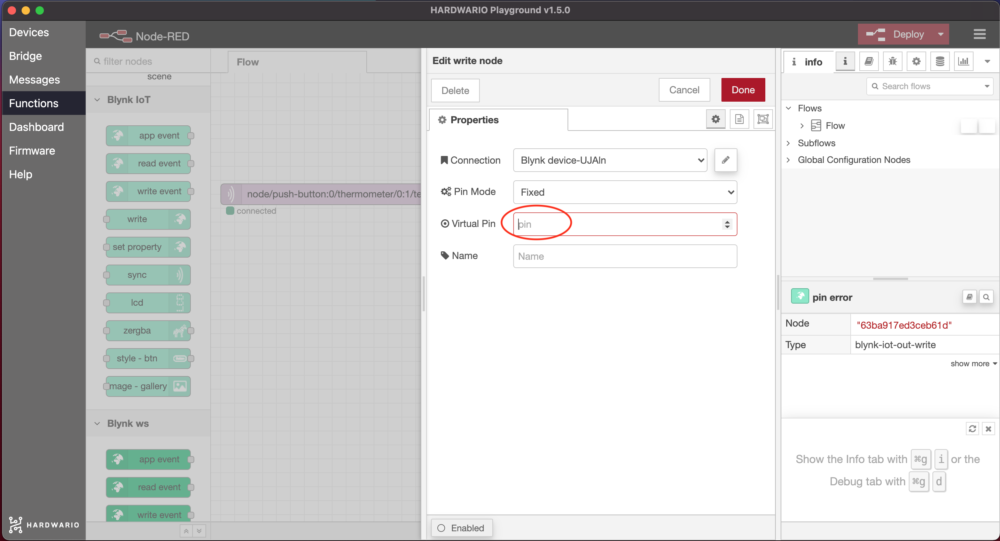

4. Now **connect both nodes** and click the red **Deploy** button in the top right. 🚨

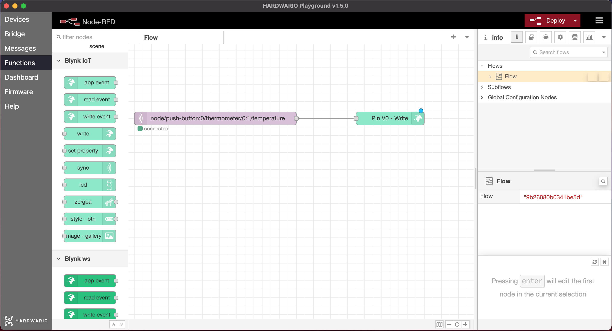

## One-up your class

1. Alone or in a group, **guess which place might be the hottest or coldest at school**. 🔥 ⛄

2. Each individual or group has **only 15 minutes** to explore. 🔦 Let's make it exciting.

3. Take the box to the spot and **watch the temperature on your mobile**. It may take a moment for the temperature to show on the gauge.

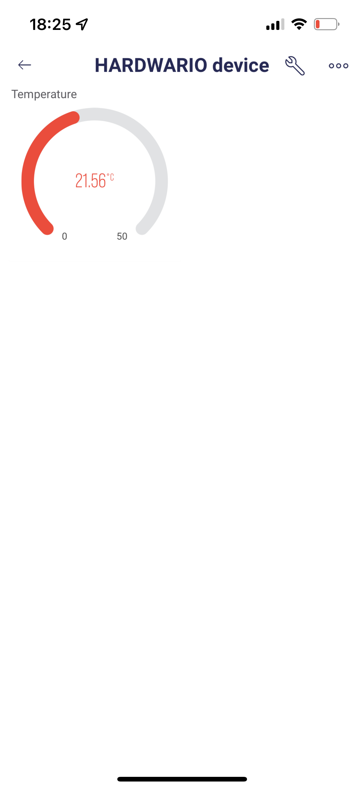

4. Try several places and at the end announce the most extreme results. **Congrats to the winners!** 🎇
