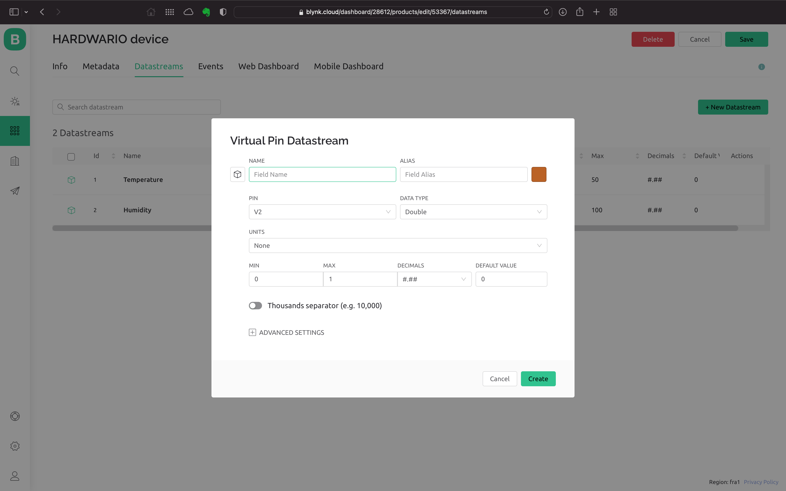
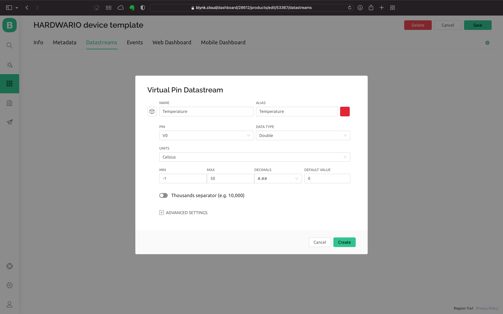
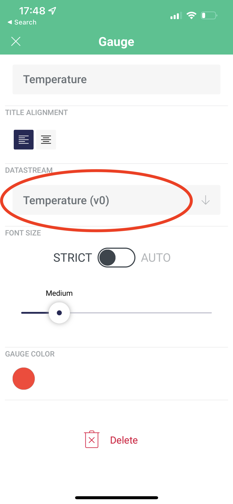
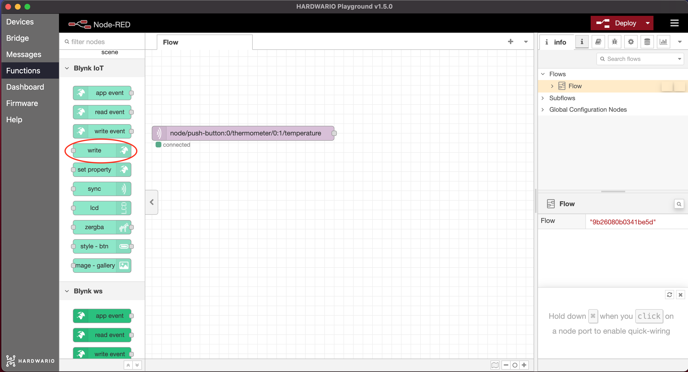
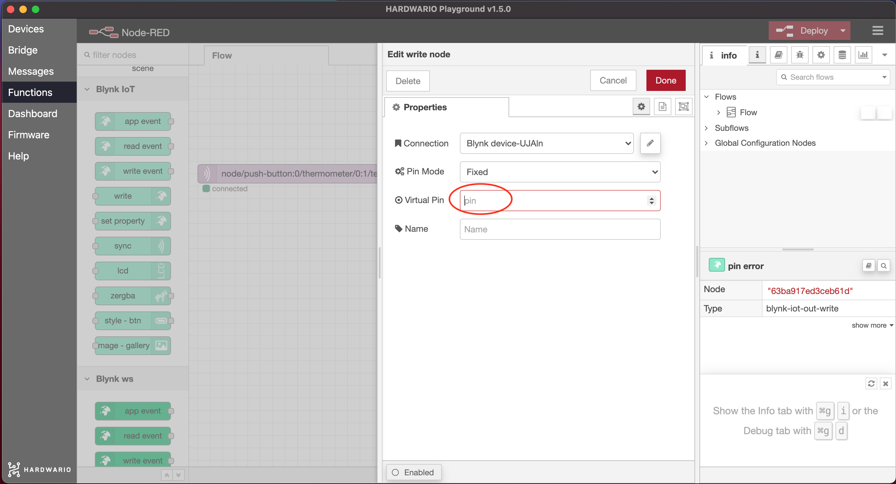
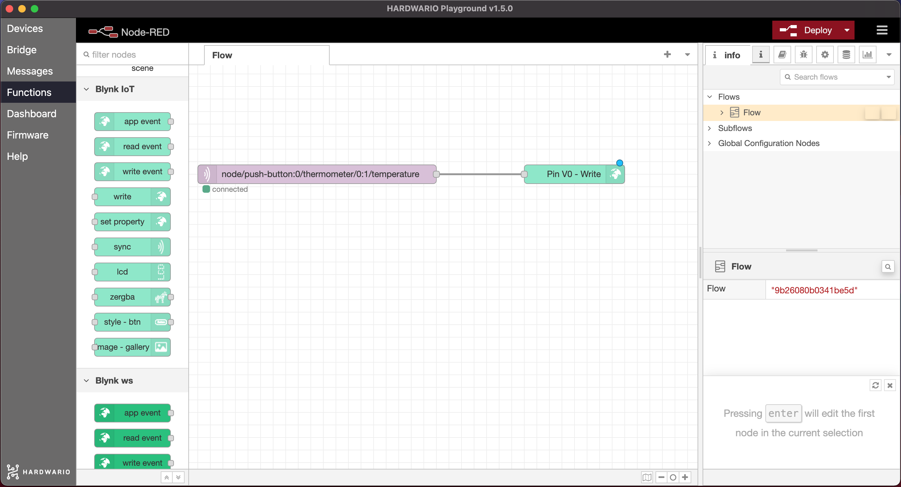
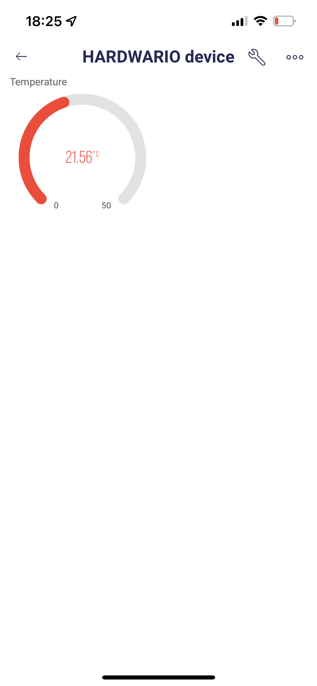

## Introduction

This project will reveal all your school's secrets, whether someone is hunting ghosts or looking for a hot spot for their next date. Measure the temperature in different corners of the school with your class and try to discover the biggest extreme. 😱

With this project, you'll learn to **measure temperature with IoT and show it on your phone**. The basic HARDWARIO set, the [**Start Set**](https://www.hardwario.store/p/start-set/), is all you need.

**Suggest the game to your physics teacher** to liven up a lesson, or just play it with friends after school.

**This game is all about winning.** Whoever finds the coldest or warmest place in the school is **the king**! 👑 If your class has several boxes, work alone or in small groups. If you only have one, take turns.


## Get your box ready

1. Assemble and pair the Start Set. The Core Module needs the **twr-radio-push-button** firmware. If you don't know how to get the firmware or what it is, [you'll find out here](https://docs.hardwario.com/tower/desktop-programming/firmware-flashing/).

2. You'll see the temperature change in the **Messages** tab in Playground.


## Set up Node-RED

1. You'll record the lowest or highest temperature on your own gauge. Start on your computer with the bubbles in [Node-RED](https://docs.hardwario.com/tower/desktop-programming/node-red-programming/). First, click the **Functions** tab in Playground.

2. Place a light purple node (a bubble) called **mqtt in** on the empty canvas. You'll find it in the network section.

3. Double-click the node to open it. In the **Topic** field you choose what the gauge will show. This time it's temperature, so copy the temperature message from the Messages tab (without the number) into the field. Or simply use this one:

```
node/push-button:0/thermometer/0:1/temperature
```


Confirm with **Done**.

## Prepare the Blynk IoT app

The box sends the measured temperature to the **Blynk IoT** app: Node-RED writes every reading to a datastream, and a gauge on your phone shows it. You don't need any automation or notification for this project.

1. If you don't have a [Blynk IoT](https://blynk.io) account yet, create one. The free plan is enough for this project.

2. Next, create a device template. [Blynk's quick guide](https://docs.blynk.io/en/getting-started/template-quick-setup) shows you how. If you already have a template from an earlier project, feel free to use it.

3. Now set up a new datastream. In the template details, open the **Datastreams** tab, click **Edit** in the top right, then **New Datastream**, and choose **Virtual Pin**. The datastream settings open:



4. Name the new datastream (for example `Temperature`) and pick one of the free pins. You'll measure temperature as a decimal number, so **choose Double as the Data Type** and set the unit to **Celsius**. Don't forget to set the range of temperatures you'll measure, for example **0–50**.

5. Create the datastream by clicking **Create**.



6. Save the template with the **Save** button in the top right corner.

## Create a device

If you don't have a device yet, create one from the template: in **Devices**, add a new device, choose your template and give the device a name. You'll find its **Auth Token** on the device's **Device Info** tab. You'll need it in Node-RED.

## Run the app on your phone

Download the **Blynk IoT app** to your phone from the [App Store](https://apps.apple.com/us/app/blynk-iot/id1559317868) or [Google Play](https://play.google.com/store/apps/details?id=cloud.blynk) and sign in with the same account.


Right after signing in, you'll see the device you created:


Tap it. Now let's set up the dashboard that will show the measured value:

1. Under the **wrench** icon in the top right, you'll find the dashboard settings.


2. Use the **+** button, or tap anywhere on the canvas, to add a new chart or another dashboard element. We'll use a **Gauge** now.


3. Tap the added widget to open its settings. The most important thing is to choose the ***Datastream*** from your template for the virtual pin you picked. You can also add a name and change the color.



4. Your app is ready. Now let's start sending data to it. 💪

## Connect your phone to the box

1. Go back to your computer. On the Node-RED canvas, add the **green write node** after the MQTT node. You'll find it on the left in the **Blynk IoT** section (the **Blynk ws** section belongs to the old Blynk, which no longer works).



2. Double-click the node to open it. Next to **Connection** you'll see **a small pencil**. Click it and a new window opens. In the **Url** field, enter `blynk.cloud`. Into the **Auth Token** and **Template ID** fields, copy the values from the Blynk web app on your computer: the Auth Token is on the device's **Device Info** tab, the Template ID in the template details.


Confirm the settings with **Add**. But don't leave the node just yet. 👈

3. In the **Virtual Pin** field, write the number of the pin you chose in Blynk, without the letter “V”. Confirm with **Done**.



4. Now **wire the two nodes together** and click the red **Deploy** button in the top right. 🚨



## One-up your class

1. Alone or in a group, **guess which place in the school might be the warmest or coldest**. 🔥 ⛄

2. Each person or group has **only 15 minutes** to explore. 🔦 That keeps it exciting.

3. Take the box to the spot you picked and **watch the temperature on your phone**. It may take a moment before the temperature shows on the gauge.



4. Try several places, and at the end announce the most extreme results. **Congratulations to the winners!** 🎇
